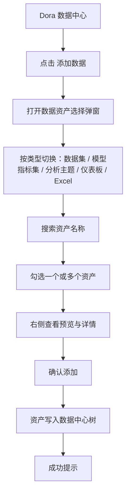
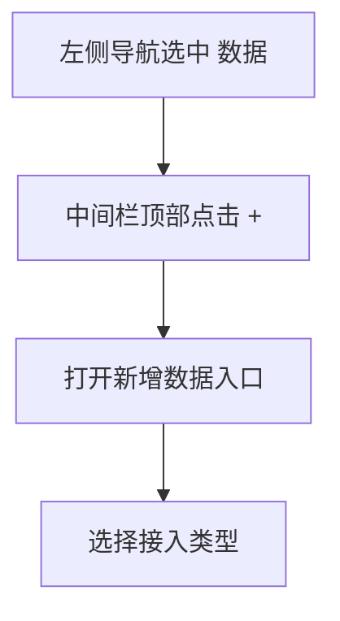
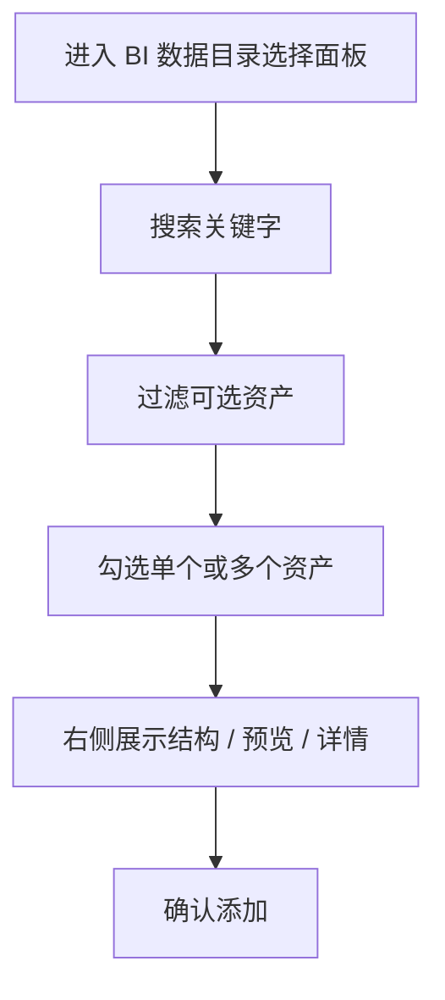
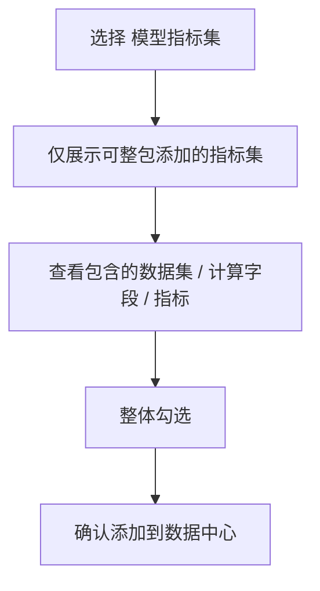
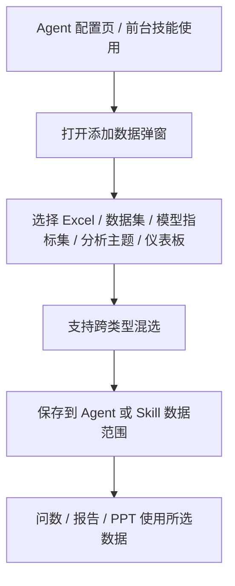

# 添加数据目录 交互逻辑

> **PRD**：[Dora 数据支持数据目录](https://fanruan-x.feishu.cn/wiki/DJsNwDFZPi1gVDk1jWdcdQXGn7g?from=space_search&previous_navigation_time=1780048879552)  
> **原型文件**：`add-data-catalog/prototype.html`  
> **设计目标**：对齐 PRD 中“Dora 数据中心支持 BI 数据目录”的接入方式，明确新增入口、数据选择、预览、权限与结果反馈的交互设计

---

## 零、评审摘要

### A — 现有实现与 PRD 差异

**现有代码**
- 数据中心主结构已存在：左侧后台导航 + 中间数据树 + 右侧预览区
- 当前“添加数据”入口只覆盖 `文件 / 分析主题 / 仪表板`
- 当前可预览的数据类型主要是 `分析主题 / 数据库表 / 仪表板`
- 当前目录树管理的是 Dora 自身的数据资产，不是 BI 数据目录中的受控资产

**PRD 目标**
- 将 BI 数据目录中的资产接入 Dora 数据中心
- 支持搜索、多选添加
- 支持的数据类型包含：
  - 数据集：Excel 数据集、SQL 数据集、数据库表、被发布的自助数据集
  - 模型指标集：整体添加，不拆分单个数据集/指标/计算字段
  - 既有资产：分析主题、仪表板、Excel 数据
- 添加后，Dora 内只展示数据类型，不展示数据来源细分

**关键流程**

### B — 现有实现可复用区域

**当前设计**
- 左侧导航、数据树、预览区的页面骨架可直接复用
- 文件夹增删改移动、树搜索、预览区切换、重命名、预览分页等能力可复用
- 现有 `Add Data` 入口弹窗的分组式选择结构可作为起点，但需要重构为 BI 数据目录导入流程

**关键流程**

---

## 一、设计背景

PRD 的核心不是“在 Dora 里新建一个目录文件夹”，而是“把 BI 数据目录中的可信资产导入 Dora 数据中心”。因此，交互设计要解决三个问题：

1. 用户从哪里发起导入
2. 用户如何筛选和选择可导入资产
3. 不同资产类型导入后，在 Dora 中如何呈现

现有代码已经具备数据中心工作台骨架，但新增入口、资产分类、权限约束和多选导入交互都还需要补齐。

页面判断：

| 判断项 | 结论 |
|--------|------|
| 页面类型 | 后台资源管理页 |
| 主任务 | 管理 Dora 可引用的数据资产，并从 BI 数据目录导入可信资产 |
| 主对象 | 数据资产，包括 Excel 数据、分析主题、仪表板、数据集、模型指标集 |
| 界面模型 | 左侧导航 + 数据树 + 右侧详情预览；新增数据使用弹窗式选择流程 |

---

## 二、完整操作流程

### 2.1 数据入口流程

### 2.2 数据目录资产选择流程

### 2.3 模型指标集流程

### 2.4 Agent 消费数据流程

---

## 三、完整交互细节说明

### 3.1 页面级结构

| 区域 | 当前设计 | 需要补齐的交互设计 |
|------|----------|--------------------|
| 左侧后台导航 | `数据` 作为主入口 | 保持不变 |
| 中间数据树 | 展示 Dora 数据资产树 | 增加 BI 数据目录导入后的新资产类型展示规则 |
| 顶部新增入口 | 现有加号可触发旧的“添加数据”弹窗 | 重构为“数据目录资产选择”入口 |
| 右侧预览区 | 展示选中资产预览 | 补齐数据集、模型指标集、Excel 的预览差异 |
| 结果反馈 | 现有只针对旧资产类型 | 新增“导入成功 / 无权限 / 已添加 / 类型不支持”反馈 |

### 3.2 Dora 数据类型与来源规则

| Dora 数据类型 | 添加来源 | Dora 中展示 |
|---------------|----------|--------------|
| Excel 数据 | 本地上传 Excel | Excel 数据 |
| 分析主题 | BI 我的分析中的分析主题 | 分析主题 |
| 仪表板 | BI 目录中发布的仪表板 | 仪表板 |
| 数据集 | 数据目录中的 Excel 数据集、SQL 数据集、数据库表、被发布的自助数据集 | 数据集 |
| 模型指标集 | 数据目录中发布的模型指标集 | 模型指标集 |

数据来源只用于添加阶段的筛选和权限判断。资产加入 Dora 后，数据中心树、Agent 后台数据选择、Agent 前台数据选择均只展示 Dora 数据类型，不展示 SQL 数据集、数据库表、自助数据集等来源细分。

### 3.3 新增入口设计

| 用户操作 | 系统反馈 |
|----------|----------|
| 点击中间栏顶部 `+` | 打开新增数据入口 |
| 选择 `BI 数据目录资产` | 进入资产选择弹窗，默认展示数据集 |
| 选择 `本地文件` | 保留现有文件导入能力 |
| 选择 `BI 分析主题 / BI 仪表板` | 保留现有资产接入能力 |

新增入口沿用当前数据中心顶部 `+` 的入口层级。`+` 代表向当前数据中心加入资产，`BI 数据目录资产` 作为其中一个来源分支，避免把数据目录误表达为一个新的 Dora 页面或独立管理域。

### 3.4 资产选择弹窗

| 用户操作 | 系统反馈 |
|----------|----------|
| 切换资产类型 | 左侧列表刷新为对应资产类型 |
| 输入搜索词 | 列表即时过滤，保留命中的祖先路径 |
| 勾选单个资产 | 右侧显示当前资产预览与详情 |
| 多选多个资产 | 底部汇总已选数量与已选名称 |
| 点击已添加资产 | 显示已接入状态，不可重复选择 |
| 点击无权限资产 | 显示无权限提示，不进入可选状态 |

弹窗结构：

| 区域 | 交互说明 |
|------|----------|
| 弹窗尺寸 | 添加数据目录、添加数据集等添加类弹窗统一为 1152 × 720 |
| 顶部类型切换 | 支持数据集、模型指标集、分析主题、仪表板、Excel 数据 |
| 左侧资产列表 | 只展示当前用户有 BI 使用或管理权限的资产；支持搜索和多选；列表内容独立滚动 |
| 右侧预览区 | 跟随当前聚焦资产展示预览、详情、权限和已添加状态；预览内容独立滚动 |
| 底部确认区 | 固定在弹窗底部，展示已选数量；无可添加项时确认按钮置灰 |

### 3.5 数据集交互

| 用户操作 | 系统反馈 |
|----------|----------|
| 选择数据集 | 显示结构预览、字段、关系或表结构 |
| 选择数据库表 | 显示宽表预览或表结构预览 |
| 选择 SQL / Excel / 自助数据集 | 统一按“数据集”类型呈现 |
| 确认添加 | Dora 中只落为“数据集”类型，不展示来源细分 |

数据集预览包含字段类型、原始名、字段别名、字段描述。指标配置支持设置数据格式，并支持指标类型配置：可累加、半累加、不可累加。

### 3.6 模型指标集交互

| 用户操作 | 系统反馈 |
|----------|----------|
| 选择模型指标集 | 只展示整体指标集，不拆散成单个资源 |
| 查看详情 | 展示包含的数据集、计算字段、指标 |
| 选择“模型指标转表”相关项 | 如果该能力不支持，则直接禁止接入 |
| 确认添加 | Dora 中落为“模型指标集”类型 |

模型指标集支持查看整体数据详情，也支持查看其中的数据集、计算字段、指标详情。指标和计算字段中的指标字段支持设置数据格式；指标类型直接读取语义模型中的设置，不在 Dora 中重复配置。

### 3.7 预览与详情

| 资产类型 | 预览方式 |
|----------|----------|
| 数据集 | 复用 BI 数据预览；表结构预览包含字段类型、原始名、字段别名、字段描述 |
| 模型指标集 | 指标集整体详情 + 组成项信息；支持宽表预览、表间关系预览、维度指标动态组合预览 |
| 分析主题 | 复用现有主题预览 |
| 仪表板 | 复用现有仪表板预览 |
| Excel | 复用现有表格预览 |

模型指标集的动态预览若实现成本过高，预览降级为“全量维度 + 单指标”的宽表预览，但仍保留数据集关系与指标详情入口。

### 3.8 权限与空态

| 场景 | 系统反馈 |
|------|----------|
| 仅有 Dora 权限，没有 BI 数据目录权限 | 不展示可选资产，提示权限不足 |
| 仅有 BI 数据目录权限，没有 Dora 权限 | 不允许进入添加流程 |
| 没有某个 BI 资产的使用或管理权限 | 该资产不出现在可选范围内 |
| 搜索结果为空 | 展示空态，提示切换关键字或类型 |
| 资产已被其他位置接入 | 明确标记已添加，不允许重复选择 |
| 类型暂不支持 | 在列表中隐藏；如由详情页跳转进入，则展示类型不支持说明 |

### 3.9 添加完成后的呈现

| 用户操作 | 系统反馈 |
|----------|----------|
| 点击确认添加 | 数据写入树并自动展开目标目录 |
| 新资产进入数据中心 | 只展示为对应数据类型，不展示来源类型 |
| 添加成功 | 显示成功提示，并保留当前筛选上下文 |
| 添加失败 | 保留选择内容，提示失败原因并允许重试 |

### 3.10 数据管理状态

| 场景 | 系统反馈 |
|------|----------|
| 新增数据目录资产 | 通过 `+` 入口进入 BI 数据目录资产选择弹窗 |
| 重命名数据目录资产 | 沿用现有右侧预览头部重命名能力 |
| 移动数据目录资产 | 沿用现有目录树移动能力，并保持同层级重名校验 |
| 查找数据目录资产 | 使用数据树搜索，命中资产时保留所在文件夹路径 |
| 删除数据目录资产 | 删除确认中提示该数据可能影响已配置的 Agent 和 Skill |
| BI 中源资产被删除 | 数据中心树中对应数据标红，右侧预览区展示“BI 数据已删除”提示 |
| 更新数据目录资产 | 沿用现有预加载更新逻辑，刷新后保持当前选中项 |

数据中心删除数据后，Agent 后台配置界面中已引用的数据统一标红并提示数据缺失；Agent 前台会话页保持问到具体内容时提示数据缺失的方式。

### 3.11 语义信息与指标配置

| 资产类型 | 语义配置对象 | 指标配置 |
|----------|----------------|----------|
| 数据集 | 数据集中的维度字段、指标字段 | 支持数据格式；支持可累加、半累加、不可累加 |
| 模型指标集 | 模型指标集整体、数据集字段、计算字段、指标 | 指标和计算字段支持数据格式；指标类型读取语义模型设置 |
| 分析主题 | 复用现有分析主题字段配置 | 复用现有能力 |
| Excel | 复用现有字段配置 | 复用现有能力 |

### 3.12 Agent 与 Skill 消费侧

| 使用场景 | 交互设计 |
|----------|----------|
| Agent 后台配置页 | 添加数据弹窗支持 Excel、数据集、模型指标集、分析主题、仪表板混选 |
| Agent 前台数据选择 | 添加数据弹窗支持 Excel、数据集、模型指标集、分析主题、仪表板混选 |
| Agent 前台问数 | 用户可选择数据集、模型指标集、分析主题、Excel 数据进行问数 |
| 问指标口径 | 模型指标集需要可读取指标来源、计算口径、负责人等详情 |
| 探索报告 / 探索 PPT | 支持分析主题、数据集、模型指标集、Excel 数据、仪表板 |
| 例行报告 / 例行 PPT | 支持按全局或章节选择数据范围 |

### 3.13 Skill 能力差异

| Skill | 需要补齐的数据能力 |
|-------|--------------------|
| 问数 | 新增支持数据集、模型指标集，并保留分析主题和 Excel |
| 探索报告 / 探索 PPT | 支持多数据类型混合分析，映射不清晰时需要反问澄清 |
| 例行报告 / 例行 PPT | 支持模型指标集、分析主题、数据集、Excel 数据，并按全局 / 章节配置 |

---

## 四、与现有实现的对齐点

| 能力 | 现有实现 | PRD 对齐要求 |
|------|----------|--------------|
| 数据中心框架 | 已有 | 保留 |
| 目录树搜索 | 已有 | 保留并用于资产筛选 |
| 多选添加 | 仅部分弹窗支持 | 扩展到 BI 数据目录资产 |
| 数据预览 | 已有主题 / 仪表板 / 表格预览 | 扩展到数据集、模型指标集 |
| 添加入口 | 旧资产类型入口 | 需改成数据目录导入入口 |
| 资产类型 | 文件 / 主题 / 仪表板 | 新增数据集 / 模型指标集 |
| 数据来源展示 | 部分实现中可见 | Dora 中不展示来源细分 |
| Agent 数据选择 | 已有数据源选择弹窗和按路径分组展示 | 支持新增类型混选，并扩展 Skill 数据范围 |
| 删除影响提示 | 当前数据项删除提示较弱 | 删除前提示影响 Agent / Skill 配置 |
| BI 源资产失效 | 需要更明确提示 | 标红失效资产，并显示“BI 数据已删除” |

---

## 五、交互决策

| 决策点 | 当前设计 |
|--------|----------|
| 数据目录入口 | 放在现有数据中心 `+` 菜单内，作为“BI 数据目录资产”来源分支 |
| 数据集预览 | 必须提供表结构预览；关系预览按 BI 能力复用，无法完整呈现时降级为宽表 / 表结构 |
| 模型指标集详情 | 在右侧通用预览区内展示整体详情和组成项详情，不新增独立页面 |
| 已添加资产 | 列表中保留展示并标记“已添加”，允许查看详情，不允许重复勾选 |
| 模型指标转表 | 若研发确认成本高或当前不支持，选择阶段直接禁用并提示不支持接入 |

---

## 六、原型演示状态

`prototype.html` 默认展示“添加 BI 数据目录资产”弹窗，评审时优先查看数据集多选导入流程。

| 演示状态 | 原型表现 |
|----------|----------|
| 标准导入 | 弹窗展示数据类型切换、搜索、多选、已添加禁用、右侧预览和底部已选汇总 |
| 权限不足 | 弹窗列表区域展示权限空态，说明需要同时具备 Dora 数据中心权限和 BI 数据目录使用或管理权限 |
| BI 源删除 | 数据中心树中失效数据标红，右侧预览区展示“BI 数据已删除”和影响范围 |
| 添加成功 | 弹窗关闭并展示添加成功提示，表示资产已进入 Dora 数据中心 |

交互说明开关开启后，原型使用目标容器边框高亮和顶层 hover 气泡标注新增入口、类型切换、多选列表、预览区、确认区、数据类型展示和删除影响提示。
