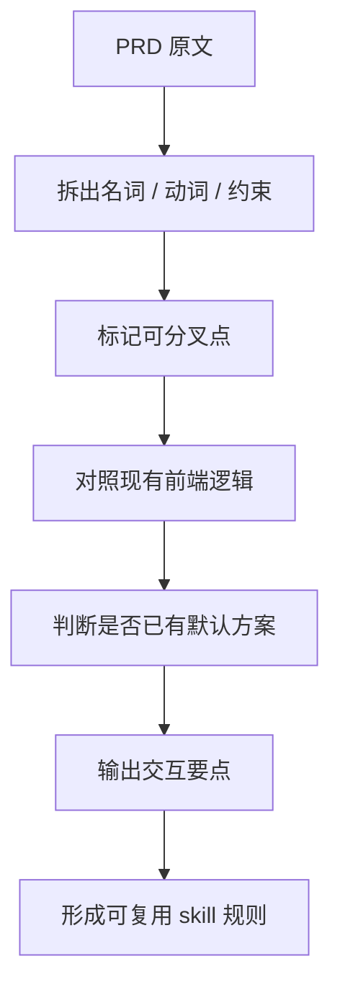
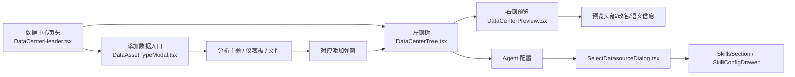
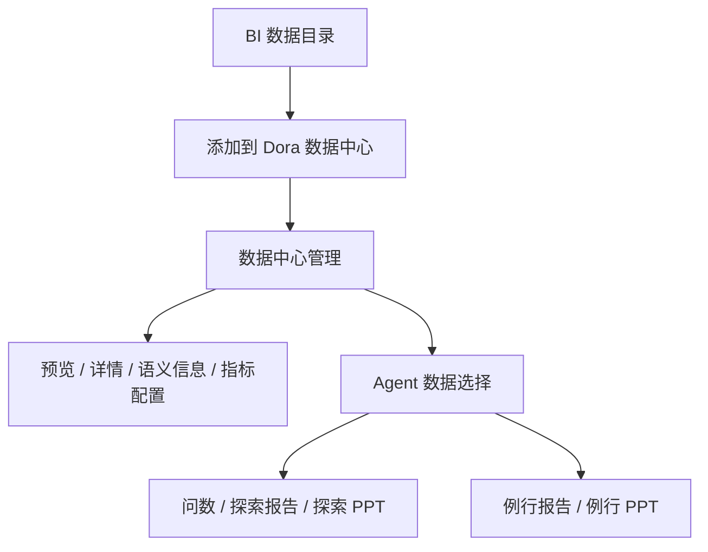

# PRD 交互提炼总结

## 目标

把信息密度不一的 PRD，先压缩成一份“交互设计该重点思考什么”的摘要，再映射到当前前端已有逻辑，方便后续继续沉淀成 skill。

## 这份总结关注什么

不是复述需求，而是识别下面这些点：

- 哪些地方存在多个合理交互方案
- 哪些地方需要补足入口、分流、选择、确认、反馈、预览、管理副作用
- 哪些地方当前代码已经有实现，设计只需要在现有路径上做强化
- 哪些地方 PRD 说得很满，但其实还缺交互决策

## 交互提炼流程



## 什么算“值得交互设计师发挥”

### 1. 入口有分叉

典型句式：

- “需要添加 A/B/C/D”
- “支持选择不同数据类型”
- “可从搜索、多选、目录树、弹窗进入”

这类描述通常不是“做一个按钮”这么简单，而是在问：

- 是先选类型，再选资源
- 还是先选资源，再判断类型
- 是菜单分流，还是弹窗分流
- 是单入口还是多入口

### 2. 同一动作有多种承载方式

例如“添加”可以拆成：

- 顶部按钮 + 下拉菜单
- 点击后先出类型面板
- 直接进入树选择
- 选择后再补充配置

交互设计要决定的是“哪一种最符合任务复杂度”，而不是只把动作写出来。

### 3. 资源类型不同，但文档只写成一类

当前前端里已经能看到这种差异：

- 分析主题
- 仪表板
- 文件数据
- 数据集
- 模型指标集

PRD 若把它们混写成“数据”，就需要交互层补出：

- 入口是否统一
- 预览是否统一
- 详情是否统一
- 删除/重命名/移动的反馈是否统一
- 不同类型是否允许混选

### 4. 有“结果”但没说“过程”

比如 PRD 写“支持添加 A/B/C/D”，但没有说：

- 搜索是否支持
- 是否支持多选
- 是否支持目录层级展开
- 是否允许在同一弹窗里边选边预览
- 是否需要重名校验
- 是否要展示已添加状态

这些都属于交互设计的主战场。

### 5. 有副作用，但 PRD 往往轻描淡写

例如：

- 删除后其他 Agent/技能如何感知
- 数据在 BI 里被删了，前端怎么标红
- 选了一个数据源后，技能默认绑定规则是什么
- 资源被移动后，路径和分组怎么更新

这类内容一旦没提清楚，后面最容易返工。

## 结合当前前端代码的真实链路



## 本次 PRD 的交互设计要点

飞书文档的主题是“Dora 数据中心支持 BI 数据目录”。PRD 表面是在扩展数据类型，但交互上真正要处理的是“资源入口、资源理解、资源管理、Agent 消费”四条链路同时变复杂。



### 1. 添加入口：菜单分流还是弹窗分流

PRD 写的是“支持搜索、多选添加数据目录数据”，但需要设计拍板的是入口模型：

| PRD 信息        | 交互设计要点                                  | 当前代码参考                                                |
| ------------- | --------------------------------------- | ----------------------------------------------------- |
| 新增数据集、模型指标集   | 新增入口是否继续使用顶部 `+` 下拉，还是进入“添加数据”大弹窗后再分组选择 | `DataCenterHeader.tsx`、`DataAssetTypeModal.tsx`       |
| 数据目录里有多种来源    | 是否按用户可理解的“数据类型”分组，还是按 BI 来源分组           | `getDataSourceCardSections`                           |
| 只展示有 BI 权限的数据 | 权限过滤是静默过滤，还是需要提示“部分数据不可见”               | 添加弹窗树加载逻辑                                             |
| 支持多选添加        | 多选后是否需要右侧预览、已选列表、重名处理                   | `AddFrbiSubjectModal.tsx`、`AddFrbiDashboardModal.tsx` |

推荐设计问题：

- 顶部 `+` 菜单是否会因新增类型过多而失控
- 数据目录是否应该作为一个一级入口，再在弹窗内区分数据集/模型指标集
- 已添加状态是否要在树中直接禁用、标记，还是允许重复选择后统一拦截

### 2. 数据类型：用户看到类型，不看到来源

PRD 明确说“数据来源只用来添加数据，实际使用数据时只展示具体数据类型”。这意味着交互层要把“来源”和“类型”分离：

| 数据来源 | 数据中心展示类型 | 交互风险 |
| --- | --- | --- |
| 数据目录 SQL 数据集 / 数据库表 / 发布的自助数据集 / 数据目录 Excel | 数据集 | 添加时来源很重要，使用时来源不展示，容易导致用户不知道数据从哪里来 |
| 数据目录模型指标集 | 模型指标集 | 模型指标集内部还有数据集、指标、计算字段，容易误以为可局部添加 |
| 我的分析分析主题 | 分析主题 | 当前已有预览与语义配置逻辑 |
| 目录仪表板 | 仪表板 | 当前已有 iframe 预览逻辑 |

推荐设计问题：

- 添加时是否展示来源标签，添加后是否只展示类型图标
- 资源详情中是否保留来源说明，避免用户找不到资产来源
- 模型指标集是否需要特殊说明“只能整体添加”

### 3. 模型指标集：整体添加，但内部要能理解

PRD 里最需要交互设计介入的是模型指标集：

- 只能添加整体模型指标集
- 内部包含数据集、指标、计算字段
- 管理时又需要分别查看整体、数据集、指标、计算字段的详情
- 预览可能有“维度 + 指标动态组合”或“全量维度 + 单指标宽表”的方案分歧

推荐设计问题：

- 选择树里模型指标集是一颗叶子，还是可展开但不可勾选子项
- 预览页是否需要二级结构：整体概览、数据集、指标、计算字段
- 动态组合预览成本高时，降级方案怎么让用户理解
- “模型指标转成表”不支持时，是添加前拦截，还是添加后在使用时提示

### 4. 预览与详情：右侧区域是否升级为资源工作台

当前前端的右侧预览已经承载：

- 数据表预览
- 表结构
- 字段配置
- 重命名
- 语义信息入口
- 仪表板 iframe 预览

本次 PRD 又新增：

- 表结构预览：字段类型、原始名、字段别名、字段描述
- 模型指标集关系预览
- 计算字段/指标动态组合预览
- 指标配置
- 数据详情

推荐设计问题：

- 右侧预览是否继续叫“预览”，还是升级为“详情工作台”
- 表格预览、结构、关系、指标配置、语义信息应该用 Tab、侧边栏还是二级导航
- 模型指标集的“整体详情”和“内部资源详情”如何切换
- 字段配置入口是放在表格列上，还是统一放在详情区

### 5. 删除与异常：要把不可用状态显性化

PRD 提到两类删除：

- 在 Dora 数据中心删除
- 在 BI 中删除原始数据

这里需要设计的不是删除按钮，而是删除后的系统反馈：

| 场景 | 设计要点 |
| --- | --- |
| Dora 删除数据 | Agent 后端配置界面要提示，已绑定数据需要标红 |
| BI 删除数据 | 数据中心对应资源标红，点击后提示“BI 数据已删除” |
| Agent 前端会话 | 保持当前逻辑，在提问具体内容时说明数据缺失 |

推荐设计问题：

- 标红是在树节点、卡片、技能配置抽屉里都出现，还是只在关键入口出现
- 删除提示是否区分“Dora 删除”和“BI 删除”
- 已删除数据是否允许继续保留在 Agent 配置里
- 是否提供“一键移除不可用数据”

### 6. Agent 消费：混合分析会改变配置心智

PRD 要求 Agent 前端和后端配置界面支持 Excel 数据、数据集、模型指标集、分析主题、仪表板，并支持混合分析。

当前前端已有逻辑是：

- Agent 数据源可从数据中心树里选择
- 已选数据按父路径分组展示
- 技能配置会区分仪表板技能和非仪表板技能
- 新增数据源后，技能会自动补默认绑定

推荐设计问题：

- 混合分析时，是否需要按类型分组展示，而不是只按目录路径分组
- 技能配置里是否要展示“该技能支持/不支持”的类型原因
- 问数、探索报告、探索 PPT、例行报告的默认绑定逻辑是否一致
- 固定报告的“全局/章节数据范围”是否复用现有章节数据配置，还是需要新的数据选择器

## 本次需求的交互机会点总表

| 优先级 | 机会点 | 为什么值得设计 | 建议产出 |
| --- | --- | --- | --- |
| P0 | 添加入口分流 | 新增资源类型后，现有 `+` 菜单可能变长、变难理解 | 入口流程图 + 弹窗结构 |
| P0 | 模型指标集选择方式 | PRD 有“只能整体添加”限制，但内部又有多层资源 | 选择树状态图 |
| P0 | 数据类型展示规则 | 来源和类型分离，容易让用户困惑 | 类型/来源展示规范 |
| P0 | 不可用数据状态 | Dora 删除和 BI 删除需要不同反馈 | 异常状态矩阵 |
| P1 | 右侧预览区升级 | 预览、详情、语义、指标配置都挤到同一区域 | 资源详情信息架构 |
| P1 | Agent 混合数据选择 | 技能消费数据的规则变复杂 | 技能数据绑定规则 |
| P2 | 固定报告全局/章节数据 | PRD 写“预研”，但影响报告配置主流程 | 报告配置交互草案 |

### 代码里已经存在的关键交互能力

1. 数据中心页头支持“刷新”和“新增”。
2. 新增入口会先做资源类型分流，再进对应弹窗。
3. 左侧树支持搜索、分类筛选、展开、重命名、移动、删除。
4. 右侧预览会根据资源类型切换：
   - 分析主题 / 表类数据：表格预览、分页、字段配置
   - 仪表板：嵌入真实报表预览
   - 不支持类型：兜底提示
5. Agent 配置里，数据源是可分组展示、可删除、可按技能自动补默认值的。
6. 技能配置里，仪表板类技能和非仪表板类技能有不同的数据筛选逻辑。

## 从 PRD 里要优先提炼的问题

### A. 入口怎么分

先问：

- 入口是一个，还是多个
- 先选类型，还是先选资源
- 是否允许从已选目标反推入口

### B. 选择怎么做

再问：

- 单选还是多选
- 是否允许跨类型混选
- 是否支持搜索、筛选、展开、全选
- 选中后是否立即生效，还是需要二次确认

### C. 预览怎么承接

再问：

- 预览是强依赖吗
- 预览是否能帮助用户决策
- 预览区是否要承担“改名 / 语义信息 / 详情”这些附加任务

### D. 管理副作用怎么兜住

再问：

- 删除后怎么提醒
- 被 BI 删除后怎么标识
- 移动后路径是否刷新
- 重名时怎么办
- 已添加项怎么展示状态

### E. 业务规则要不要前置

再问：

- 是否有权限前置过滤
- 是否有类型前置过滤
- 是否有“整体可添加 / 局部不可添加”的限制
- 是否需要强约束才能继续下一步

## 一个实用的提炼模板

当 PRD 里出现“需要支持 XXX”时，优先填这五项：

1. 入口是什么
2. 用户要怎么选
3. 选完怎么看结果
4. 失败怎么提示
5. 变更如何影响后续使用

## 结合本项目的可复用判断

### 已有逻辑优先复用的地方

- 资源分类与图标映射
- 树结构搜索与筛选
- 资源预览区
- 添加弹窗的类型分流
- Agent 数据源分组展示
- 技能配置的数据类型过滤

### 需要交互设计额外拍板的地方

- 多类型资源的统一入口还是分入口
- 预览是否作为“决策中枢”
- 选择时是否强制二次确认
- 类型差异是否暴露给用户
- 删除、移动、重命名这些副作用是否要显式提示

## 建议的 skill 化方向

后续可以把这套流程沉淀成一个“PRD 交互提炼 skill”，输入一份 PRD，输出以下内容：

- 交互机会点清单
- 当前代码可复用的逻辑点
- 需要设计拍板的问题
- 建议的交互流转图
- 风险点与待确认项

### skill 的固定输出格式建议

```markdown
## 一句话结论
## 交互机会点
## 当前代码可复用逻辑
## 需要拍板的问题
## 推荐交互方案
## 风险与待确认项
## 图示
```

## 这次文档对应的代码参考

- [packages/dora-dev/src/modules/data-center/layout/DataCenterHeader.tsx](DataCenterHeader.tsx)
- [packages/dora-dev/src/modules/data-center/modals/data-asset-type/DataAssetTypeModal.tsx](DataAssetTypeModal.tsx)
- [packages/dora-dev/src/modules/data-center/tree/DataCenterTree.tsx](DataCenterTree.tsx)
- [packages/dora-dev/src/modules/data-center/preview/DataCenterPreview.tsx](DataCenterPreview.tsx)
- [packages/dora-dev/src/modules/data-center/modals/select-datasource/SelectDatasourceDialog.tsx](SelectDatasourceDialog.tsx)
- [packages/dora-dev/src/modules/agent-management/agent-config/sections/DataSection.tsx](DataSection.tsx)
- [packages/dora-dev/src/modules/agent-management/agent-config/sections/SkillConfigDrawer.tsx](SkillConfigDrawer.tsx)
