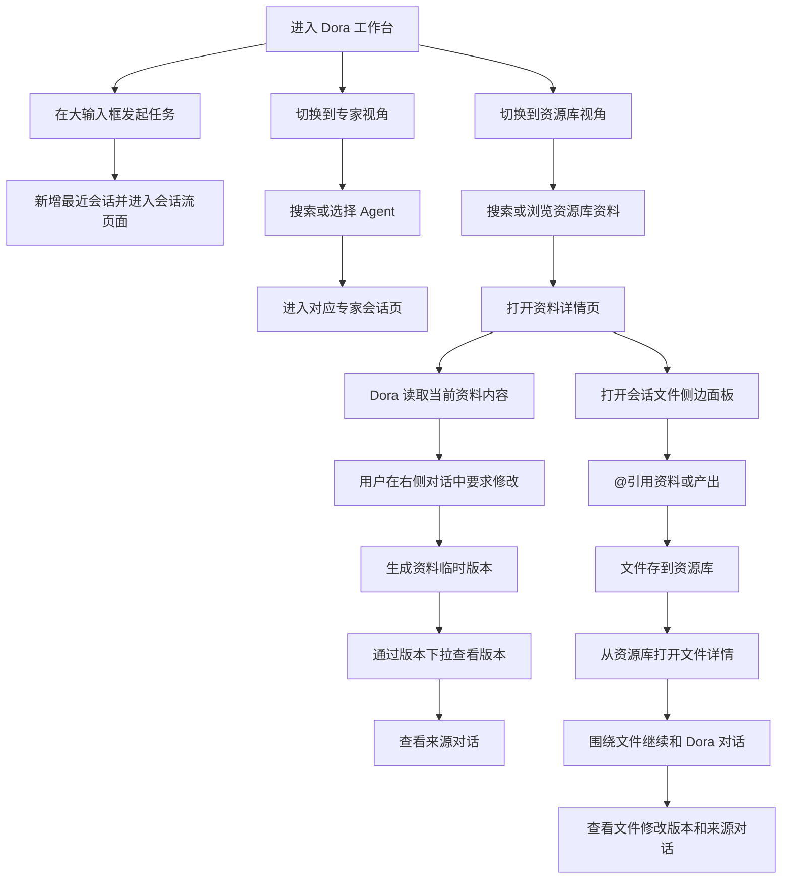

# Dora / 专家 / 资源库资料联动原型交互逻辑

> **原型文件**：prototype.html
> **页面类型**：Dora 工作台 + Agent 列表 + Agent 会话页 + 资源库 + 资料详情页
> **主任务**：用户从 Dora 或专家 Agent 发起会话，在资源库视角查找资料，并围绕资料继续对话、查看版本来源和引用会话文件。
> **主对象**：Dora 对话、专家 Agent、资源库资料、资料版本、会话文件。

---

## 零、评审摘要

原型包含 `Dora`、`专家`、`资源库` 三个一级视角。左侧窄导航用于切换用户当前是在发起通用对话、查找专家 Agent，还是查找资源库资料。顶部新增方案切换 Tab，用于对比 Sender 添加入口的不同表达方式。

一级视角切换会保留用户离开该视角时的页面状态。用户从资源库资料详情切到 Dora 或专家后，再回到资源库仍停留在该资料详情；用户从某个会话流切走后，再回到对应视角仍保留该会话状态。

Dora 视角本身就是 Dora 会话页关系：默认展示新会话空态输入，并默认收起左侧会话侧栏。用户可通过左上角展开按钮打开会话侧栏；侧栏选中“新会话”时，右侧白色区域展示 Dora 彩色新会话空态内容。Dora 会话没有返回操作，也不提供专家 Agent 切换；发送后新增最近会话并进入 Dora 会话流。“新会话”和“最近会话”列表项是互斥选中关系，不能同时选中。专家 Agent 卡片进入对应专家会话页，会话页根据入口切换标题、Agent 名称、用户问题和执行过程内容；专家会话左侧标题区支持快速切换到其他专家 Agent。

资源库资料由用户在会话文件中存入沉淀，也支持从资源库首页进入详情页。详情页采用“左侧资料预览 + 右侧关联对话”的结构，右侧 Dora 可以基于当前打开的资料继续回答或修改，资料顶部展示版本入口，并支持查看版本来源对话。

每个会话拥有独立的会话文件。会话文件可通过会话头部文件夹、输入区加号或资料详情右侧对话头部文件夹打开。会话文件以右侧侧边面板呈现，分为 `资料` 和 `产出` 两个 Tab，文件可被 `@引用`、存到资源库、刷新、下载或删除；点击存到资源库后，该文件进入资源库的全部资源列表。Sender 支持用户在发送前添加本地文件、FineBI 资产或 FineReport 资产，添加后的对象会以文件 Chip 呈现在输入区，并同步进入当前会话文件。

---

## 一、页面结构

| 视图 | 主要内容 | 主任务 |
|---|---|---|
| Dora | 默认收起侧栏的新会话空态、问候语、大输入框、最佳实践卡片 | 在 Dora 会话空态中直接发起通用对话 |
| 专家 | Dora 同款轻背景、Agent 搜索、筛选、卡片列表 | 查找特定 Agent 并进入对话 |
| 会话页 | 左侧会话历史、中间对话、执行过程、底部输入区 | 承接 Dora 或专家 Agent 的具体对话 |
| 资源库 | 最近常用、全部资源、资料搜索、资料卡片 | 查找和打开资源库资料 |
| 资料详情 | 资料预览、版本入口、右侧 Dora 对话 | 围绕当前资料继续追问或修改 |

---

## 1.x Sender 添加入口方案

顶部方案切换 Tab 只用于评审对比，不改变 Dora、专家、资源库的页面状态。切换方案后，页面内所有 Sender 入口保持同一种表达方式，包括 Dora 新会话输入框、专家会话输入区和资料详情右侧输入区。

| 方案 | 名称 | 表达方式 | 适用判断 |
|---|---|---|---|
| 方案1 | 菜单入口 | Sender 左侧只露出一个 `+`，点击后展开菜单，包含上传本地文件、添加 FineBI 资产、添加 FineReport 资产 | 入口最克制，适合功能稳定但不希望占用输入区宽度的版本 |
| 方案2 | 入口平铺 | Sender 左侧直接平铺 `上传`、`BI`、`FR` 三个入口 | 可发现性最高，适合需要重点教育用户“可添加多种上下文”的版本 |
| 方案3 | 半遮挡入口 | 默认露出 `+`，BI / FR 入口从右侧半遮挡露出；hover 时自然展开，提示用户可直接点击添加 | 兼顾空间占用与可发现性，适合在视觉上强调“还有更多可添加对象”的版本 |

| 用户操作 | 系统反馈 |
|---|---|
| 点击顶部方案 Tab | 所有 Sender 添加入口同步切换为对应方案 |
| 方案1 hover `+` | 在输入区上方打开添加菜单 |
| 方案2 点击 `上传` | 打开本地文件选择 |
| 方案2 点击 `BI` / `FR` | 打开对应资产选择器 |
| 方案3 hover 半遮挡入口 | BI / FR 入口向右轻微展开，表达可点击 |
| 点击页面其他区域 | 收起 Sender 菜单或资产选择器 |

---

## 二、核心流程

---

## 三、Dora 视角

| 元素 | 说明 |
|---|---|
| Dora 问候语 | 页面主视觉，强调通用助手入口 |
| Sender 上方资产入口 | 前置展示添加 BI 资产、添加 FR 资产，强调用户可先补充分析上下文 |
| 大输入框 | 支持直接输入问题并发送 |
| 加号入口 | 打开本次会话文件侧边面板 |
| 最佳实践卡片 | 展示智能问数、智能报告、沉淀资料等典型场景 |

| 用户操作 | 系统反馈 |
|---|---|
| 点击左上角展开按钮 | 展开 Dora 会话侧栏 |
| 点击侧栏新会话 | 取消最近会话选中，右侧继续展示 Dora 彩色新会话空态 |
| 点击最近会话 | 取消新会话选中，只高亮当前历史会话 |
| 点击发送 | 新增一条最近会话，选中该会话并进入会话流页面 |
| 点击 Sender 上方添加 BI / FR 资产 | 打开对应资产选择器，确认后资产进入当前会话文件并展示为输入区 Chip |
| 点击 Sender 添加入口 | 按当前顶部方案打开菜单、本地文件选择或资产选择器 |
| 添加本地文件 / BI / FR | 输入区展示已添加文件 Chip，并同步写入当前会话文件 |
| 点击左侧专家 / 资源库 | 切换到对应一级视角，并保留 Dora 当前状态 |

---

## 四、专家视角

专家视角使用与 Dora 首页一致的轻盈渐变背景，展示 Agent 列表，支持按类型筛选与搜索名称或描述。Agent 卡片展示名称、描述和最近编辑时间。

| 用户操作 | 系统反馈 |
|---|---|
| 搜索 Agent | 在当前列表中查找 Agent |
| 点击 Agent 卡片 | 进入该 Agent 对应的会话页 |
| 点击去创建 | 进入创建 Agent 入口 |
| 点击左侧 Dora / 资源库 | 切换到对应一级视角，并保留专家当前状态 |

---

## 五、会话页

会话页承接 Dora 首页和专家列表的入口。页面结构包含左侧会话历史、中间会话内容和底部输入区。左侧顶部将返回入口、头像和 Agent 名称放在同一行；左侧主操作为“新会话”；会话页左侧不提供独立的“会话文件”按钮，会话文件入口位于会话头部文件夹和输入区加号。

| 入口 | 会话页变化 |
|---|---|
| Dora 首页发送 | 新增并选中最新最近会话，展示 Dora 会话标题、用户问题和 Dora 执行过程 |
| 智能问数卡片 | 展示智能问数会话标题、指标归因副标题和问数相关执行过程 |
| 其他专家卡片 | 展示对应专家名称、对应任务问题和专属执行过程 |

| 用户操作 | 系统反馈 |
|---|---|
| 点击返回 | 专家会话返回专家视角；Dora 会话不展示返回入口 |
| 点击标题区切换 | 专家会话打开专家 Agent 切换浮层；Dora 会话不展示切换入口 |
| 在切换浮层搜索 | 按专家 Agent 名称或描述筛选列表 |
| 选择专家 Agent | 会话页切换为对应专家 Agent 的标题、问题和执行过程 |
| 点击会话头部文件夹 | 打开当前会话独立的会话文件侧边面板 |
| 点击输入区 Sender 添加入口 | 添加本地文件、FineBI 资产或 FineReport 资产 |
| 添加完成 | 输入区展示文件 Chip，当前会话文件侧边面板新增对应资料 |
| 在底部输入区继续输入 | 保持当前 Agent 会话上下文 |
| Dora 会话点击新会话 | 回到 Dora 彩色新会话空态 |
| 切换到其他一级视角 | 保留当前会话页、选中会话和侧边面板状态 |

### 5.x 执行过程中的中间查询图表

当 Agent 在执行过程中调用查数动作并返回表格类结果时，会在**中间结果文字与执行过程区域之间**插入一个临时图表组件，包含：

- **图表生成规则栏**：用胶囊标签描述本次查询，绿色强=指标字段、绿色浅=操作（求和/降序等）、白底=值（如日期范围）、紫色=分组维度
- **结果表格**：列头 + 数据行
- **页脚**：总条数 + 分页器

| 时机 | 系统反馈 |
|---|---|
| 查数动作开始 | 图表组件从下方滑入（slide-up + fade，约 540ms） |
| 查数动作进行中 | 用户可阅读图表内容，但不参与交互（演示中） |
| 下一个动作开始 | spotlight 位置的图表淡出收起，**同一份图表同步在该查数动作的时间线节点内淡入展开并永久保留**；后续动作正常追加在它下方。视觉上像图表从中间结果区流入了 timeline，而不是消失 |
| 查数动作的数据文件 pill | 始终留在该节点内，作为查询结果的可点击引用 |

---

## 六、资源库视角

### 6.1 资料库首页

| 区域 | 内容 |
|---|---|
| 最近常用 | 横向展示近期打开或使用的资料 |
| 全部资源 | 展示已存入资源库的资料 |
| 类型筛选 | 按 HTML、PPT、BI 等类型过滤 |
| 搜索框 | 按名称、来源对话、来源 Agent 搜索 |

切换离开资源库视角时，资源库首页或资料详情页的状态会被保留；再次进入资源库时回到离开前的页面。

### 6.2 资料卡片

资料卡片包含文件类型、缩略图、资料名称、来源 Agent 和所有者头像。用户在会话文件中点击存到资源库后，文件作为资源库资料出现在全部资源中。点击资料卡片进入资料详情页。

---

## 七、资料详情页

### 7.1 资料预览

资料详情页左侧展示资料内容。当前原型以 `销售预测系统.html` 为例，展示规则配置、关键指标、预测图表和明细区域。

### 7.2 右侧对话

| 用户操作 | 系统反馈 |
|---|---|
| 在右侧输入问题 | Dora 基于当前资料继续回答 |
| 要求修改当前资料 | Dora 读取资料内容并生成临时版本 |
| 点击右侧对话头部文件夹 | 打开当前资料关联会话的会话文件 |
| 点击收起 | 右侧对话收起，资料预览占据主要空间 |
| 点击浮动 Dora | 右侧对话重新展开 |

### 7.3 版本与来源

| 元素 | 说明 |
|---|---|
| 版本入口 | 展示当前资料版本，如 `V2` |
| 版本下拉 | 展示 V1 / V2 / V3 等版本 |
| 来源图标 | 点击后在页面内展示来源说明浮层 |
| 来源对话入口 | 从资料详情顶部进入当前资料的来源对话 |

---

## 八、会话文件侧边面板

会话文件侧边面板从会话头部文件夹、输入区加号或资料详情右侧对话头部的文件夹入口打开，用于查看本次会话可引用的资料和产出。面板顶部展示当前会话名称，表达文件归属于当前会话。

| Tab | 内容 | 操作 |
|---|---|---|
| 资料 | 当前会话关联的文件、表格、文档 | @引用、存到资源库、刷新、下载、删除 |
| 产出 | Agent 生成的多种产物，按用途分组： · **报告类**：PPT（汇报）、Word（管理层）、PDF（归档）、Markdown（纯文本） · **数据类**：清洗后 Excel、CSV 明细、JSON 结构化结果（供下游系统） · **可视化**：HTML 看板（可交互）、PNG 图片组 · **复用资产**：技能（可在后续会话复用本次分析流程） · **归档**：ZIP（一键打包全部产物） | @引用、存到资源库、刷新、下载、删除 |

| 用户操作 | 系统反馈 |
|---|---|
| 在任意 Sender 上传本地文件 | 文件进入当前会话文件的 `资料` Tab，并在 Sender 中展示为 Chip |
| 在任意 Sender 添加 FineBI / FineReport 资产 | 打开资产选择器，确认后资产进入当前会话文件的 `资料` Tab，并在 Sender 中展示为 Chip |
| 点击存到资源库 | 文件标记为已存入，并出现在资源库的全部资源列表 |
| 从资源库打开文件 | 进入资料详情页，左侧预览文件，右侧可继续和 Dora 对话 |
| 在资料详情查看版本 | 展示该文件的修改版本和来源对话入口 |

---

## 九、交互说明

顶部“交互说明”开关控制页面就地标号。标号仅出现在关键流程位置：

| 标号范围 | 说明对象 |
|---|---|
| 左侧 Dora / 专家 / 资源库 | 一级视角切换 |
| Dora 输入框 | 通用对话入口和会话文件入口 |
| 专家卡片 | 进入指定 Agent 对话 |
| 会话页 | Dora 和专家 Agent 共享会话框架，内容跟随入口变化 |
| 专家切换 | 在专家会话页内搜索并快速切换其他专家 Agent |
| 会话头部文件夹 | 打开当前会话独立的会话文件 |
| 资源库搜索框 | 按名称、来源对话、来源 Agent 搜索 |
| 资源库资料卡片 | 进入资料详情页 |
| 版本下拉 | 查看资料版本和来源对话 |
| 右侧对话收起 | 资料预览沉浸态 |
| Dora 回复 | Agent 读取当前资料并生成临时修改 |
| 文件夹 | 在资料详情右侧对话中打开会话文件 |
| Sender 添加入口 | 对比三种添加本地文件、BI 资产、FR 资产的入口方案 |
| 会话文件侧边面板 | 引用、存到资源库、刷新、下载、删除 |

关闭“交互说明”后，标号与说明气泡完全隐藏。
