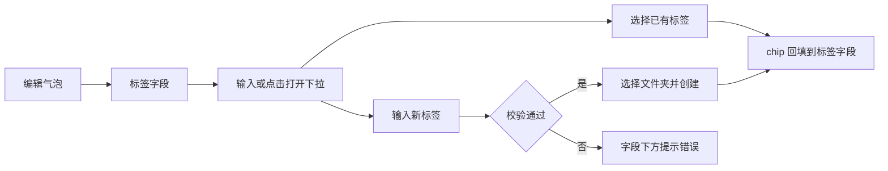
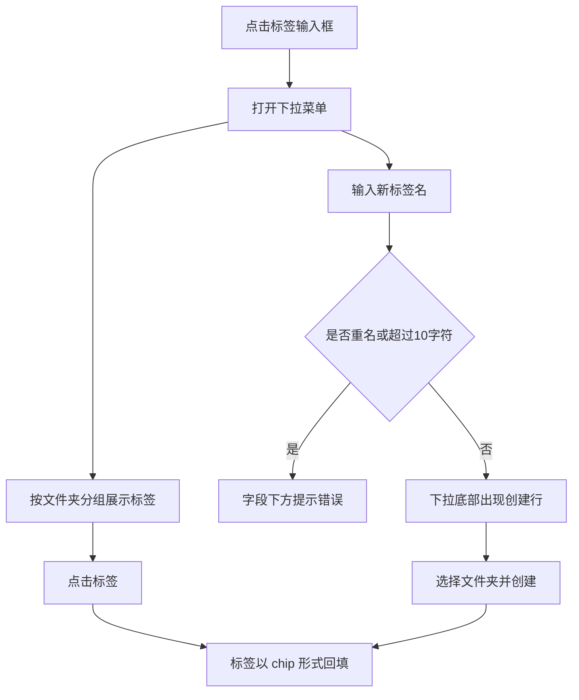
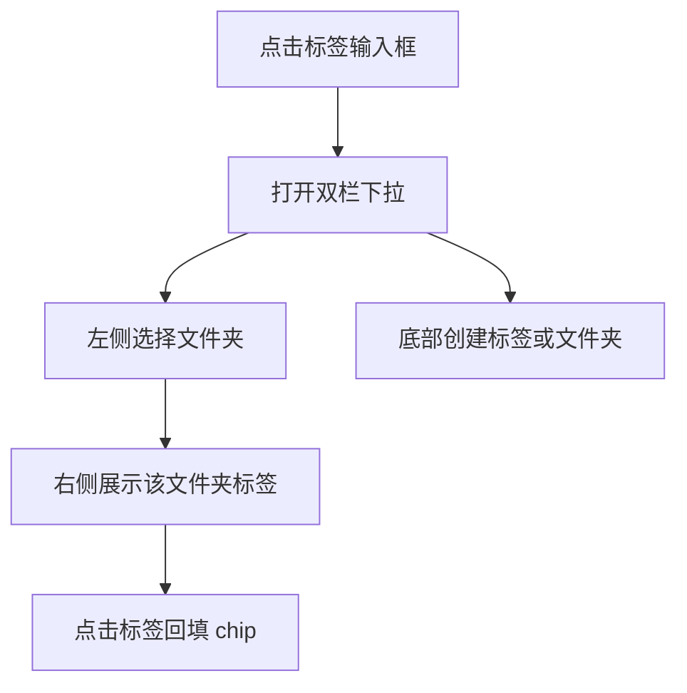
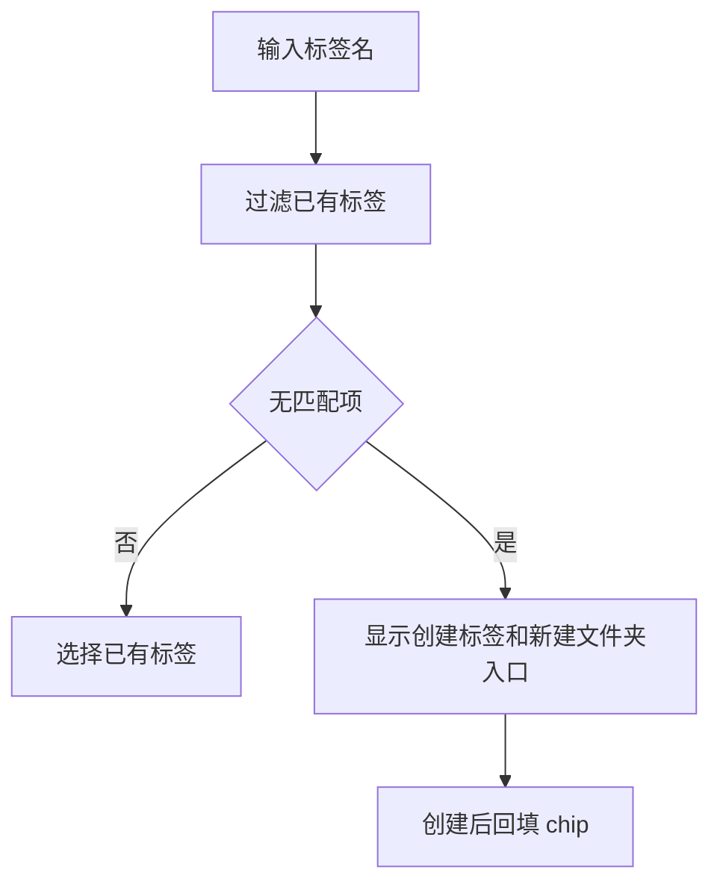

# Agent 配置标签气泡交互逻辑

> **原型文件**：prototype.html  
> **设计目标**：复刻 Agent 工作台中的编辑气泡，并在该气泡内用通用多选标签输入框完成标签选择、创建和文件夹归类。

---

## 零、评审摘要

### Agent 编辑气泡

**本次变更**
- 页面保持工作台结构：左侧配置、右侧预览，编辑气泡悬浮在 Agent 标题附近。
- 标签作为编辑气泡里的普通字段出现，不新增页面、不做大弹窗、不做权限表达。
- 推荐方案 A：`chip 多选输入框 + 按文件夹分组的下拉菜单`。
- 文件夹只用于整理标签；创建标签时在下拉底部选择文件夹即可。

**关键流程**

---

## 一、设计背景

当前页面类型是 Agent 配置页，主任务是编辑 Agent 基础信息，主对象是 Agent。标签只是一项轻量配置属性，适合沿用常见的多选输入框交互，而不是把标签管理做成独立流程。文件夹是标签的归类维度，不表达权限和可见范围。

---

## 二、完整操作流程

### 方案 A — 通用下拉

### 方案 B — 左侧文件夹

### 方案 C — 快速创建

---

## 三、完整交互细节说明

### 3.1 通用规则

| 用户操作 | 系统反馈 |
|----------|----------|
| 打开编辑气泡 | 标签字段显示已选标签 chip 和输入框。 |
| 点击或聚焦标签输入框 | 展开标签下拉菜单。 |
| 点击已有标签 | 选中标签回填为 chip；再次点击可取消选择。 |
| 点击 chip 的关闭按钮 | 从当前 Agent 移除该标签，不删除标签资产。 |
| 输入新标签名 | 下拉底部出现创建入口。 |
| 创建标签 | 选择文件夹后创建，创建成功后立即回填为 chip。 |
| 新建文件夹 | 在下拉内完成，新文件夹可立即作为标签归属。 |

### 3.2 校验规则

| 场景 | 系统反馈 |
|------|----------|
| 标签名为空 | 提示“请输入标签名”。 |
| 标签名重名 | 提示“标签不可以重名”。 |
| 标签名超过 10 个字符 | 提示“标签长度不可超过10个字符”。 |
| 文件夹名为空 | 提示“请输入文件夹名”。 |
| 文件夹名重名 | 提示“文件夹不可以重名”。 |

---

## 四、方案差异对比

| 维度 | 方案 A：通用下拉 | 方案 B：左侧文件夹 | 方案 C：快速创建 |
|------|------------------|--------------------|------------------|
| 推荐程度 | 推荐默认方案 | 标签较多时可选 | 高频创建时可选 |
| 是否像普通气泡字段 | 高 | 中 | 高 |
| 文件夹可见性 | 中 | 高 | 中 |
| 操作复杂度 | 低 | 中 | 低 |
| 适用场景 | 大多数 Agent 标签配置 | 标签量多、分组多 | 经常新建标签 |

---

## 五、待讨论问题

- [ ] 是否限制单个 Agent 可绑定的标签数量。
- [ ] 标签删除资产是否需要另设入口，本原型只覆盖从 Agent 上移除标签。
- [ ] 如果标签很多，是否在方案 A 的下拉顶部增加搜索结果优先展示。
