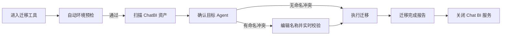
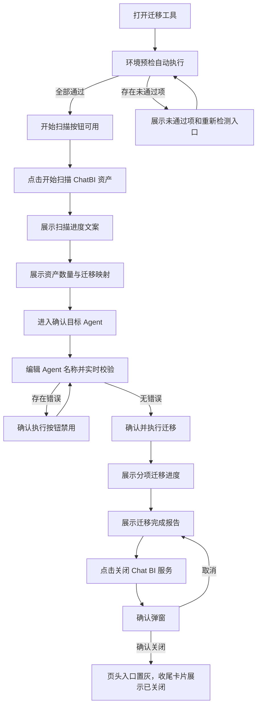

# ChatBI → Dora 迁移工具 Demo 交互逻辑

> **原型文件**：prototype.html  
> **设计目标**：验证独立迁移工具在预检扫描、目标 Agent 确认、执行报告与旧服务收尾中的完整交互闭环

---

## 零、评审摘要

### 迁移工具工作台

**设计要点**
- 工具以独立页面承载一次性迁移任务，采用三段式 Wizard：环境预检与资产扫描、确认目标 Agent、执行与报告。
- 页头保留两个全局入口：关闭 Chat BI 服务、查看 Chat BI 原配置。
- 关闭 Chat BI 服务是高风险一次性操作，页头入口与完成页收尾卡片共用同一确认弹窗和关闭状态。
- 目标 Agent 确认页只开放名称编辑，系统实时校验空名、迁移清单内同名、Dora 已存在同名。

**关键流程**

---

## 一、设计背景

ChatBI 资产迁移到 Dora 是面向超管的一次性治理任务。用户需要先确认运行条件满足要求，再查看原 ChatBI 资产会迁移到哪些 Dora 对象，最后执行迁移并完成旧服务收尾。原型重点验证流程是否足够线性、风险动作是否明确、命名冲突是否可在迁移前处理。

---

## 二、完整操作流程

---

## 三、完整交互细节说明

### 3.1 页头全局入口

| 用户操作 | 系统反馈 |
|----------|----------|
| 点击「Chat BI 原配置」 | 新开浏览器标签页查看旧配置，当前迁移页面保持不变 |
| 点击「关闭 Chat BI 服务」 | 打开确认弹窗，说明关闭旧入口不会删除 ChatBI 资产 |
| 在确认弹窗点击「取消」 | 关闭弹窗，服务状态保持未关闭 |
| 在确认弹窗点击「确认关闭 Chat BI 服务」 | 弹窗关闭，页头入口置为禁用态，完成页收尾卡片同步显示已关闭状态 |
| 服务已关闭后再次点击页头入口 | 入口保持禁用态，确认弹窗不触发 |

### 3.2 环境预检与资产扫描

| 用户操作 | 系统反馈 |
|----------|----------|
| 打开工具 | 系统自动执行环境预检，逐项检测 ChatBI 插件卸载状态、BI 版本、Dora 插件和超管权限 |
| 预检全部通过 | 状态文案显示预检完成，「开始扫描 ChatBI 资产」按钮可点击 |
| 预检存在未通过项 | 未通过项展示错误原因，页面提供「重新检测」入口，扫描按钮保持禁用 |
| 点击「开始扫描 ChatBI 资产」 | 预检卡片收起，展示扫描中状态和当前扫描日志 |
| 扫描完成 | 展示数据资产、业务知识、业务用语数量，并展示迁移映射说明 |
| 点击「重新检测」 | 回到预检卡片，重新执行环境检测 |

### 3.3 确认目标 Agent

| 用户操作 | 系统反馈 |
|----------|----------|
| 点击「确认目标Agent」 | 进入目标 Agent 确认页，系统根据扫描结果生成目标列表 |
| 查看顶部摘要 | 摘要展示将创建的 Agent 数量、命名冲突数、迁移组织方式 |
| 编辑 Agent 名称 | 系统实时校验名称，列表行和输入框同步展示校验结果 |
| 名称为空 | 当前行展示「Agent 名称不能为空」，确认执行按钮禁用 |
| 名称与 Dora 已存在 Agent 重名 | 当前行展示「Dora 中已存在同名 Agent」，确认执行按钮禁用 |
| 迁移清单内出现重名 | 相关行展示「迁移清单中存在同名 Agent」，确认执行按钮禁用 |
| 所有名称校验通过 | 命名冲突数归零，「确认并执行迁移」按钮可点击 |

### 3.4 执行迁移与报告

| 用户操作 | 系统反馈 |
|----------|----------|
| 点击「确认并执行迁移」 | 进入执行页，按数据中心、知识库与语义信息、Agent 创建、推荐问题、模型配置展示迁移进度 |
| 迁移执行中 | 页面提示不要关闭页面，进度条逐项推进 |
| 迁移完成 | 页面切换为完成态，展示完成时间、耗时、统计卡片、迁移明细和报告下载入口 |
| 点击「下载报告 PDF」 | 原型弹出下载成功提示 |
| 在完成页点击「关闭chatbi服务」 | 打开与页头一致的确认弹窗 |
| 确认关闭旧服务 | 完成页收尾卡片展示已关闭状态，操作按钮隐藏 |

---

## 四、方案差异对比

当前原型只有一个方案。顶部方案栏保留，用于评审时开启交互说明和演示状态跳转。

---

## 五、待讨论问题

- [ ] 环境预检失败时，是否需要提供跳转到平台升级或插件安装页面的直接入口？
- [ ] 迁移执行失败时，是否支持按失败项重试，还是只支持重新发起完整迁移？
- [ ] 关闭 Chat BI 服务后，是否需要在迁移报告中记录关闭操作者和关闭时间？
