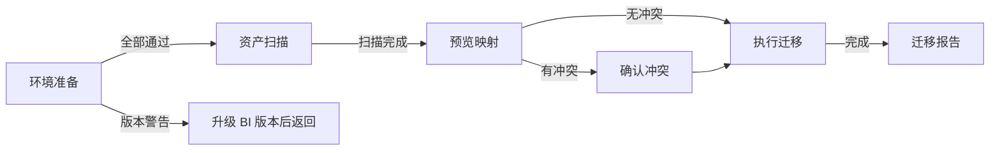
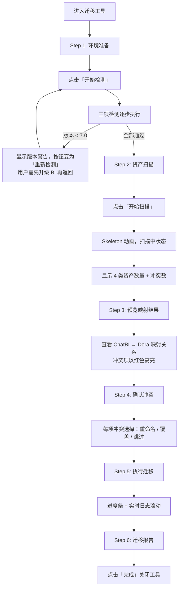

# ChatBI 迁移工具 交互逻辑

> **原型文件**：prototype.html  
> **设计目标**：验证独立迁移小工具的 5 步线性流程，覆盖环境检测 → 资产扫描 → 映射预览 → 冲突处理 → 执行报告全链路

---

## 零、评审摘要

### 迁移工具主流程

**设计要点**
- 独立小工具（非嵌入主产品），单页面 Wizard 模式
- 5 步线性流程，顶部步骤导航，底部固定操作栏
- 每步明确告知用户「当前在做什么」和「下一步做什么」
- 版本警告是关键阻断点：6.1 版本需先升级再迁移

**关键流程**

---

## 一、设计背景

ChatBI 迁移到 Dora Agent 是一次性的资产搬迁操作，用户（超管）需要在环境满足条件后，一次性完成所有资产的映射和迁移。作为独立工具，需要流程引导清晰、每步状态明确、错误可恢复。

---

## 二、完整操作流程

---

## 三、完整交互细节说明

### 3.1 环境准备

| 用户操作 | 系统反馈 |
|----------|----------|
| 进入工具，查看 Step 1 | 三项检测均为未检测状态（空圆圈图标） |
| 点击「开始检测」 | 逐项显示旋转加载图标，依次检测 |
| 所有检测通过 | 三项均显示绿色勾，按钮变为「下一步」 |
| 版本检测发现 6.1 | 该项显示橙色警告，展开说明文案：需先升级 BI 至 7.0；按钮变为「重新检测」 |
| 点击「重新检测」 | 重新执行全部检测流程 |

### 3.2 资产扫描

| 用户操作 | 系统反馈 |
|----------|----------|
| 进入 Step 2，未扫描 | 4 个数量格显示空占位，说明文案提示点击开始扫描 |
| 点击「开始扫描」 | 数量格显示骨架屏动效，底部状态条显示「正在扫描…」 |
| 扫描完成 | 数量格显示真实数字，底部状态条变绿色，显示总数和冲突数 |

### 3.3 预览映射结果

| 用户操作 | 系统反馈 |
|----------|----------|
| 进入 Step 3 | 展示 ChatBI 资产 → Dora Agent 结构的映射列表，冲突项行背景变为浅红 + 「命名冲突」badge |
| 点击「下一步：确认冲突」 | 进入冲突处理步骤 |

### 3.4 确认冲突

| 用户操作 | 系统反馈 |
|----------|----------|
| 进入 Step 4 | 展示每项冲突，每项有 3 个单选项（重命名 / 覆盖 / 跳过），默认选中「重命名」 |
| 选择处理方式 | 对应行边框高亮为蓝色，记录选择 |
| 点击「开始迁移」 | 进入执行步骤 |

### 3.5 执行迁移

| 用户操作 | 系统反馈 |
|----------|----------|
| 进入 Step 5 | 进度条自动开始，显示 0% |
| 迁移执行中 | 进度条逐步推进，日志区域实时追加每项操作结果 |
| 迁移完成（100%） | 进度条变满，日志末行显示「迁移任务全部完成 ✓」，「查看报告」按钮可点击 |

### 3.6 迁移报告

| 用户操作 | 系统反馈 |
|----------|----------|
| 进入 Step 6 | 展示成功 banner + 三项统计数字（成功/处理/失败） + 四类资产迁移明细 |
| 点击「完成」 | 关闭迁移工具，返回主系统 |

---

## 四、待讨论问题

- [ ] 版本警告状态下是否允许跳过检测强行继续？
- [ ] 迁移失败某一项时，是否支持重试单项，还是必须整体重新迁移？
- [ ] 「完成」后是否需要跳转到 Dora Agent 某个具体页面？
