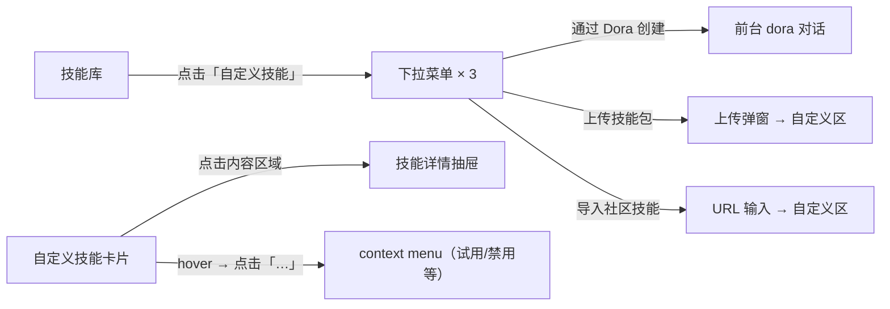
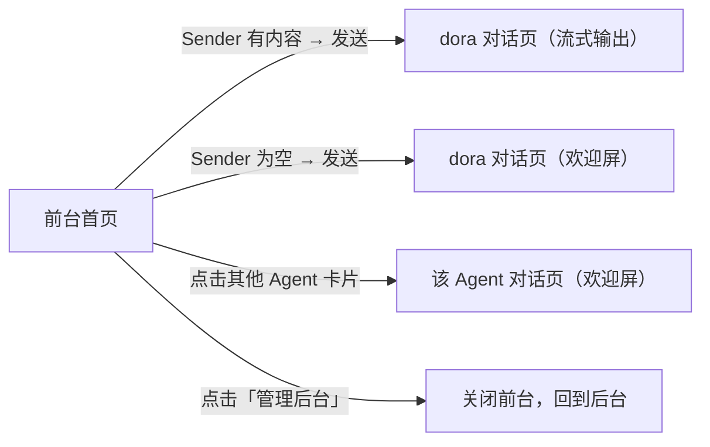
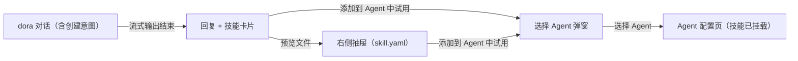
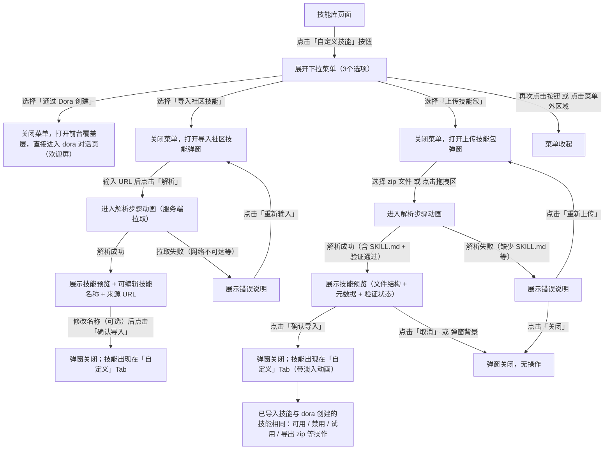
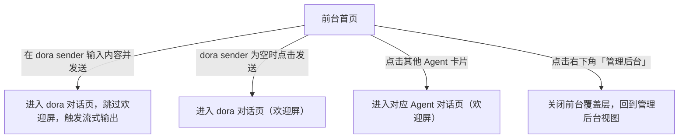
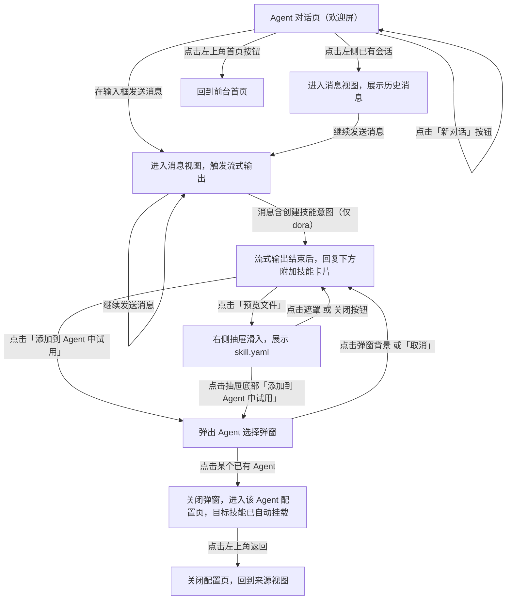
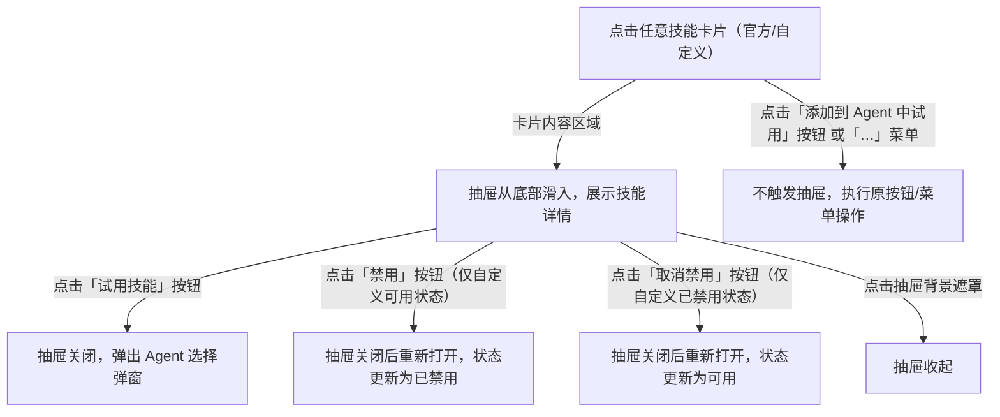
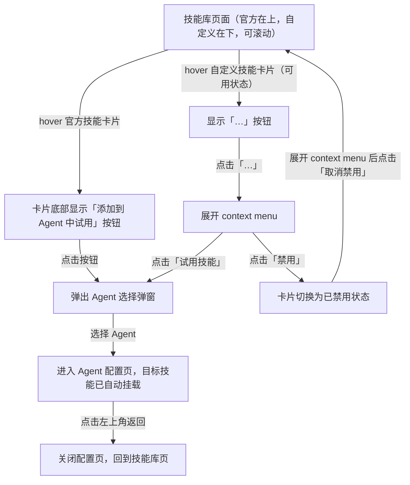

# 自定义技能入口 交互逻辑

> **原型文件**：prototype.html  
> **设计目标**：验证「自定义技能入口」的完整操作链路——从后台技能库激活入口，到前台 dora 对话创建技能，再到技能挂载 Agent 试用  
> **方案对比**：方案「跳转」vs 方案「新 Tab」，差异仅在前后台切换的导航模式，所有其他交互逻辑相同

---

## 零、评审摘要

> 供评审使用——每个变更页面一节，只含本次改了什么 + 核心流程。细节见下方第二、三部分。

### A — 后台技能库

**本次变更**
- 「自定义技能」按钮从禁用改为可点击，展开含 3 个选项的下拉菜单
- 技能库页面布局改为上下分区（官方在上、自定义在下），取消 Tab 切换
- 自定义技能卡片新增「…」context menu 及可用 / 已禁用两种状态
- 新增「上传技能包」弹窗（选文件 → 解析 → 预览确认）
- 新增「导入社区技能」弹窗（URL 输入 → 服务端拉取 → 预览确认）
- 新增技能详情抽屉（点击卡片内容区域触发，底部滑入）

**关键流程**

---

### B — 前台首页

**本次变更**
- dora 从普通 Agent 卡片升级为差异化首屏区域：渐变背景上直接展示头像 + 名称 + Sender
- 首页 Sender 支持直接输入发送（有内容时跳过欢迎屏、触发流式输出；为空时进欢迎屏）

**关键流程**

---

### C — 前台对话页 · 技能创建链路

**本次变更**
- dora 对话含「创建技能」意图时，流式回复下方附加技能卡片
- 技能卡片支持「预览文件」（右侧抽屉，展示 skill.yaml）和「添加到 Agent 中试用」
- 选择 Agent 后进入配置页，目标技能已自动挂载并带「新加入」标签

**关键流程**

---

## 一、设计背景

原技能库页面的「自定义技能」按钮为禁用状态（tooltip 提示「即将推出」），用户无法创建自定义技能，也没有完整的创建→使用路径。

本原型验证三件事：
1. 自定义技能入口激活：按钮改为可点击，展开三条创建路径的下拉菜单
2. 通过 dora 对话创建技能的完整流程：前台首页 → dora 对话 → 技能生成 → 试用
3. 前台首页 dora 区域的视觉差异化：dora 不放在卡片中，直接在背景上呈现 sender

---

## 二、完整操作流程

### A — 自定义技能入口（后台技能库）

### B — 前台首页

### C — 前台 Agent 对话页

### D — 技能详情抽屉

### E — 后台技能库触发「添加到 Agent」

---

## 三、交互规格

### 3.1 自定义技能按钮与下拉菜单

| 用户操作 | 系统反馈 |
|----------|----------|
| 点击「自定义技能」按钮 | 按钮下方出现下拉菜单（含3个选项）；按钮变为激活态 |
| 再次点击按钮 | 菜单收起；按钮恢复默认态 |
| 点击菜单外任意区域 | 菜单收起；按钮恢复默认态 |
| 选择「通过 Dora 创建」 | 菜单收起；打开前台覆盖层，直接进入 dora 对话页欢迎屏 |
| 选择「导入社区技能」 | 菜单收起（功能待定，当前无后续操作） |
| 选择「上传技能包」 | 菜单收起（功能待定，当前无后续操作） |

**按钮状态**

| 状态 | 条件 |
|------|------|
| 默认可点击 | 进入技能库页面 |
| 激活（菜单展开中） | 已点击按钮，菜单可见 |

### 3.2 前台首页

#### dora 首屏区域

dora 不放在卡片背景中，直接在渐变背景上展示 Agent 信息（头像 + 名称）+ Sender 输入框。

| 用户操作 | 系统反馈 |
|----------|----------|
| 在 Sender 输入内容并发送（回车或点击发送按钮） | 跳过欢迎屏，直接进入 dora 对话页并触发流式输出 |
| 输入内容含创建技能意图关键词 | 进入 dora 对话页后，触发技能创建流式输出，回复中包含技能卡片 |
| Sender 为空时点击发送 | 进入 dora 对话页欢迎屏 |

#### 其他 Agent 区域

| 用户操作 | 系统反馈 |
|----------|----------|
| 点击任意 Agent 卡片 | 进入该 Agent 对话页（欢迎屏） |

#### 管理后台入口

| 用户操作 | 系统反馈 |
|----------|----------|
| 点击右下角「管理后台」按钮 | 关闭前台覆盖层，显示管理后台页面 |

### 3.3 前台 Agent 对话页

#### Sidebar

| 用户操作 | 系统反馈 |
|----------|----------|
| 点击左上角首页图标 | 回到前台首页（欢迎屏消失，重置当前 Agent 状态） |
| 点击 Agent 列表中的某个 Agent | 切换到该 Agent 的欢迎屏，会话列表更新 |
| 点击「新对话」按钮 | 显示当前 Agent 的欢迎屏，清空历史输入 |
| 点击某条历史会话 | 进入消息视图，展示该会话历史消息 |
| hover 历史会话 | 显示重命名、删除两个操作按钮（当前原型中点击无实际操作） |
| 点击折叠按钮 | Sidebar 收起；再次点击展开 |

#### 欢迎屏

| 用户操作 | 系统反馈 |
|----------|----------|
| 在输入框发送消息（回车或点击发送按钮） | 进入消息视图，立即显示用户消息气泡，触发 AI 流式输出 |
| 输入框为空时点击发送 | 无响应 |

#### AI 流式输出

| 阶段 | 系统表现 |
|------|----------|
| 发送后立即 | 用户消息气泡出现；AI 侧显示「思考中」三点跳动动画，持续约 1.5 秒 |
| 思考结束后 | 文字逐字流式输出（约 18ms/字） |
| 输出完毕 | 文字渲染为 Markdown 格式；若含技能卡片，卡片以淡入方式附加在回复下方 |

#### 消息视图

| 用户操作 | 系统反馈 |
|----------|----------|
| 在底部输入框发送消息 | AI 继续流式回复（原型演示固定回复，无实际分析） |

### 3.4 技能卡片

技能卡片出现在 dora 含创建意图的对话回复中（欢迎屏发送或首页 dora sender 发送均可触发）。

| 用户操作 | 系统反馈 |
|----------|----------|
| 查看技能卡片 | 展示技能名称、类型标签、描述；底部两个操作按钮：「预览文件」「添加到 Agent 中试用」 |
| 点击「预览文件」 | 右侧抽屉滑入，展示 skill.yaml 配置内容；背景添加遮罩 |
| 点击「添加到 Agent 中试用」 | 弹出 Agent 选择弹窗 |

### 3.5 技能预览抽屉

| 用户操作 | 系统反馈 |
|----------|----------|
| 抽屉打开 | 展示技能基本信息（名称、类型）+ skill.yaml 代码内容 |
| 点击遮罩 或 抽屉内关闭按钮 | 抽屉收起 |
| 点击抽屉底部「添加到 Agent 中试用」 | 抽屉收起，弹出 Agent 选择弹窗 |

### 3.6 添加到 Agent 弹窗

触发来源：技能卡片按钮、技能抽屉底部按钮、技能库页卡片按钮。

| 用户操作 | 系统反馈 |
|----------|----------|
| 弹窗打开 | 标题显示技能名称；列出可选 Agent（见下方限制说明）+ 「新建 Agent」选项 |
| 点击某个已有 Agent | 弹窗关闭；进入该 Agent 配置页，目标技能已自动出现在「技能」分区（带「新加入」标签） |
| 点击「新建 Agent」 | 弹窗关闭；进入 Agent 配置页，为新建空白 Agent（名称显示「未命名 Agent」，配置面板无预设内容），技能分区仅包含目标技能（带「新加入」标签） |
| 点击弹窗背景 或「取消」 | 弹窗关闭，回到来源视图 |

**Agent 列表限制**：dora 不在可选列表中——dora 是技能创建工具本身，不作为技能的承载 Agent。

### 3.7 Agent 配置页

静态页面，不含实际保存逻辑。

| 状态      | 说明                                               |
| ------- | ------------------------------------------------ |
| 进入配置页   | 顶部显示 Agent 名称、已发布状态、保存/发布按钮；左侧配置面板；右侧预览面板        |
| 技能分区    | 显示原有默认技能「报表生成技能」+ 新加入的技能（带「新加入」标签）               |
| 点击左上角返回 | 关闭配置页（及前台覆盖层），进入后台 Agent 管理页；左侧导航高亮切换至「Agent 管理」 |

**技能禁用状态联动**

当配置页中已挂载某个自定义技能，用户在技能库将该技能禁用后，该技能项在 Agent 配置页的技能分区中实时追加「已禁用」灰色标签；若用户随后取消禁用，标签同步移除。配置页无需刷新或重新进入。

### 3.8 技能库页（后台）

技能库页面不使用 Tab 切换，「官方」和「自定义」两组技能以分区标题上下排列，整个区域可滚动。官方技能位于上方，自定义技能位于下方。

#### 官方技能卡片

| 用户操作 | 系统反馈 |
|----------|----------|
| hover 技能卡片 | 卡片底部显示「添加到 Agent 中试用」按钮 |
| 点击「添加到 Agent 中试用」 | 弹出 Agent 选择弹窗（同 3.6） |

#### 自定义技能卡片——状态

自定义技能有两种状态：

| 状态 | 卡片外观 | 可用操作 |
|------|----------|----------|
| 可用 | 正常卡片样式；右上角「可用」绿色标签 | 试用技能 / 禁用 / 复制 / 导出 zip / 删除 |
| 已禁用 | 卡片内容降低不透明度，背景变灰；右上角「已禁用」灰色标签；底部「添加到 Agent」按钮隐藏 | 取消禁用 / 复制 / 导出 zip / 删除 |

#### 自定义技能卡片——context menu

| 用户操作 | 系统反馈 |
|----------|----------|
| hover 自定义技能卡片 | 卡片右上角显示「…」按钮 |
| 点击「…」按钮 | 展开 context menu；menu 固定定位，不受卡片列表 overflow 截断；若下方空间不足则向上展开 |
| 再次点击「…」按钮 或 点击 menu 外区域 | menu 收起 |
| 点击「试用技能」（仅可用状态） | menu 收起；弹出 Agent 选择弹窗（同 3.6） |
| 点击「禁用」（仅可用状态） | menu 收起；卡片切换为已禁用状态（标签变「已禁用」，内容变灰，「添加到 Agent」按钮隐藏） |
| 点击「取消禁用」（仅已禁用状态） | menu 收起；卡片恢复为可用状态 |
| 点击「复制」 | menu 收起（功能待定，当前无后续操作） |
| 点击「导出 zip」 | menu 收起（功能待定，当前无后续操作） |
| 点击「删除」 | menu 收起（功能待定，当前无后续操作） |

### 3.9 上传技能包弹窗

弹窗从「自定义技能」下拉菜单的「上传技能包」入口打开。

#### 步骤一：选择文件

| 用户操作 | 系统反馈 |
|----------|----------|
| 拖拽 zip 文件至拖拽区 / 点击拖拽区 | 进入解析步骤（步骤二） |
| 点击弹窗关闭按钮 | 弹窗关闭 |

拖拽区显示提示：最大 50MB，根目录须包含 SKILL.md。

#### 步骤二：解析中

系统依次执行以下解析步骤，每步完成后高亮下一步：

1. 解压 zip 文件
2. 检测 SKILL.md
3. 提取元数据（name、description 等 YAML frontmatter 字段）
4. 执行元数据验证

| 结果 | 后续 |
|------|------|
| 全部通过 | 自动进入步骤三（预览确认） |
| 检测到错误（如缺少 SKILL.md） | 步骤高亮变为错误色，跳转至错误态 |

#### 步骤三：预览确认

展示解析结果，供用户核对后再导入：

| 区域 | 内容 |
|------|------|
| 技能卡头部 | 技能图标 + 名称 + 描述 + 「验证通过」绿色标签 |
| 文件结构 | 展示 zip 内目录树（SKILL.md、scripts/、references/ 等），每项显示验证状态 ✓ |

| 用户操作 | 系统反馈 |
|----------|----------|
| 点击「确认导入」 | 弹窗关闭；自动切换到「自定义」Tab；新技能卡片以淡入动画出现在列表末尾；卡片初始状态为「可用」 |
| 点击「取消」 或 弹窗背景 | 弹窗关闭，不导入 |

#### 错误态

| 用户操作 | 系统反馈 |
|----------|----------|
| 点击「重新上传」 | 弹窗回到步骤一（选择文件） |
| 点击「关闭」 | 弹窗关闭 |

**导入后的技能与通过 dora 创建的技能完全等同**：拥有相同的卡片结构、「…」context menu（试用技能 / 禁用 / 复制 / 导出 zip / 删除）和可用 / 已禁用状态切换逻辑。

### 3.10 导入社区技能弹窗

弹窗从「自定义技能」下拉菜单的「导入社区技能」入口打开。

#### 步骤一：URL 输入

| 元素 | 说明 |
|------|------|
| URL 输入框 | 预置说明文字；用户粘贴或输入 URL 后自动识别类型 |
| URL 类型识别 | 实时显示在输入框下方：GitHub 仓库 / 直链 zip 文件 / HTTP 地址，附说明文字 |
| 提示文案 | 「仅支持公开可访问的 URL，服务端代理请求以避免 CORS 限制」 |

| 用户操作 | 系统反馈 |
|----------|----------|
| 在输入框输入 / 粘贴 URL | 识别 URL 类型，更新类型标签和说明 |
| 点击「解析」 | 进入解析步骤（步骤二） |
| 点击「取消」 或 关闭按钮 | 弹窗关闭 |

#### 步骤二：服务端拉取与解析中

系统依次执行以下步骤，每步完成后高亮下一步：

1. 建立服务端请求
2. 拉取远程内容
3. 解析技能元数据
4. 执行元数据验证

| 结果 | 后续 |
|------|------|
| 全部通过 | 自动进入步骤三（预览确认） |
| 拉取失败（URL 不可达、超时等） | 步骤高亮变为错误色，跳转至错误态 |

#### 步骤三：预览确认

| 区域 | 内容 |
|------|------|
| 技能卡头部 | 技能图标 + 解析到的名称 + 描述 + 「验证通过」绿色标签 |
| 技能名称（可编辑） | 预填解析到的 name 字段；用户可修改以避免与已有技能冲突 |
| 文件结构 | zip 内目录树，每项显示验证状态 ✓ |
| 来源 URL | 显示导入的原始 URL，系统将记录用于后续溯源和更新 |

| 用户操作 | 系统反馈 |
|----------|----------|
| 修改技能名称输入框 | 实时更新（导入后卡片使用修改后的名称） |
| 点击「确认导入」 | 弹窗关闭；自动切换到「自定义」Tab；新技能卡片以淡入动画出现在列表末尾；卡片初始状态为「可用」 |
| 点击「取消」 或 弹窗背景 | 弹窗关闭，不导入 |

#### 错误态

| 用户操作 | 系统反馈 |
|----------|----------|
| 点击「重新输入」 | 弹窗回到步骤一（保留原 URL 供修改） |
| 点击「关闭」 | 弹窗关闭 |

**导入后的技能与通过 dora 创建或 zip 上传的技能完全等同**：拥有相同的卡片结构和所有 context menu 操作。系统内部记录来源 URL，支持后续溯源。

### 3.11 技能详情抽屉

点击任意技能卡片（官方或自定义）的内容区域，从屏幕底部滑入抽屉，展示技能完整信息。

**触发规则**

| 触发条件 | 结果 |
|----------|------|
| 点击技能卡片的内容区域（卡片主体） | 抽屉从底部滑入 |
| 点击「添加到 Agent 中试用」按钮 | 不触发抽屉，直接弹出 Agent 选择弹窗 |
| 点击「…」菜单按钮 | 不触发抽屉，展开 context menu |

**抽屉结构**

| 区域                | 内容                                                    |
| ----------------- | ----------------------------------------------------- |
| 拖拽把手              | 顶部居中的拖拽条                                              |
| 技能图标              | 与卡片相同的图标背景和 SVG                                       |
| 技能名称              | 右侧笔形「编辑」按钮仅自定义技能可见（原型中点击无操作）                          |
| 操作按钮区             | 自定义技能：状态标签（可用/已禁用）+ 禁用/取消禁用按钮 + 试用技能按钮；官方技能：仅试用技能按钮   |
| 描述                | 技能功能说明文本                                              |
| 来源标签              | 彩色标签区分四种来源：官方（灰）/ dora 创建（蓝）/ 上传（橙）/ 导入（浅蓝）           |
| 来源路径              | 上传显示 zip 文件名；导入显示原始 URL；官方/dora 创建不显示                 |
| 创建时间              | 官方显示「系统内置」；自定义显示创建日期                                  |
| 文件树（左侧面板）         | SKILL.md（高亮选中）+ assets/、references/、scripts/ 三个目录及其文件 |
| SKILL.md 预览（右侧面板） | YAML frontmatter（含语法高亮）+ 技能描述 + 使用示例代码块               |

**操作反馈**

| 用户操作 | 系统反馈 |
|----------|----------|
| 点击「试用技能」 | 抽屉关闭，弹出 Agent 选择弹窗（同 3.6） |
| 点击「禁用」（自定义可用状态） | 抽屉关闭后重新打开，状态更新为已禁用；对应技能卡片同步更新 |
| 点击「取消禁用」（自定义已禁用状态） | 抽屉关闭后重新打开，状态更新为可用；对应技能卡片同步更新 |
| 点击抽屉背景遮罩 | 抽屉收起 |

---

## 四、方案差异对比

| 维度            | 方案「跳转」              | 方案「新 Tab」                  |
| ------------- | ------------------- | -------------------------- |
| 前后台切换方式       | 同页面覆盖层切换（overlay）   | 模拟新浏览器标签页                  |
| 前台打开后         | 全屏覆盖管理后台，不可同时可见     | 浏览器 Tab 栏新增「前台对话」Tab，可来回切换 |
| 管理后台入口        | 关闭覆盖层，返回后台          | 切换到「管理后台」Tab               |
| 关闭前台          | 覆盖层消失，回到后台          | 点击 Tab 上的 × 关闭前台 Tab       |
| 「通过 Dora 创建」  | 覆盖层打开，直接进入 dora 对话  | 新 Tab 打开，直接进入 dora 对话      |
| Agent 配置页「返回」 | 关闭配置层，跳转后台 Agent 管理 | 关闭前台 Tab，跳转后台 Agent 管理（同左） |

---

## 五、待讨论问题

- [x] 「上传技能包」交互流程已确定（见 3.9）
- [x] 「导入社区技能」交互流程已确定（见 3.10）
- [ ] 「添加到 Agent 中试用」完成后是否需要有确认/反馈提示？
- [ ] 三个自定义技能入口是否存在权限差异（例如社区版不显示「上传」）？
- [ ] Agent 配置页点击「返回」的来源记忆逻辑（从前台来还是从后台来）
