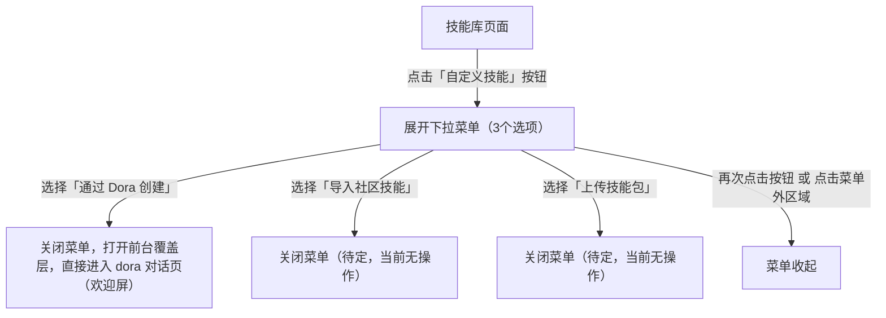
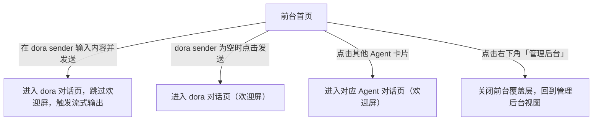
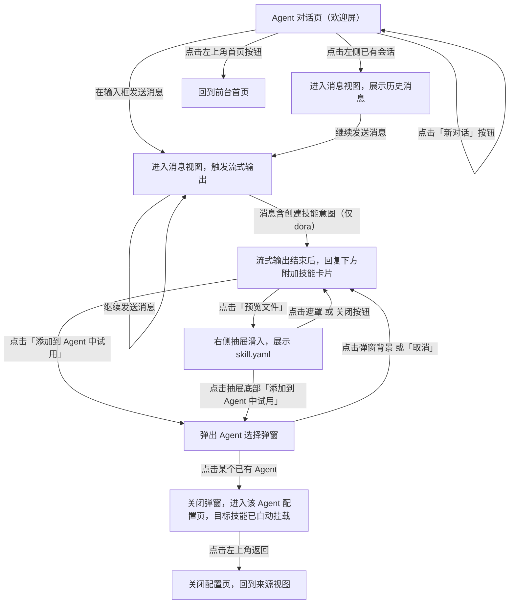
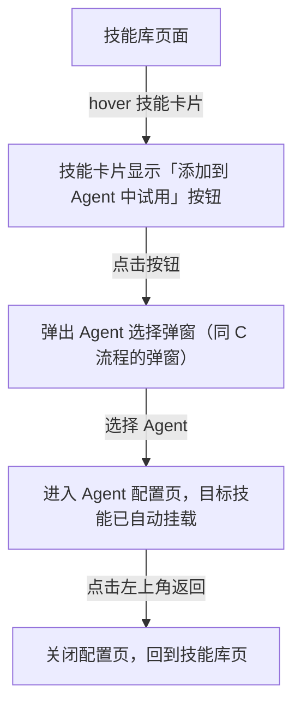

# 自定义技能入口 交互逻辑

> **原型文件**：prototype.html  
> **设计目标**：验证「自定义技能入口」的完整操作链路——从后台技能库激活入口，到前台 dora 对话创建技能，再到技能挂载 Agent 试用  
> **方案对比**：方案「跳转」vs 方案「新 Tab」，差异仅在前后台切换的导航模式，所有其他交互逻辑相同

---

## 一、设计背景

原技能库页面的「自定义技能」按钮为禁用状态（tooltip 提示「即将推出」），用户无法创建自定义技能，也没有完整的创建→使用路径。

本原型验证三件事：
1. 自定义技能入口激活：按钮改为可点击，展开三条创建路径的下拉菜单
2. 通过 dora 对话创建技能的完整流程：前台首页 → dora 对话 → 技能生成 → 试用
3. 前台首页 dora 区域的视觉差异化：dora 不放在卡片中，直接在背景上呈现 sender

---

## 二、操作流程

### A — 自定义技能入口（后台技能库）

### B — 前台首页

### C — 前台 Agent 对话页

### D — 后台技能库触发「添加到 Agent」

---

## 三、交互规格

### 3.1 自定义技能按钮与下拉菜单

| 用户操作 | 系统反馈 |
|----------|----------|
| 点击「自定义技能」按钮 | 按钮下方出现下拉菜单（含3个选项）；按钮变为激活态 |
| 再次点击按钮 | 菜单收起；按钮恢复默认态 |
| 点击菜单外任意区域 | 菜单收起；按钮恢复默认态 |
| 选择「通过 Dora 创建」 | 菜单收起；打开前台覆盖层，直接进入 dora 对话页欢迎屏 |
| 选择「导入社区技能」 | 菜单收起（功能待定，当前无后续操作） |
| 选择「上传技能包」 | 菜单收起（功能待定，当前无后续操作） |

**按钮状态**

| 状态 | 条件 |
|------|------|
| 默认可点击 | 进入技能库页面 |
| 激活（菜单展开中） | 已点击按钮，菜单可见 |

### 3.2 前台首页

#### dora 首屏区域

dora 不放在卡片背景中，直接在渐变背景上展示 Agent 信息（头像 + 名称）+ Sender 输入框。

| 用户操作 | 系统反馈 |
|----------|----------|
| 在 Sender 输入内容并发送（回车或点击发送按钮） | 跳过欢迎屏，直接进入 dora 对话页并触发流式输出 |
| 输入内容含创建技能意图关键词 | 进入 dora 对话页后，触发技能创建流式输出，回复中包含技能卡片 |
| Sender 为空时点击发送 | 进入 dora 对话页欢迎屏 |

#### 其他 Agent 区域

| 用户操作 | 系统反馈 |
|----------|----------|
| 点击任意 Agent 卡片 | 进入该 Agent 对话页（欢迎屏） |

#### 管理后台入口

| 用户操作 | 系统反馈 |
|----------|----------|
| 点击右下角「管理后台」按钮 | 关闭前台覆盖层，显示管理后台页面 |

### 3.3 前台 Agent 对话页

#### Sidebar

| 用户操作 | 系统反馈 |
|----------|----------|
| 点击左上角首页图标 | 回到前台首页（欢迎屏消失，重置当前 Agent 状态） |
| 点击 Agent 列表中的某个 Agent | 切换到该 Agent 的欢迎屏，会话列表更新 |
| 点击「新对话」按钮 | 显示当前 Agent 的欢迎屏，清空历史输入 |
| 点击某条历史会话 | 进入消息视图，展示该会话历史消息 |
| hover 历史会话 | 显示重命名、删除两个操作按钮（当前原型中点击无实际操作） |
| 点击折叠按钮 | Sidebar 收起；再次点击展开 |

#### 欢迎屏

| 用户操作 | 系统反馈 |
|----------|----------|
| 在输入框发送消息（回车或点击发送按钮） | 进入消息视图，立即显示用户消息气泡，触发 AI 流式输出 |
| 输入框为空时点击发送 | 无响应 |

#### AI 流式输出

| 阶段 | 系统表现 |
|------|----------|
| 发送后立即 | 用户消息气泡出现；AI 侧显示「思考中」三点跳动动画，持续约 1.5 秒 |
| 思考结束后 | 文字逐字流式输出（约 18ms/字） |
| 输出完毕 | 文字渲染为 Markdown 格式；若含技能卡片，卡片以淡入方式附加在回复下方 |

#### 消息视图

| 用户操作 | 系统反馈 |
|----------|----------|
| 在底部输入框发送消息 | AI 继续流式回复（原型演示固定回复，无实际分析） |

### 3.4 技能卡片

技能卡片出现在 dora 含创建意图的对话回复中（欢迎屏发送或首页 dora sender 发送均可触发）。

| 用户操作 | 系统反馈 |
|----------|----------|
| 查看技能卡片 | 展示技能名称、类型标签、描述；底部两个操作按钮：「预览文件」「添加到 Agent 中试用」 |
| 点击「预览文件」 | 右侧抽屉滑入，展示 skill.yaml 配置内容；背景添加遮罩 |
| 点击「添加到 Agent 中试用」 | 弹出 Agent 选择弹窗 |

### 3.5 技能预览抽屉

| 用户操作 | 系统反馈 |
|----------|----------|
| 抽屉打开 | 展示技能基本信息（名称、类型）+ skill.yaml 代码内容 |
| 点击遮罩 或 抽屉内关闭按钮 | 抽屉收起 |
| 点击抽屉底部「添加到 Agent 中试用」 | 抽屉收起，弹出 Agent 选择弹窗 |

### 3.6 添加到 Agent 弹窗

触发来源：技能卡片按钮、技能抽屉底部按钮、技能库页卡片按钮。

| 用户操作 | 系统反馈 |
|----------|----------|
| 弹窗打开 | 标题显示技能名称；列出可选 Agent（见下方限制说明）+ 「新建 Agent」选项 |
| 点击某个已有 Agent | 弹窗关闭；进入该 Agent 配置页，目标技能已自动出现在「技能」分区（带「新加入」标签） |
| 点击「新建 Agent」 | 弹窗关闭；进入 Agent 配置页，为新建空白 Agent（名称显示「未命名 Agent」，配置面板无预设内容），技能分区仅包含目标技能（带「新加入」标签） |
| 点击弹窗背景 或「取消」 | 弹窗关闭，回到来源视图 |

**Agent 列表限制**：dora 不在可选列表中——dora 是技能创建工具本身，不作为技能的承载 Agent。

### 3.7 Agent 配置页

静态页面，不含实际保存逻辑。

| 状态 | 说明 |
|------|------|
| 进入配置页 | 顶部显示 Agent 名称、已发布状态、保存/发布按钮；左侧配置面板；右侧预览面板 |
| 技能分区 | 显示原有默认技能「报表生成技能」+ 新加入的技能（带「新加入」标签） |
| 点击左上角返回 | 关闭配置页（及前台覆盖层），进入后台 Agent 管理页；左侧导航高亮切换至「Agent 管理」 |

### 3.8 技能库页（后台）

| 用户操作 | 系统反馈 |
|----------|----------|
| hover 技能卡片 | 卡片右下角显示「添加到 Agent 中试用」按钮 |
| 点击「添加到 Agent 中试用」 | 弹出 Agent 选择弹窗（同 3.6） |

---

## 四、方案差异对比

| 维度 | 方案「跳转」 | 方案「新 Tab」 |
|------|-------------|---------------|
| 前后台切换方式 | 同页面覆盖层切换（overlay） | 模拟新浏览器标签页 |
| 前台打开后 | 全屏覆盖管理后台，不可同时可见 | 浏览器 Tab 栏新增「前台对话」Tab，可来回切换 |
| 管理后台入口 | 关闭覆盖层，返回后台 | 切换到「管理后台」Tab |
| 关闭前台 | 覆盖层消失，回到后台 | 点击 Tab 上的 × 关闭前台 Tab |
| 「通过 Dora 创建」| 覆盖层打开，直接进入 dora 对话 | 新 Tab 打开，直接进入 dora 对话 |
| Agent 配置页「返回」| 关闭配置层，跳转后台 Agent 管理 | 关闭前台 Tab，跳转后台 Agent 管理（同左） |

---

## 五、待讨论问题

- [ ] 「导入社区技能」和「上传技能包」两条路径的具体交互待定
- [ ] 「添加到 Agent 中试用」完成后是否需要有确认/反馈提示？
- [ ] 三个自定义技能入口是否存在权限差异（例如社区版不显示「上传」）？
- [ ] Agent 配置页点击「返回」的来源记忆逻辑（从前台来还是从后台来）
