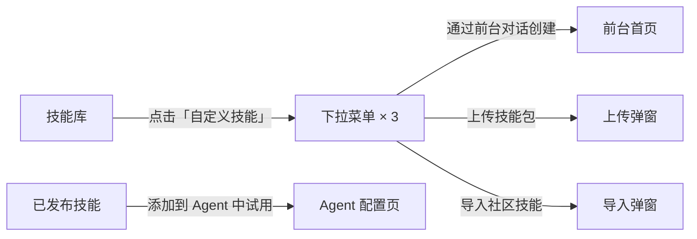
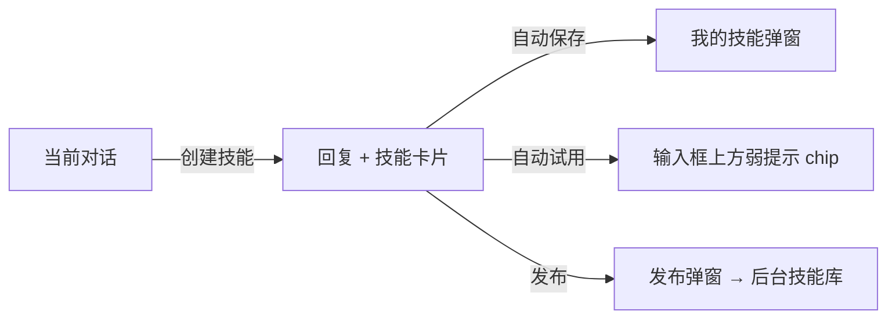
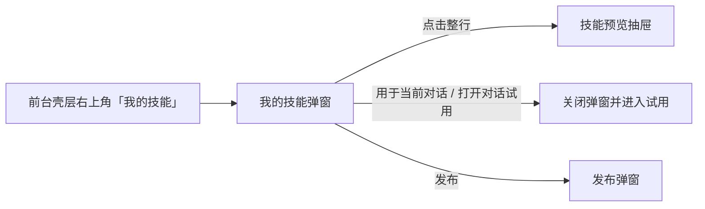
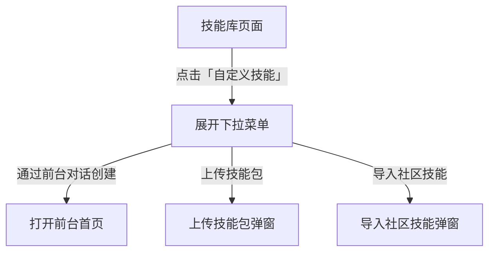
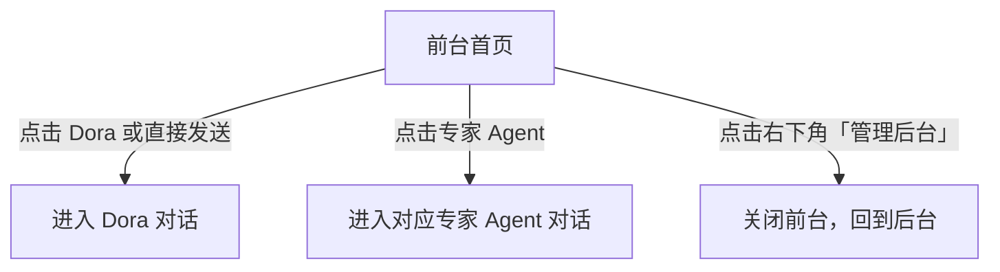
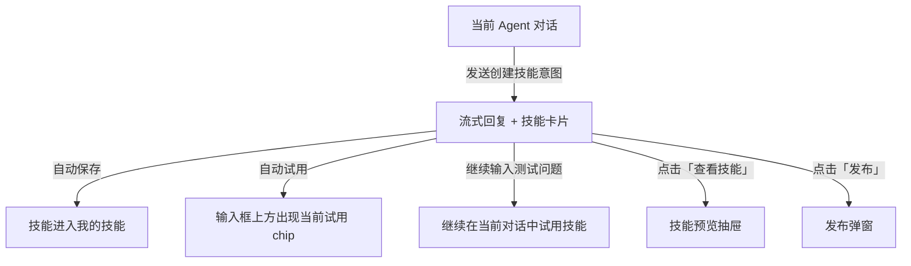
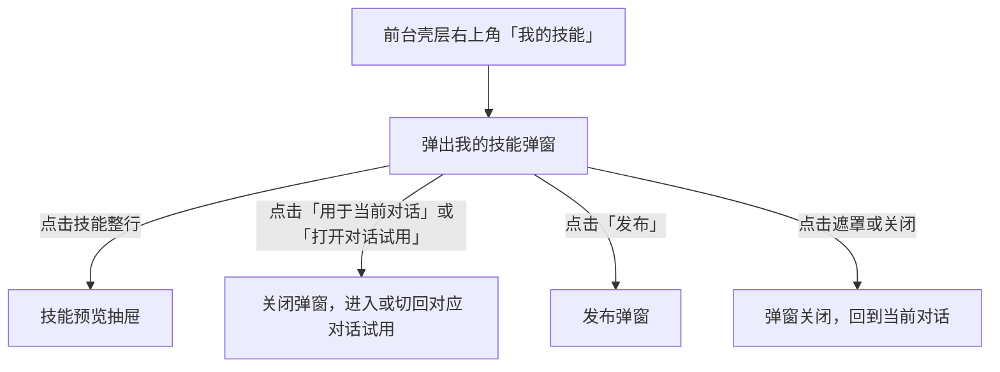
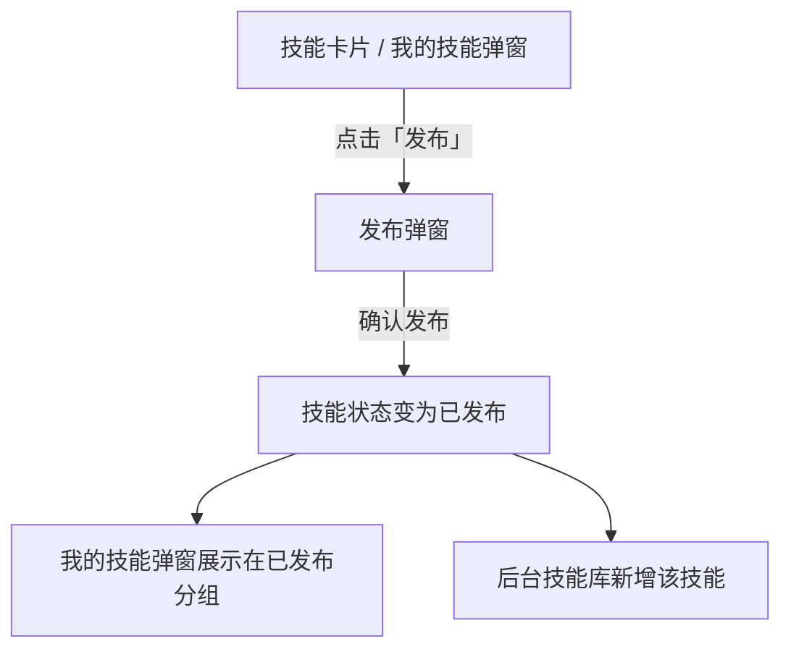
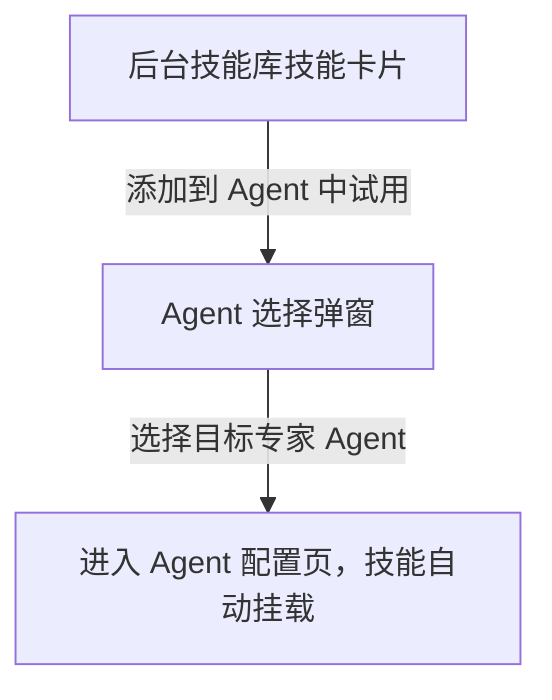

# 自定义技能入口 交互逻辑

> **原型文件**：`prototype.html` / `prototype-newtab.html`  
> **设计目标**：验证后台技能库、前台对话创建技能、我的技能轻量管理、当前对话试用、发布到后台技能库的完整链路  
> **方案对比**：方案「跳转」vs 方案「新 Tab」，只区分前后台切换方式，业务交互保持一致

---

## 零、评审摘要

### A — 后台技能库

**当前设计**
- 「自定义技能」按钮展开 3 个入口：`通过前台对话创建`、`导入社区技能`、`上传技能包`
- 后台技能库承载公共技能管理、技能详情查看、启用 / 禁用、导出、删除等管理操作
- 前台发布的技能进入后台技能库，管理员可继续分配给专家 Agent
- 上传技能包、导入社区技能均在后台技能库完成

**关键流程**

---

### B — 前台对话页

**当前设计**
- Dora 和专家 Agent 都支持在对话中创建技能
- 技能生成后，回复下方展示一张技能卡片
- 技能卡片提供 `查看技能`、`发布` 两个主操作
- 当前对话正在试用的技能以输入框上方弱提示 chip 展示
- `我的技能` 入口位于前台右上角壳层入口，欢迎页与对话页共用

**关键流程**

---

### C — 我的技能

**当前设计**
- `我的技能` 以轻量弹窗呈现
- 全局入口位于前台壳层右上角，不附着在某个会话头部
- 弹窗按 `草稿中` / `已发布` 分组
- 技能项采用紧凑列表卡片
- 技能项根据当前语境提供 `用于当前对话` 或 `打开对话试用` 操作，并保留 `发布` 操作
- 点击技能整行打开技能预览抽屉

**关键流程**

---

## 一、设计原则

当前交互以“继续对话试用”为主路径，技能管理能力以轻量方式辅助呈现。

- **对话主链路**：技能创建成功后，用户继续在当前对话中试用和调试
- **试用提示**：输入框上方展示当前试用技能 chip，提示用户当前会话正在使用哪个技能
- **技能资产管理**：`我的技能` 作为用户级资产入口，放在前台壳层右上角；弹窗承载用户创建的技能草稿与已发布技能
- **后台发布分发**：用户发布技能后，技能进入后台技能库，由管理员继续分配给专家 Agent

---

## 二、完整操作流程

### A — 后台自定义技能入口

### B — 前台首页

### C — 对话内创建技能

### D — 我的技能弹窗

### E — 发布到后台技能库

### F — 后台分配给专家 Agent

---

## 三、完整交互细节说明

### 3.1 自定义技能按钮与下拉菜单

| 用户操作 | 系统反馈 |
| --- | --- |
| 点击「自定义技能」按钮 | 展开下拉菜单 |
| 点击菜单外区域 / 再次点击按钮 | 菜单收起 |
| 选择「通过前台对话创建」 | 打开前台首页 |
| 选择「导入社区技能」 | 打开导入弹窗 |
| 选择「上传技能包」 | 打开上传弹窗 |

### 3.2 前台首页

| 用户操作 | 系统反馈 |
| --- | --- |
| 在 Dora Sender 输入内容并发送 | 进入 Dora 对话 |
| 点击某个专家 Agent | 进入该专家 Agent 对话 |
| 点击右下角「管理后台」 | 返回后台 |

**页面说明**
- 首页聚焦 Agent 选择与 Dora 快速输入
- 技能资产管理入口位于前台壳层右上角，欢迎页与对话页共享

### 3.3 对话页整体结构

| 区域 | 说明 |
| --- | --- |
| 会话头部外壳 | 右上角提供 `我的技能` 轻入口，不介入当前会话主体结构 |
| 会话头部 | 左侧折叠按钮 + 会话标题 |
| 消息区 | 展示问答消息、技能创建结果卡片 |
| 输入区 | 用户继续提问、试用或调试技能 |
| 当前试用提示 | 输入框上方展示当前试用技能 chip，并提供 `切换` 轻量捷径 |

### 3.4 当前试用技能弱提示

| 条件 / 操作 | 系统反馈 |
| --- | --- |
| 当前会话没有试用技能 | 不展示提示 |
| 当前会话正在试用某个技能 | 输入框上方显示 `当前试用 · 技能名 + 状态` |
| 当前会话存在多个试用技能 | 展示当前优先试用项，并以 `+n` 表示其余数量 |
| 点击提示右侧「切换」 | 打开“我的技能”弹窗，并以“选择用于当前对话”为当前语境 |

### 3.5 技能创建后的消息卡片

#### 卡片内容

| 区块 | 说明 |
| --- | --- |
| 头部 | 技能名称、来源标签、状态标签（草稿 / 已发布） |
| 描述 | 技能能力概述 |
| 轻提示 | `已保存到我的技能，当前对话已开始试用` |
| 操作 | `查看技能`、`发布` |

#### 卡片交互

| 用户操作 | 系统反馈 |
| --- | --- |
| 创建技能成功 | 回复下方出现技能卡片 |
| 点击「查看技能」 | 打开技能预览抽屉 |
| 点击「发布」 | 打开发布弹窗 |
| 继续描述修改要求 | 当前对话继续围绕该技能进行调试 |

### 3.6 我的技能弹窗

#### 弹窗结构

| 区域 | 说明 |
| --- | --- |
| 标题区 | 标题 + 语境说明 + 关闭按钮 |
| 列表区 | 分为 `草稿中`、`已发布` 两组 |
| 技能项 | 紧凑行式卡片，展示名称、状态、描述、创建时间和创建助手 |

#### 技能项交互

| 用户操作 | 系统反馈 |
| --- | --- |
| 点击技能整行 | 打开技能预览抽屉 |
| 当前存在会话时点击「用于当前对话」 | 关闭弹窗；当前会话开始试用该技能 |
| 当前不在会话中时点击「打开对话试用」 | 进入该技能来源 Agent 或 dora 对话，并开始试用 |
| 点击「发布」 | 打开发布弹窗 |
| 点击遮罩 / 关闭按钮 | 关闭弹窗 |

### 3.7 技能预览抽屉

| 用户操作 | 系统反馈 |
| --- | --- |
| 点击技能卡片「查看技能」或在“我的技能”中点击整行 | 打开抽屉 |
| 抽屉打开 | 展示技能基本信息、来源、`skill.yaml` 预览 |
| 点击底部主按钮（草稿） | 打开发布弹窗 |
| 点击底部主按钮（已发布） | 显示已发布态 |
| 点击遮罩 / 关闭按钮 | 抽屉关闭 |

### 3.8 发布技能弹窗

| 用户操作 | 系统反馈 |
| --- | --- |
| 打开发布弹窗 | 预填技能名称与说明 |
| 修改技能名称 | 弹窗内名称同步更新 |
| 点击确认发布 | 技能状态更新为已发布；技能进入后台技能库 |
| 点击取消 / 遮罩 | 关闭弹窗，不修改状态 |

**发布后的状态**
- 当前对话继续保留该技能的试用状态
- 我的技能弹窗中，该技能展示在 `已发布` 分组
- 后台技能库新增该技能，管理员可继续分配给专家 Agent

### 3.9 后台技能库与专家 Agent 配置

| 用户操作 | 系统反馈 |
| --- | --- |
| 在后台技能库 hover 技能卡片 | 显示 `添加到 Agent 中试用` |
| 点击 `添加到 Agent 中试用` | 打开 Agent 选择弹窗 |
| 选择专家 Agent | 进入 Agent 配置页，技能自动挂载 |
| 点击保存 | 技能成为专家 Agent 的已保存技能 |

### 3.10 上传技能包 / 导入社区技能

| 流程 | 系统反馈 |
| --- | --- |
| 上传技能包 | 选文件 → 解析 → 预览确认 → 进入后台技能库 |
| 导入社区技能 | 输入 URL → 拉取解析 → 预览确认 → 进入后台技能库 |
| 解析失败 | 给出错误说明，并支持重试 |

---

## 四、方案差异（跳转 / 新 Tab）

| 项目 | 方案 A：跳转 | 方案 B：新 Tab |
| --- | --- | --- |
| 后台进入前台 | 当前页内切到前台 | 新开前台 Tab |
| 前台返回后台 | 关闭覆盖层，回到当前后台 | 打开后台页 / 回到后台 Tab |
| 「通过前台对话创建」 | 当前页打开前台首页 | 新 Tab 打开前台首页 |
| 其余业务交互 | 完全一致 | 完全一致 |

---

## 五、待确认

- 多个技能同时处于当前会话试用状态时，是否需要提供显式切换入口？当前设计展示优先试用项与剩余数量
- 发布流程是否需要增加“待审核”状态？当前设计发布后进入后台技能库
