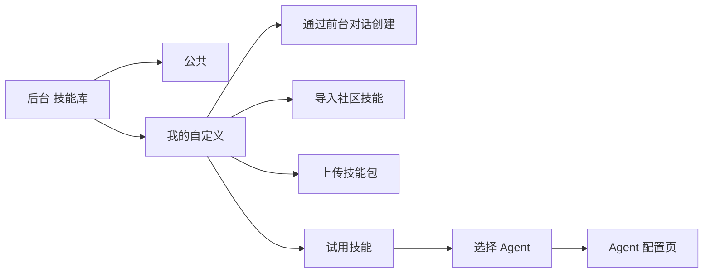
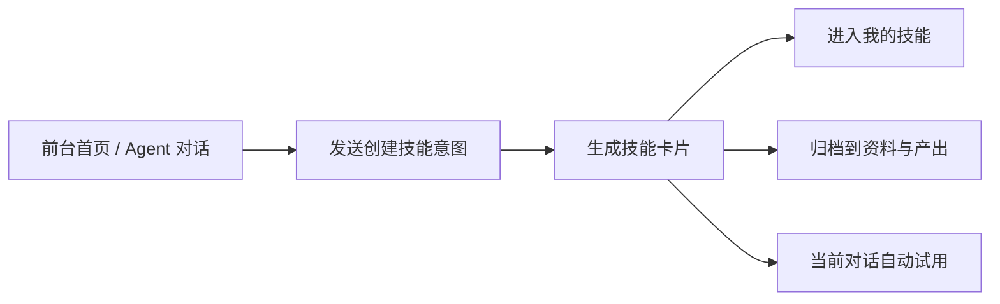
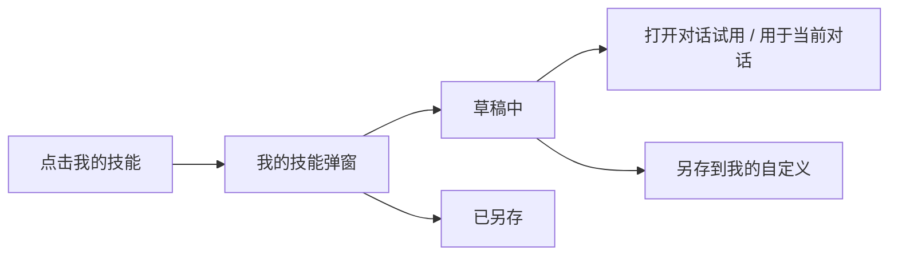
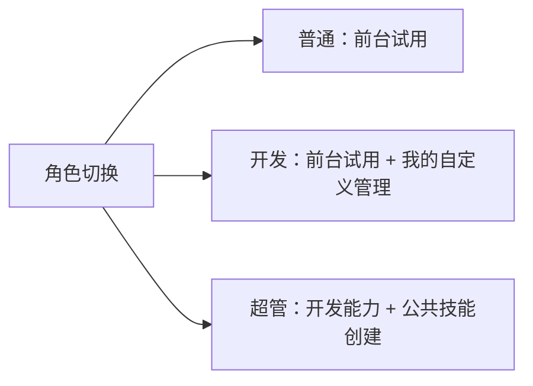
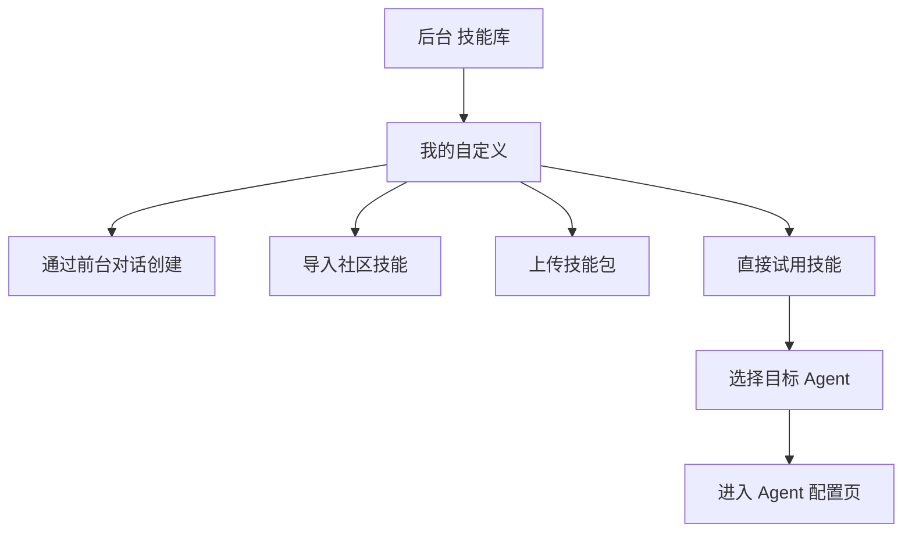
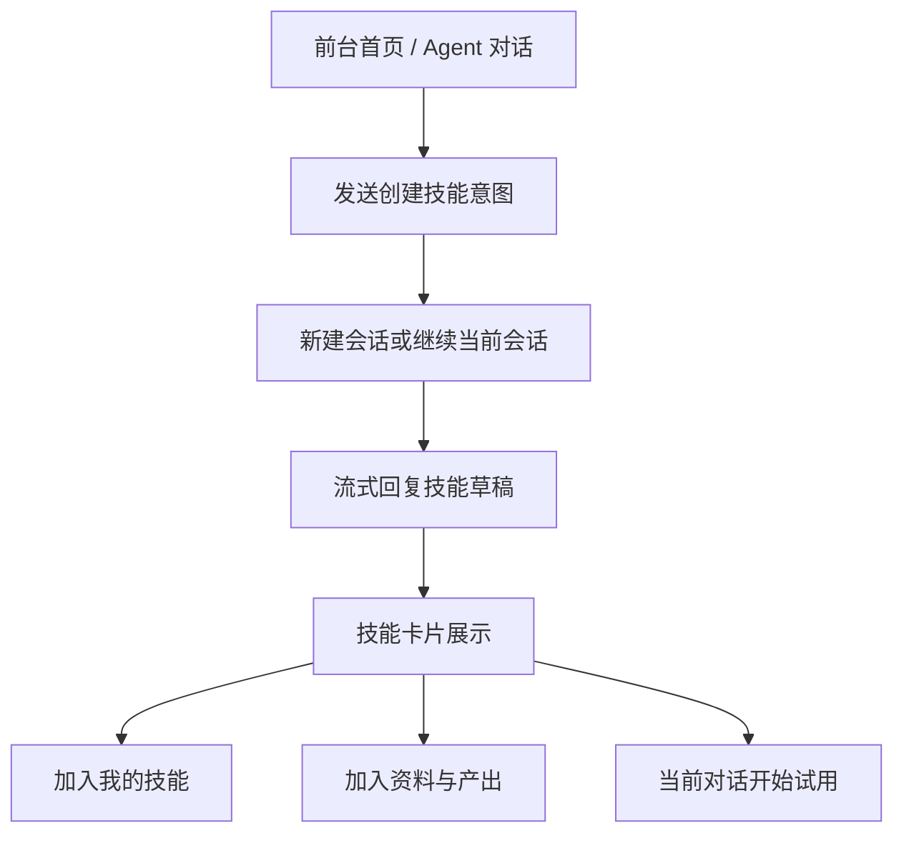
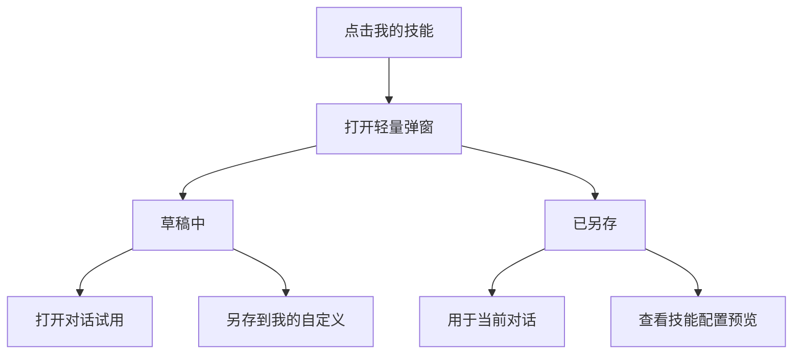
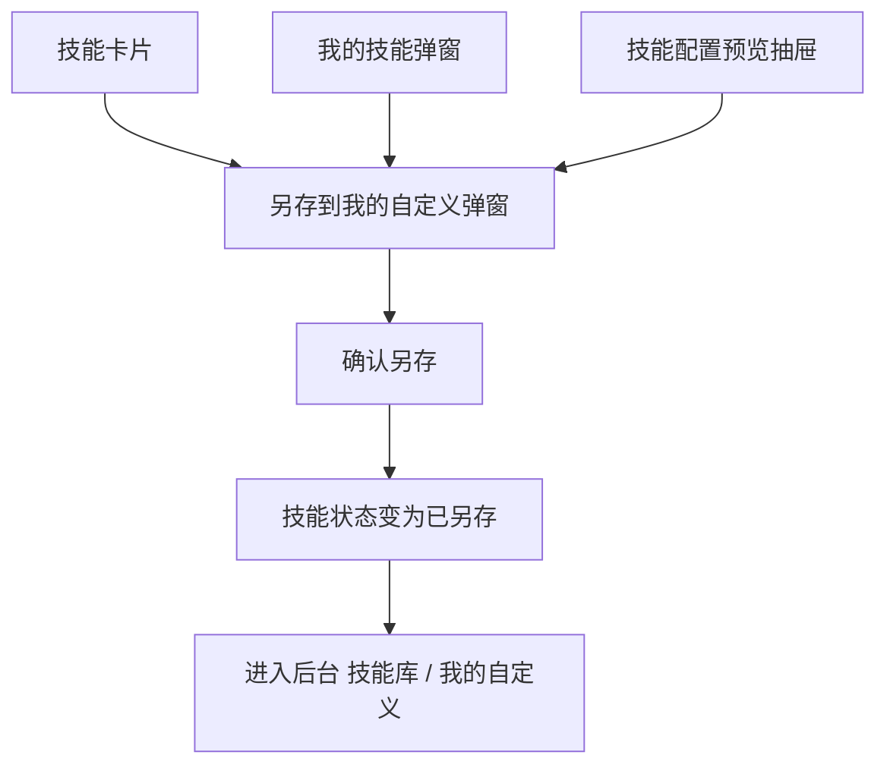
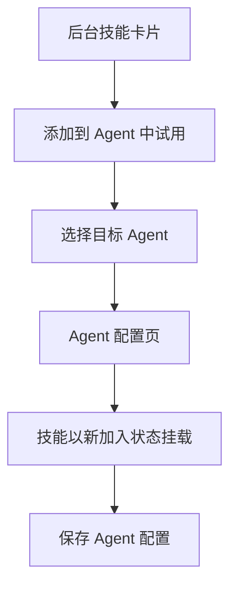
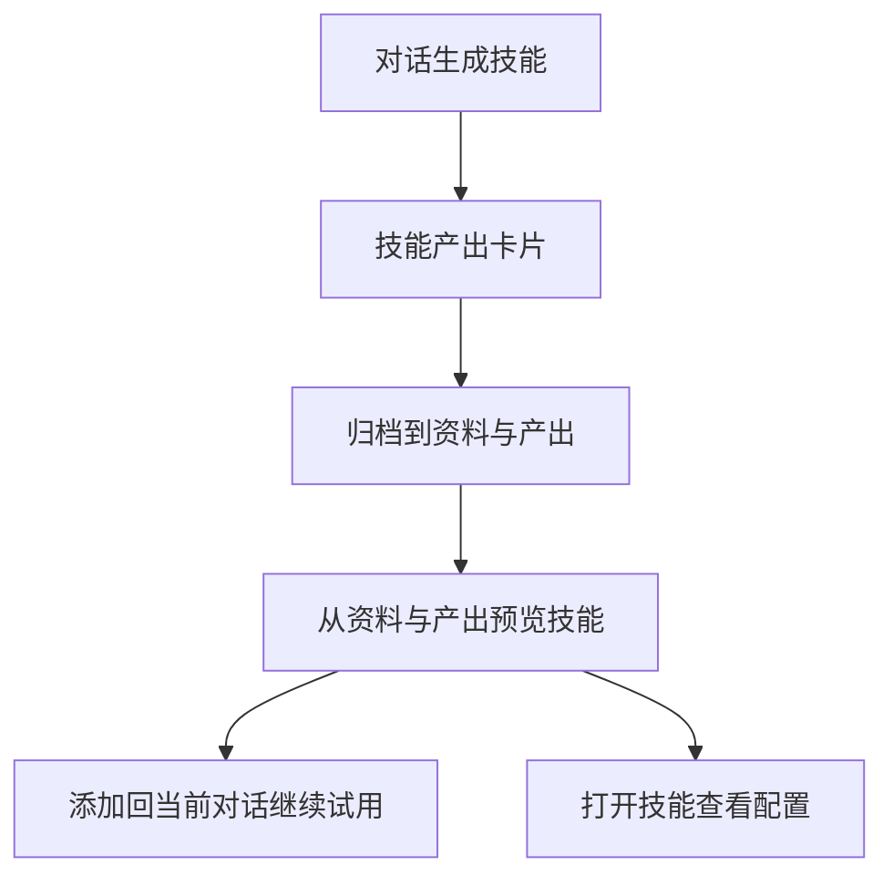

# Dora 自定义技能专项 交互逻辑

> **原型文件**：`dora-custom-skills/prototype.html`  
> **设计目标**：基于现有 Dora 新架构原型，梳理其中与“自定义技能”直接相关的页面、入口、状态和流转关系  
> **说明范围**：只描述当前原型里与自定义技能相关的部分，包括后台技能库、前台对话创建、我的技能、资料与产出、另存到我的自定义、添加到 Agent 中试用、Agent 配置页

---

## 零、评审摘要

### A — 后台技能库

**当前设计**
- 后台技能库分为 `公共` 与 `我的自定义`
- `我的自定义` 提供 3 种创建入口：`通过前台对话创建`、`导入社区技能`、`上传技能包`
- 超管额外展示 `公共技能` 创建入口，创建方式与 `我的自定义` 一致
- `我的自定义` 技能卡片支持 `试用技能`、`禁用 / 取消禁用`、`导出 zip`、`删除`
- 技能可从后台直接进入“添加到 Agent 中试用”链路

**关键流程**

### B — 前台对话生成技能

**当前设计**
- 前台首页可直接与 `dora` 对话，也可进入专家 Agent 对话
- 任意 Agent 对话中输入创建技能意图后，会生成技能草稿
- 生成成功后，回复中展示技能卡片
- 同时发生 3 个结果：
  - 技能进入 `我的技能`
  - 技能作为产出归档到 `资料与产出`
  - 当前对话自动开始试用该技能

**关键流程**

### C — 前台“我的技能”

**当前设计**
- `我的技能` 以轻量弹窗承接前台创建的技能资产
- 弹窗按 `草稿中`、`已另存` 分组
- 在 `global` 语境下，主操作是 `打开对话试用`
- 在 `session` 语境下，主操作是 `用于当前对话`
- 开发 / 超管可继续执行 `另存到我的自定义`

**关键流程**

### D — 角色差异

**当前设计**
- 普通：不展示后台入口，不展示后台创建能力，不可另存到后台
- 开发：可进入后台，管理 `我的自定义`，可把前台草稿另存到后台
- 超管：包含开发能力，并额外可创建 `公共技能`

**关键流程**

---

## 一、设计背景

当前原型中的“自定义技能”不是独立页面，而是横跨前后台的一组连续流程。

- 后台负责管理和分发：
  - 技能库中的 `我的自定义`
  - 自定义技能的启停、导出、删除
  - 添加到 Agent 中试用
- 前台负责生成和调试：
  - 对话创建技能
  - 当前对话立即试用
  - 资料与产出统一归档
  - 我的技能轻量切换
- 页面模型主要由以下几类组成：
  - 后台列表管理页：技能库
  - 前台工作台：首页 / Agent 对话
  - 轻量资产弹层：我的技能
  - 技能预览抽屉 / 详情抽屉
  - 分发配置页：Agent 配置页

---

## 二、完整操作流程

### 2.1 后台创建与管理“我的自定义”

### 2.2 前台对话创建技能

### 2.3 前台“我的技能”切换试用

### 2.4 另存到后台“我的自定义”

### 2.5 后台分发到 Agent

### 2.6 资料与产出中的技能归档

---

## 三、完整交互细节说明

### 3.1 角色切换

| 用户操作 | 系统反馈 |
|----------|----------|
| 点击 `普通` | 前台隐藏 `管理后台` 入口；后台 `我的自定义` / `公共技能` 创建入口不作为普通用户能力展示；另存到后台按钮禁用 |
| 点击 `开发` | 展示前台 `管理后台` 入口；后台展示 `我的自定义` 创建入口；允许另存到后台 |
| 点击 `超管` | 在开发能力基础上，额外展示 `公共技能` 创建入口 |

### 3.2 后台技能库

| 用户操作 | 系统反馈 |
|----------|----------|
| 进入 `技能` 页面 | 展示 `公共` 与 `我的自定义` 两个分区 |
| 点击 `+我的自定义` | 展开 `通过前台对话创建 / 导入社区技能 / 上传技能包` |
| 超管点击 `+公共技能` | 展开同样的三种创建方式，但最终归属到公共技能 |
| 点击自定义技能卡片上的 `添加到 Agent 中试用` | 打开 Agent 选择弹窗 |
| 点击技能更多菜单 | 可执行 `试用技能`、`禁用/取消禁用`、`导出 zip`、`删除` |

### 3.3 通过前台对话创建

| 用户操作 | 系统反馈 |
|----------|----------|
| 在后台下拉里点击 `通过前台对话创建` | 打开前台覆盖层 |
| 在首页直接向 dora 输入创建意图 | 创建新会话并开始生成技能 |
| 在专家 Agent 对话中输入创建意图 | 在该 Agent 当前对话中生成技能 |
| 输入内容匹配“创建技能”意图 | 回复中产出技能草稿 |

### 3.4 前台首页与 Agent 对话

| 用户操作 | 系统反馈 |
|----------|----------|
| 首页点击 dora 或专家 Agent | 进入对应前台工作区 |
| 首页直接发送技能创建需求 | 自动创建新会话并进入消息视图 |
| 在欢迎屏输入框创建技能 | 流式回复技能草稿 |
| 在消息视图继续创建技能 | 在当前会话继续累积技能草稿与试用状态 |
| 生成技能成功 | 输入框上方出现 `当前试用` 弱提示，显示最后启用的技能 |

### 3.5 技能卡片

| 用户操作 | 系统反馈 |
|----------|----------|
| 技能生成成功后查看消息卡片 | 卡片展示名称、标签、说明、草稿/已另存状态 |
| 点击 `查看技能` | 打开技能配置预览抽屉 |
| 开发 / 超管点击 `另存到我的自定义` | 打开另存弹窗 |
| 普通点击另存按钮 | 按钮禁用并提示不可另存到后台 |

### 3.6 我的技能弹窗

| 用户操作 | 系统反馈 |
|----------|----------|
| 点击首页右上角或对话侧栏底部 `我的技能` | 打开轻量弹窗 |
| 在 `global` 模式打开 | 副标题强调“带回任一对话试用” |
| 在 `session` 模式打开 | 副标题强调“这里只切换当前会话试用，不改变技能归属” |
| 点击 `打开对话试用` | 如无当前会话则补建会话，并启用技能 |
| 点击 `用于当前对话` | 当前会话直接切换到该技能 |
| 点击技能卡片本体 | 打开技能配置预览抽屉 |

### 3.7 技能配置预览抽屉

| 用户操作 | 系统反馈 |
|----------|----------|
| 打开技能配置预览 | 展示技能基本信息与 `skill.yaml` 预览 |
| 开发 / 超管点击底部主按钮 | 进入 `另存到我的自定义` 弹窗 |
| 普通打开抽屉 | 底部按钮为禁用态，不允许另存 |

### 3.8 另存到“我的自定义”弹窗

| 用户操作 | 系统反馈 |
|----------|----------|
| 打开弹窗 | 展示技能名称输入框、适用说明输入框、另存说明 |
| 点击 `确认另存` | 技能状态变为 `published` |
| 另存成功 | `我的技能` 中从 `草稿中` 移到 `已另存`；技能库 `我的自定义` 新增对应卡片 |
| 另存后继续当前对话 | 当前对话仍保持草稿试用链路，不被打断 |

### 3.9 资料与产出中的技能产出

| 用户操作 | 系统反馈 |
|----------|----------|
| 技能生成成功 | 自动生成一张技能产出卡片并归档到 `资料与产出` |
| 打开 `资料与产出` | 在产出列表里可看到技能产出物 |
| 在产出中点击技能卡片 `预览` | 进入技能产出预览 |
| 在产出中点击 `添加到对话` | 当前对话重新启用该技能 |
| 在产出预览里点击 `查看技能` | 打开技能配置预览抽屉 |

### 3.10 后台“添加到 Agent 中试用”与 Agent 配置页

| 用户操作 | 系统反馈 |
|----------|----------|
| 在后台技能库点击 `添加到 Agent 中试用` | 打开 Agent 选择弹窗 |
| 选择目标 Agent | 进入对应 Agent 配置页 |
| 在配置页看到技能 | 以 `新加入` 状态追加到技能区块 |
| 点击保存 | 技能从临时试用状态进入该 Agent 的已保存配置 |
| 选择 `新建 Agent` | 进入空白 Agent 配置页，并只挂载目标技能 |

### 3.11 技能详情抽屉

| 用户操作 | 系统反馈 |
|----------|----------|
| 从后台技能卡片打开详情 | 展示技能来源、元信息、文件结构和预览内容 |
| 点击 `试用技能` | 走“添加到 Agent 中试用”链路 |
| 在详情中点击 `禁用 / 取消禁用` | 技能状态与技能库卡片状态同步切换 |

---

## 四、角色权限说明

| 角色 | 前台创建技能 | 当前对话自动试用 | 我的技能 | 资料与产出中的技能归档 | 另存到我的自定义 | 后台我的自定义管理 | 公共技能创建 |
|------|--------------|------------------|----------|--------------------------|------------------|--------------------|--------------|
| 普通 | 支持 | 支持 | 支持 | 支持 | 不支持 | 不支持 | 不支持 |
| 开发 | 支持 | 支持 | 支持 | 支持 | 支持 | 支持 | 不支持 |
| 超管 | 支持 | 支持 | 支持 | 支持 | 支持 | 支持 | 支持 |

---

## 五、当前设计结论

- 当前原型里的自定义技能不是单一页面，而是一条“后台管理 + 前台生成 + 当前对话试用 + 再沉淀回后台”的闭环
- 前台技能生成后的落点有 3 个：`我的技能`、`资料与产出`、`当前对话试用`
- `另存到我的自定义` 是把前台草稿沉淀为后台正式资产的关键桥梁
- 后台的价值不只在存储，还包括 `添加到 Agent 中试用` 和 Agent 配置分发
- 超管与开发的关键差异不是前台生成能力，而是后台是否拥有 `公共技能` 创建权限
