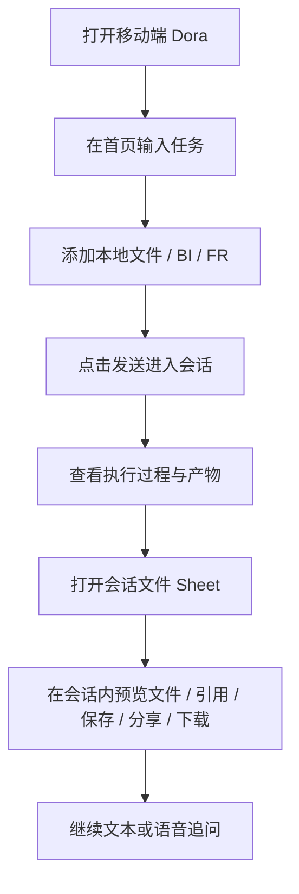
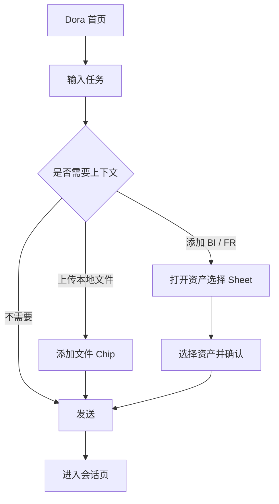
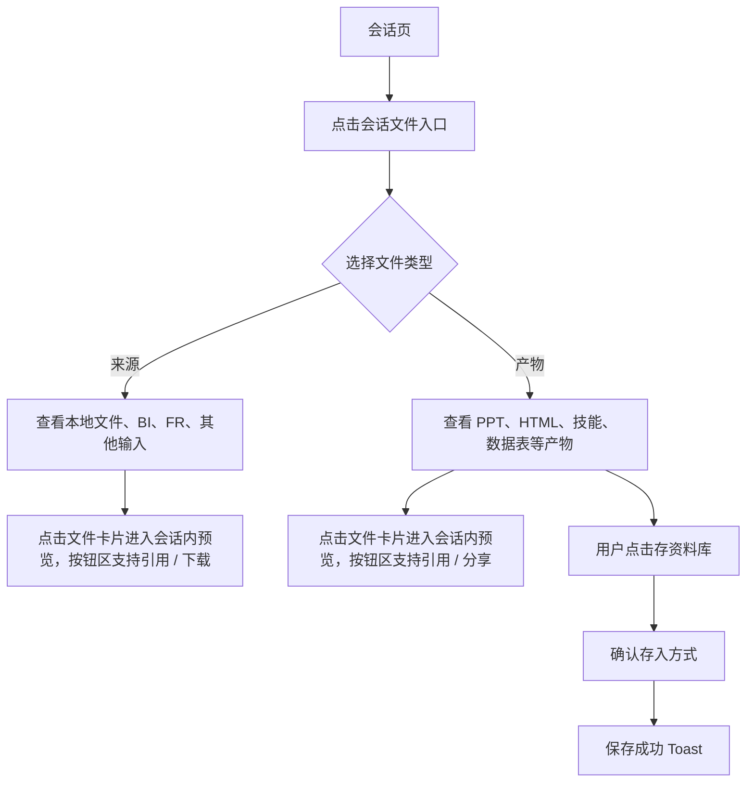
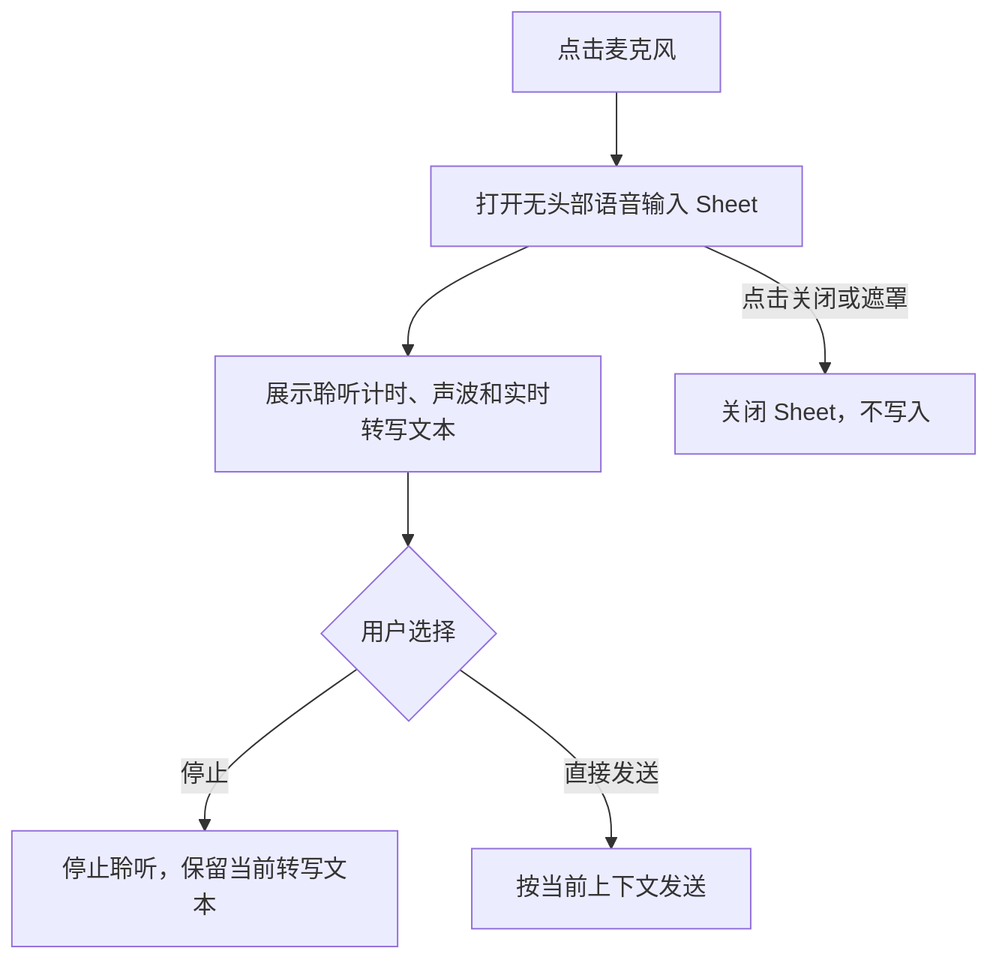
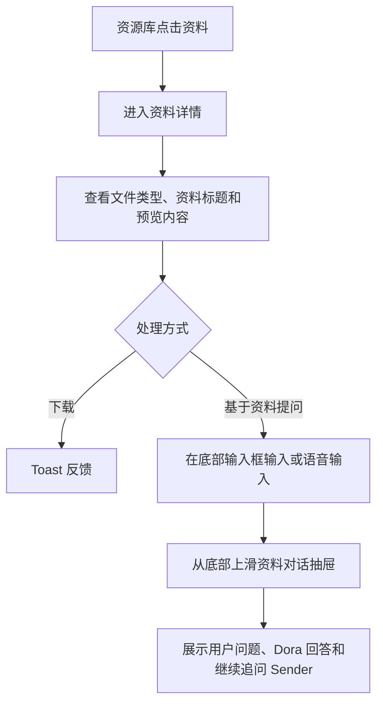

# Dora Mobile 新 UX 交互规格

## 零、评审摘要

### 本次设计要点

- 当前整体框架支持「方案A：侧边菜单」和「方案B：更多菜单」两个对比方案。
- 顶部方案配置采用组合式面板，每个设计点独立选择方案；当前支持框架方案和会话标题两个设计点。
- Dora 首页以“华东销售经营日报”为业务旅程，展示 KPI、Dora 今日洞察和预填问题 Sender。
- 会话页采用沉浸式单屏，对话、执行过程、产物卡片和 Sender 位于同一任务流中。
- PC 端会话历史侧栏、专家切换、资料面板在移动端分别转为抽屉或底部 Sheet。
- 会话产物默认只存在于会话文件中，不自动进入资料库；只有用户主动执行“存资料库”后才沉淀为资料。
- 会话文件预览承接当前会话上下文，支持返回会话、分享和下载，不展示资料库追问 Sender。
- 资源库保留检索、筛选、资源卡片、资料详情、下载和基于资料的 Dora 提问。
- 所有 Sender 均支持语音输入，语音识别结果可停止确认或直接发送。

### 关键流程图

## 一、页面结构

### 0. 方案配置

| 区域 | 交互 |
| --- | --- |
| 顶部常驻栏 | 左侧展示“方案配置”和当前组合摘要，右侧保留交互说明入口 |
| 方案配置面板 | 点击“方案配置”打开面板；面板按设计点分组，每个设计点独立选择方案，切换后即时生效并保留面板打开状态 |
| 框架方案 | 支持“方案A：侧边菜单”和“方案B：更多菜单”；切换后即时刷新页面菜单入口 |
| 会话标题 | 支持“方案1：仅标题”“方案2：仅名称”“方案3：名称+标题”；切换后只刷新会话页标题区 |
| 扩展规则 | 后续新增设计点时，在面板中新增配置项，并为该设计点提供独立渲染逻辑 |

### 1. Dora 首页

| 区域 | 交互 |
| --- | --- |
| 顶部标题区 | 方案A在左侧提供菜单入口并打开最近会话抽屉；方案B在右侧提供更多菜单入口并打开底部菜单；标题展示 Dora |
| 最近会话抽屉 | 方案A从左侧滑出约 86% 屏宽；顶部提供新聊天和定时任务，下面固定搜索会话，并按分身、资料库会话、今天、7天内、30天内、更早分组；分组可收起/展开，会话项展示来源 icon、标题、未读状态和当前高亮 |
| 更多菜单抽屉 | 方案B从底部上滑，标题展示当前 Agent 名称，分段承载会话记录和定时任务 |
| 问候区 | 展示 Dora 问候、当前业务上下文和异常提示 |
| 经营 KPI | 展示昨日销售额、新增商机、回款完成率、风险客户 |
| Dora 今日洞察 | 展示销售下滑、商机转化、回款异常；洞察卡只承载判断，不直接触发发送 |
| 首页 Sender | 完全复用会话页 Sender 样式，预填基于洞察的建议问题，支持添加上下文、语音输入和发送；Dora 建议与 Sender 共同固定在底部输入区，通过背景模糊渐变与上方内容柔和过渡 |

### 2. 专家团页

| 区域 | 交互 |
| --- | --- |
| 搜索框 | 用于按名称或描述检索专家 |
| 标签筛选 | 横向滚动 chips 支持全部、我创建的、运营、市场、行政、研发、财务、法务等场景筛选 |
| 快捷进入 | 最近使用和我收藏的以前置横滑区呈现，点击头像卡直接进入专家会话 |
| 专家卡片 | 展示头像、专家名称、创建人、描述、场景标签、使用次数和收藏星标；点击卡片进入会话，点击星标只切换收藏状态 |

### 3. 会话页

| 区域 | 交互 |
| --- | --- |
| 顶部标题区 | 方案A在标题左侧提供最近会话抽屉入口；方案B在标题右侧提供更多菜单入口；专家会话额外保留返回专家页入口，并作为专家团下的二级页隐藏底部 Tab；中间展示当前会话标题；所有会话均可开启同类型新对话、转发会话和打开会话文件 Sheet |
| 对话区 | 展示用户消息、Agent 回复、执行过程和产物卡片 |
| 执行过程面板 | 默认展开，可收起 / 展开 |
| 产物卡片 | 点击直接进入该文件的会话内预览页面 |
| 会话 Sender | 支持添加上下文、引用会话文件、语音输入和发送 |
| 会话文件预览 | 从会话文件 Sheet 进入，头部展示当前文件和来源会话；左侧返回当前会话，右侧提供分享和下载，不展示资料库详情的底部追问 Sender |

说明：专家会话不在顶部提供切换 Agent 入口，切换专家通过返回专家页完成。
说明：资料库会话只归属于 Dora/资料库链路，不出现在具体专家 Agent 的会话记录中；专家会话记录只展示该专家自身发起或延续的会话。
点击 Dora 新对话后回到带经营看板和推荐问题的 Dora 首页模式；点击专家新对话后保留当前专家类型，标题切换为“新对话”，清空对话流、输入框和已引用文件，并展示空会话提示。
新会话的会话文件中「产物」为空，计数显示为 0；发送需求并生成回复后，产物区再出现当前会话生成的文件。
Dora 对应名称为“Dora超级智能体”，专家会话对应具体专家 Agent 名称。

### 4. 资源库

| 区域 | 交互 |
| --- | --- |
| 搜索框 | 按名称、来源会话、来源 Agent 检索 |
| 类型分段 | 按全部、HTML、PPT、MD 快速过滤；点击后真实隐藏不匹配资料，并自动收起无匹配分组 |
| 资源卡片 | Mock HTML、PPT、MD 三类资料；标题左侧通过文件类型标识区分资料类型，点击进入资料详情 |
| 详情页预览 | 展示资料内容摘要、指标卡和预测折线趋势图 |
| 详情页工具 | 顶部标题区展示资料类型标识和资料名称，并提供分享和下载 |
| 去问 Dora | 固定在详情页底部，支持直接输入、添加上下文、语音输入和发送；点击发送后从底部上滑资料对话抽屉承载问答内容，抽屉头部参考 Dora 会话页提供新会话、会话文件和更多操作，关闭按钮保持在最右侧，抽屉内消息区独立滚动，继续追问 Sender 固定在底部 |

## 二、关键交互流程

### 1. 发起新任务

### 2. 会话文件处理

规则：会话文件 Sheet 在「来源 / 产物」之间切换时保持固定抽屉高度，只更新内部列表内容，避免页面跳动。

规则：会话文件列表点击文件卡片进入会话内预览；预览页保留来源会话、分享和下载，不承载资料库详情的追问 Sender，卡片内的引用、下载、分享和存资料库只执行对应动作。

规则：会话产物不会自动进入资料库；只有用户主动点击「存资料库」并确认后，才作为快照副本沉淀到资源库。

### 3. 语音输入

语音输入 Sheet 使用弱化背景的浮层承载语音状态、转写结果和操作按钮。

### 4. 资料详情处理

## 三、状态与反馈

| 场景 | 状态 | 反馈 |
| --- | --- | --- |
| 添加文件 | 成功 | Sender 上方新增文件 Chip，并 Toast 提示 |
| 添加 BI / FR | 成功 | Sender 上方新增资产 Chip，并 Toast 提示 |
| 语音输入中 | Listening | 展示计时、声波动画和逐步更新的实时转写文本 |
| 语音停止 | Stopped | 停止计时和转写，将当前识别文本回填到对应输入框，用户可继续直接发送 |
| 会话发送 | Success | 用户消息追加到对话底部，随后追加 Agent 回复 |
| 执行过程 | Running | 当前阶段展示进行中状态 |
| 新会话产物 | Empty | 会话文件 Sheet 的「产物」计数为 0，并展示当前会话暂无产物 |
| 产物保存资料库 | Conflict | 弹出同名确认 Sheet，提供另存或覆盖 |
| 无匹配专家 | Empty | Toast 提示未找到匹配的专家 Agent |

## 四、移动端适配规则

- 一级视角使用底部 Tab；Dora、专家团、资源库分别使用默认和选中两套图片图标；切换 Tab 时保留每个 Tab 上次停留的页面；Dora 会话保留底部 Tab；专家会话作为专家团下的二级页隐藏底部 Tab；资料详情页进入后隐藏底部 Tab。
- PC 端三列布局在移动端拆为单屏主任务和临时 Sheet。
- PC 端侧边能力在移动端按使用频率重排：最近会话保留左侧抽屉，专家团页右侧的最近使用/收藏收进列表顶部快捷横滑区。
- 高优操作保留在当前任务区，低频管理能力放入 Sheet。
- Sender 的添加入口统一为 `＋`、BI、FR、麦克风和发送按钮。
- 会话文件预览优先保持当前会话连续性，资料库详情优先保持资料管理和下载能力，两者使用不同的来源说明和返回语义。

## 五、演示入口

- 顶部方案切换用于整体框架对比；当前方案为「方案A：侧边菜单」，交互说明入口保留在右侧。
- 点击「交互说明」后，关键交互容器显示高亮，鼠标悬停展示说明气泡。
- 原型内可直接演示：添加文件、添加资产、语音输入、发送会话、打开最近会话抽屉、专家标签筛选、专家收藏切换、打开资料面板、资料保存冲突、资料详情处理。
