# Dora 新架构设计 交互逻辑

> **原型文件**：`dora-new-architecture-design-overlay.html`  
> **设计目标**：验证 Dora 新架构设计下的后台技能库、后台数据页、前台对话创建技能、我的技能轻量管理、统一「资料与产出」入口、Gen UI 辅助表达、当前对话试用、另存到后台管理「我的自定义」的完整链路  
> **说明范围**：当前文档描述 Dora 新架构设计的前台覆盖层方案结果态

---

## 零、评审摘要

### A — 后台技能库

**当前设计**
- 技能页面分为 `公共`、`我的自定义` 两个分类
- `+我的自定义` 展开 3 个入口：`通过前台对话创建`、`导入社区技能`、`上传技能包`
- 超管角色额外展示 `+公共技能`，同样支持 3 种创建方式
- 后台技能库承载公共技能管理、我的自定义技能管理、技能详情查看、启用 / 禁用、导出、删除等管理操作
- 开发用户与超管可将前台对话创建的技能另存到后台管理的 `我的自定义`；普通用户不能执行该动作
- 上传技能包、导入社区技能均在后台技能库完成

**关键流程**
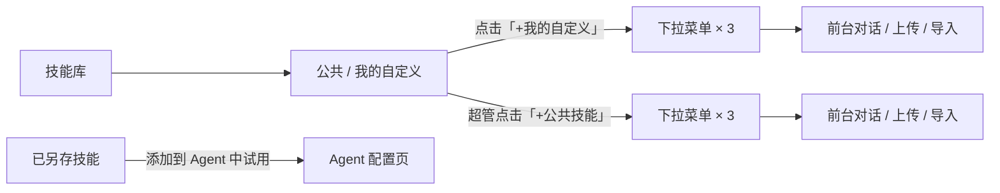

---

### B — 角色切换

**当前设计**
- 顶部评审切换区提供 `普通`、`开发`、`超管` 三种角色
- 普通角色可使用前台对话与我的技能，不展示进入管理后台的入口；通过对话创建的技能不能另存到后台
- 开发用户可进入管理后台；在数据页中可查看 `公共数据`，也可管理自己的 `我的数据`
- 超管角色拥有开发用户能力，并额外拥有 `+公共技能` 创建入口；同时可管理 `公共数据` 与自己的 `我的数据`

**关键流程**
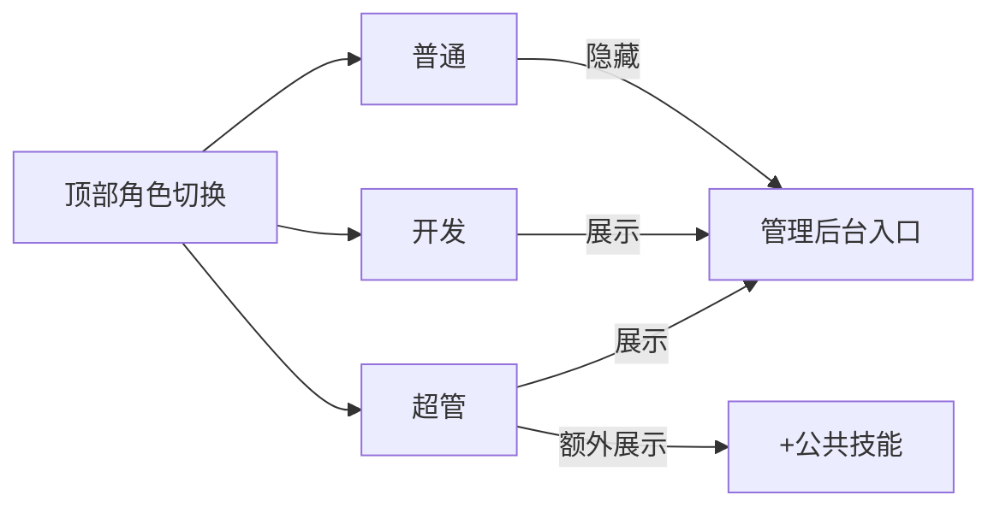

---

### C — 前台对话页

**当前设计**
- Dora 和专家 Agent 都支持在对话中创建技能
- 进入 Agent 后，左侧为当前 Agent 工作区侧栏，包含 `home` 返回、`新聊天`、`定时任务`、`分身`、`历史会话`
- 技能生成后，回复下方按统一产出卡片展示，和其它报告、PPT、仪表盘保持一致
- 技能产出卡片不再额外标记“草稿”，并继续支持查看技能、后续试用与后台另存
- 当前对话正在试用的技能以输入框上方弱提示 chip 展示
- 首页不展示 `我的技能` 与 `资料与产出` 入口；进入 Agent 后，`我的技能` 位于左侧栏底部，`资料与产出` 位于对话头部
- 开发用户与超管角色的前台展示 `管理后台` 入口；普通角色不展示该入口

**关键流程**
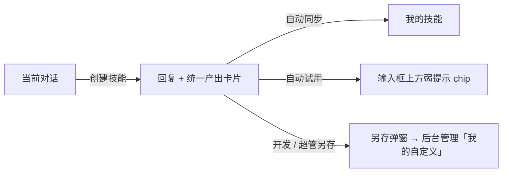

---

### D — 我的技能

**当前设计**
- `我的技能` 以轻量弹窗呈现
- 首页不展示入口
- 进入 Agent 后，入口位于左侧栏底部；开发用户与超管角色下靠近 `管理后台`
- 弹窗按 `草稿中` / `已另存` 分组
- 技能项采用紧凑列表卡片
- 技能项根据当前语境提供 `用于当前对话` 或 `打开对话试用` 操作；开发用户与超管额外保留 `另存到我的自定义` 操作
- 点击技能整行打开技能预览抽屉

**关键流程**
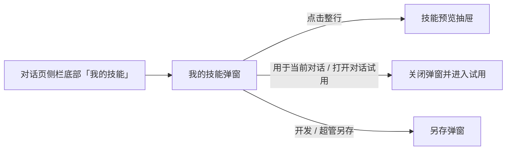

---

### E — 资料与产出面板（重设计）

**当前设计**
- 面板默认宽度 50% 屏幕，左边缘支持拖拽调整宽度（最小 320px）
- 顶部两个 Tab：`资料` | `产出`，Tab 上带数量角标；角标选中态反色显示
- Tab 下方：`全部`（当前 Agent 所有对话）| `当前对话` 两个 Scope 切换按钮
- 面板内分两个页面：**列表页**（默认）→ 点击文件 → **预览页**，预览页有「← 返回列表」
- **资料 Tab**：平铺列表，每项显示文件名、来源会话、时间，点击进入预览页
- **产出 Tab**：技能、报告、PPT、仪表盘等统一作为主产出物展示；过程文件以折叠方式收纳在主产出下方，默认收起，点击「过程文件（N）」展开
- **列表 hover 操作**：资料、主产出、过程文件统一在 hover 时露出 `添加到对话`、`删除`
- **预览页**：顶栏文件名 + 操作按钮（资料：加入当前对话 / 下载文件；技能：添加到对话 / 查看技能；其它产出：添加到对话 / 打开产物；过程文件：添加到对话 / 查看文件），主体为文件内容渲染区（HTML 报告 / PPT 幻灯片 / 仪表盘 / 表格数据 / 技能摘要 / 代码 / Markdown）

**关键流程**
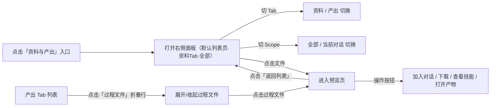

---

### F — 后台数据页

**当前设计**
- 后台新增 `数据` 页面，采用 `左侧目录树 + 右侧统一预览工作台` 的布局；右侧工作台头部横跨整块，底部分为结果集列表与表格预览
- 数据页支持 `公共数据` / `我的数据` 两种视角切换
- 开发用户与超管都展示 `公共数据` / `我的数据`
- 开发用户与超管进入数据页时，默认优先选中 `我的数据`
- 开发用户对 `公共数据` 保持只读，但可管理自己的 `我的数据`
- 超管角色可在 `公共数据` 中执行新增、重命名、目录调整等管理动作，也可管理自己的 `我的数据`
- `我的数据` 展示个人沉淀资产，用于表达个人视角与平台共享视角的切换关系

**关键流程**
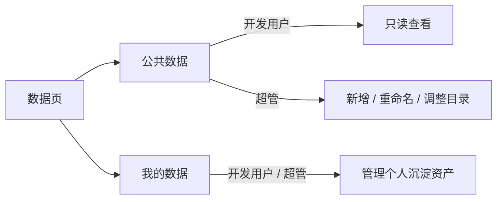

---

## 一、设计原则

当前交互以“继续对话试用”为主路径，技能管理能力与统一产出能力以轻量方式辅助呈现。

- **角色分层**：顶部角色切换只用于评审不同权限视角；普通用户不感知管理后台，开发用户可使用后台能力并管理自己的数据，超管额外管理公共技能与公共数据
- **对话主链路**：技能创建成功后，用户继续在当前对话中试用和调试
- **试用提示**：输入框上方展示当前试用技能 chip，提示用户当前会话正在使用哪个技能
- **技能资产管理**：`我的技能` 作为用户级资产入口；进入 Agent 后从侧栏底部进入；弹窗承载用户创建的技能草稿与已另存技能
- **后台另存分发**：开发用户与超管可将前台对话创建的技能另存到后台管理的 `我的自定义`；普通用户仅保留前台草稿与试用能力；超管从 `+公共技能` 入口创建的技能归入 `公共`
- **数据权限分层**：后台数据页区分 `公共数据` 与 `我的数据`；开发用户对公共数据保持只读，但可管理自己的 `我的数据`；公共数据的管理能力仅在超管视角下开放

---

## 二、完整操作流程

### A — 角色切换

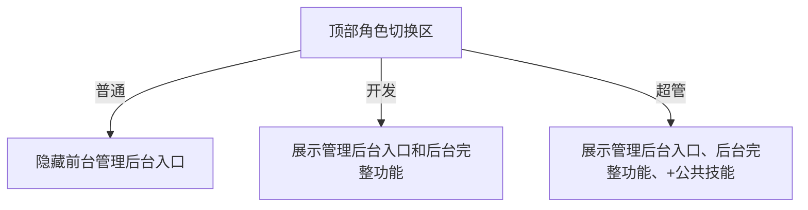

### B — 后台技能创建入口

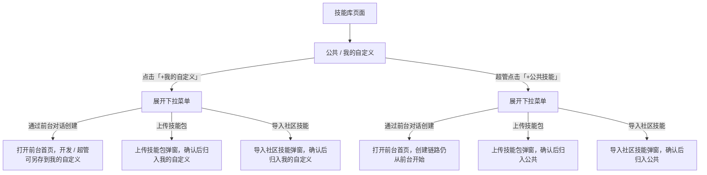

### C — 前台首页

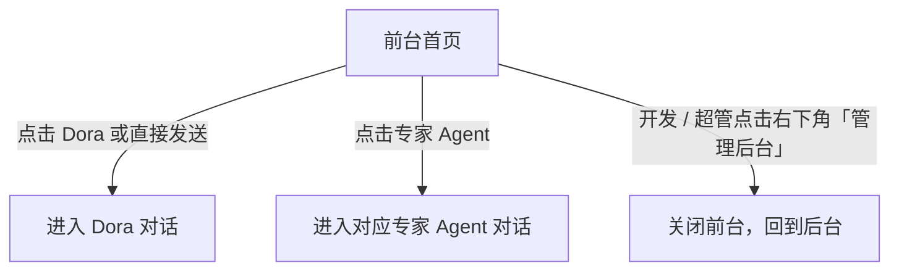

### D — 对话内创建技能

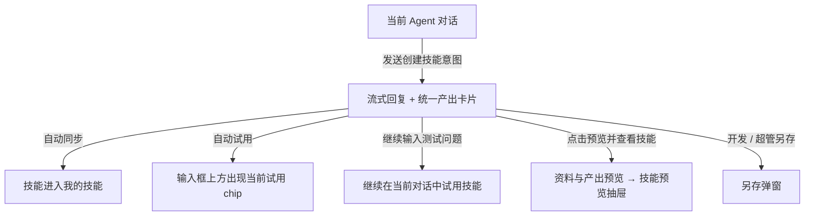

### E — 我的技能弹窗

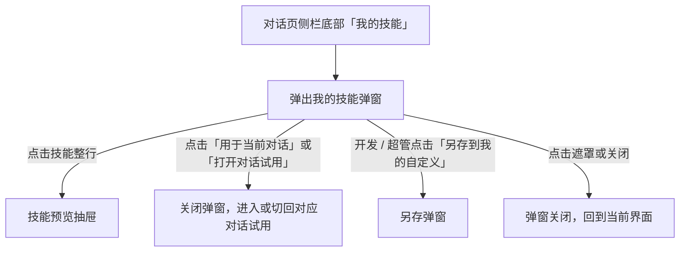

### F — 另存到后台管理「我的自定义」

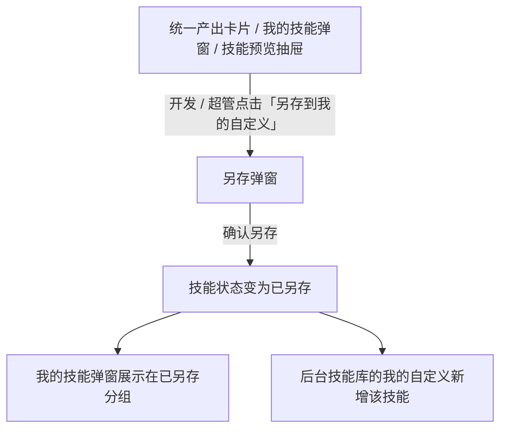

### G — 后台分配给专家 Agent

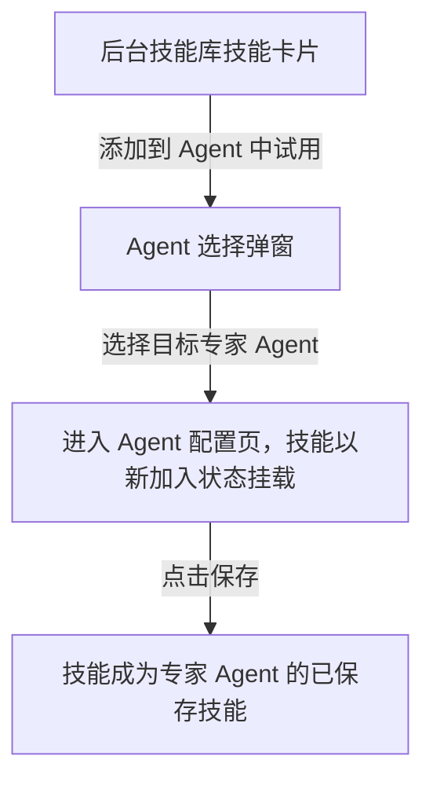

### H — 后台数据页

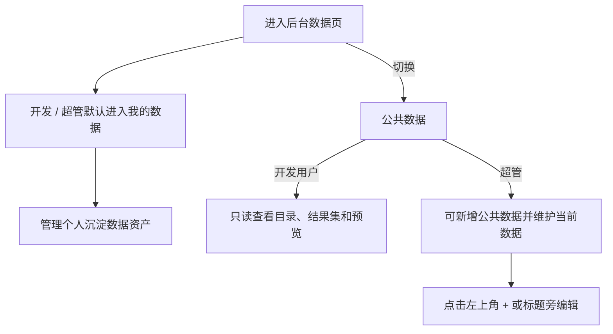

---

## 三、完整交互细节说明

### 3.1 顶部角色切换

| 用户操作 | 系统反馈 |
| --- | --- |
| 点击「普通」 | 前台不展示 `管理后台` 入口；后台创建入口在该视角下不作为普通用户能力展示；前台对话创建的技能不可另存到后台 |
| 点击「开发」 | 前台展示 `管理后台` 入口；后台保留 `+我的自定义` 和完整管理能力；数据页可切换并管理 `我的数据` |
| 点击「超管」 | 在开发用户能力基础上，技能库工具栏额外展示 `+公共技能`；数据页可切换 `公共数据` / `我的数据`，并可管理公共数据 |

### 3.2 后台技能页分类与创建入口

| 用户操作 | 系统反馈 |
| --- | --- |
| 查看技能库页面 | 页面按 `公共`、`我的自定义` 两类展示技能 |
| 点击「+我的自定义」 | 展开 3 种创建方式 |
| 点击「+公共技能」（超管） | 展开 3 种创建方式 |
| 选择「通过前台对话创建」 | 打开前台首页，并记录本次创建归属 |
| 选择「导入社区技能」 | 打开导入弹窗；确认后进入对应分类 |
| 选择「上传技能包」 | 打开上传弹窗；确认后进入对应分类 |

### 3.3 创建按钮下拉菜单

| 用户操作 | 系统反馈 |
| --- | --- |
| 点击创建按钮 | 展开下拉菜单 |
| 点击菜单外区域 / 再次点击按钮 | 菜单收起 |
| 选择「通过前台对话创建」 | 打开前台首页 |
| 选择「导入社区技能」 | 打开导入弹窗 |
| 选择「上传技能包」 | 打开上传弹窗 |

### 3.4 前台首页

| 用户操作 | 系统反馈 |
| --- | --- |
| 在 Dora Sender 输入内容并发送 | 进入 Dora 对话 |
| 点击某个专家 Agent | 进入该专家 Agent 对话 |
| 开发 / 超管点击右下角「管理后台」 | 返回后台 |

**页面说明**
- 首页聚焦 Agent 选择与 Dora 快速输入
- 首页不展示「我的技能」与「资料与产出」入口
- 普通角色不展示 `管理后台` 入口

### 3.5 对话页整体结构

| 区域 | 说明 |
| --- | --- |
| 左侧侧栏头部 | `home` 返回首页 + 当前 Agent 标识 |
| 左侧侧栏主体 | `新聊天`、`定时任务`、`分身`、`历史会话` |
| 左侧侧栏底部 | 用户头像、`我的技能`；开发 / 超管额外展示 `管理后台` |
| 欢迎态头部 | 左侧折叠按钮 |
| 消息态头部 | 左侧折叠按钮 + 会话标题 + `资料与产出` |
| 消息区 | 展示问答消息与统一产出卡片（资料 / 技能 / 报告等） |
| 输入区 | 用户继续提问、试用或调试技能 |
| 当前试用提示 | 输入框上方展示当前试用技能 chip，并提供 `切换` 轻量捷径 |
| 定时任务 | 作为侧栏结构入口展示，本轮不展开内部内容 |

### 3.6 当前试用技能弱提示

| 条件 / 操作 | 系统反馈 |
| --- | --- |
| 当前会话没有试用技能 | 不展示提示 |
| 当前会话正在试用某个技能 | 输入框上方显示 `当前试用 · 技能名 + 试用中/已另存` |
| 当前会话存在多个试用技能 | 展示当前优先试用项，并以 `+n` 表示其余数量 |
| 点击提示右侧「切换」 | 打开“我的技能”弹窗，并以“选择用于当前对话”为当前语境 |

### 3.7 技能创建后的统一产出卡片

#### 卡片内容

| 区块 | 说明 |
| --- | --- |
| 头部 | 产出名称、`产出` 标签、类型标签（技能 / HTML 报告 / PPT / 仪表盘等） |
| 描述 | 当前产出的能力概述或摘要 |
| 底部 | 来源会话、时间、关键信息标签 |
| 操作 | 统一为 `预览` + `继续围绕它提问 / 添加到对话`；技能的后台另存动作收敛到技能预览抽屉与“我的技能”中 |

#### 卡片交互

| 用户操作 | 系统反馈 |
| --- | --- |
| 创建技能成功 | 回复下方出现统一产出卡片，并同步归档到「资料与产出」 |
| 点击「预览」 | 打开资料与产出预览页；若为技能，可继续进入技能预览抽屉 |
| 点击「添加到对话」 | 技能加入当前对话并开始试用；其它文件加入当前对话上下文 |
| 继续描述修改要求 | 当前对话继续围绕该技能进行调试 |

### 3.8 我的技能弹窗

#### 弹窗结构

| 区域 | 说明 |
| --- | --- |
| 标题区 | 标题 + 语境说明 + 关闭按钮 |
| 列表区 | 分为 `草稿中`、`已另存` 两组 |
| 技能项 | 紧凑行式卡片，展示名称、状态、描述、创建时间和创建助手 |

#### 技能项交互

| 用户操作 | 系统反馈 |
| --- | --- |
| 点击技能整行 | 打开技能预览抽屉 |
| 当前存在会话时点击「用于当前对话」 | 关闭弹窗；当前会话开始试用该技能 |
| 当前不在会话中时点击「打开对话试用」 | 进入该技能来源 Agent 或 dora 对话，并开始试用 |
| 开发用户或超管点击「另存到我的自定义」 | 打开另存弹窗 |
| 普通用户查看该按钮 | 展示不可另存到后台的禁用态 |
| 点击遮罩 / 关闭按钮 | 关闭弹窗 |

### 3.9 技能预览抽屉

| 用户操作 | 系统反馈 |
| --- | --- |
| 点击技能产出预览中的「查看技能」或在“我的技能”中点击整行 | 打开抽屉 |
| 抽屉打开 | 展示技能基本信息与 `skill.yaml` 预览 |
| 开发用户或超管点击底部主按钮 | 打开另存弹窗；按钮文案随技能状态变化 |
| 普通用户查看底部主按钮 | 展示不可另存到后台的禁用态 |
| 点击遮罩 / 关闭按钮 | 抽屉关闭 |

### 3.10 另存到我的自定义弹窗

| 用户操作 | 系统反馈 |
| --- | --- |
| 打开另存弹窗 | 预填技能名称与说明 |
| 修改技能名称 | 弹窗内名称同步更新 |
| 点击确认另存 | 技能状态更新为已另存；技能进入后台管理的 `我的自定义` 分类 |
| 点击取消 / 遮罩 | 关闭弹窗，不修改状态 |

**另存后的状态**
- 当前对话继续保留该技能的试用状态
- 我的技能弹窗中，该技能展示在 `已另存` 分组
- 后台技能库在 `我的自定义` 中新增该技能，管理员可继续分配给专家 Agent

### 3.11 后台技能库与专家 Agent 配置

| 用户操作 | 系统反馈 |
| --- | --- |
| 在后台技能库 hover 技能卡片 | 显示 `添加到 Agent 中试用` |
| 点击 `添加到 Agent 中试用` | 打开 Agent 选择弹窗 |
| 选择专家 Agent | 进入 Agent 配置页，技能以“新加入”状态挂载到配置列表 |
| 点击保存 | 技能成为专家 Agent 的已保存技能 |

### 3.12 后台数据页

#### 页面结构

| 区域 | 说明 |
| --- | --- |
| 左栏 | 顶部为当前视角标题下拉、新增入口、搜索框和目录树 |
| 右侧工作台头部 | 展示当前数据资产图标、标题、元信息、权限标签与语义信息入口 |
| 右侧工作台底部左侧 | 展示当前数据资产下的结果集列表 |
| 右侧工作台底部右侧 | 展示结果集工具栏与表格数据预览 |

#### 角色差异

| 角色 | 页面能力 |
| --- | --- |
| 开发用户 | 可切换 `公共数据` / `我的数据`；`公共数据` 只读，`我的数据` 可管理 |
| 超管 | 可切换 `公共数据` / `我的数据`；在 `公共数据` 中可新增、重命名和调整目录，在 `我的数据` 中也可管理个人资产 |

#### 关键交互

| 用户操作 | 系统反馈 |
| --- | --- |
| 开发用户或超管打开数据页 | 默认优先进入 `我的数据` 视角 |
| 开发用户查看数据页 | 左上角展示当前视角标题下拉；可在 `公共数据` 与 `我的数据` 之间切换 |
| 开发用户或超管点击 `我的数据` | 左栏切换为个人沉淀资产树，中栏与右栏同步刷新 |
| 点击左侧目录树中的数据资产 | 右侧头部刷新为当前数据资产信息，底部左侧展示结果集列表，底部右侧展示表格预览 |
| 超管在 `公共数据` 中点击左上角 `+` | 进入新增公共数据的后续流程 |
| 超管点击标题旁编辑图标 | 进入当前公共数据的重命名 / 配置流程 |
| 开发用户或超管在 `我的数据` 中点击左上角 `+` | 进入新增个人数据的后续流程 |
| 开发用户或超管在 `我的数据` 中点击标题旁编辑图标 | 进入当前个人数据的重命名 / 配置流程 |

### 3.13 资料与产出面板

#### 设计原则

- 面板命名为 `资料与产出`，打开后覆盖在对话区右侧，聊天区同时保持可见
- 面板以 `资料` / `产出` 两个 Tab 为主导航，消除旧版「全部/资料/产出」三路过滤
- Scope 切换（`全部` / `当前对话`）作为次要控件，在 Tab 下方展示
- 列表页与预览页为顺序导航（不并列），降低单屏信息密度

#### 入口与面板尺寸

| 位置 | 系统反馈 |
| --- | --- |
| 对话页头部 | 展示 `资料与产出` 入口，便于在会话中随时查看 |
| 点击入口 | 打开右侧面板，默认宽度 50% 屏幕；聊天区同时可见 |
| 拖拽面板左边缘 | 调整面板宽度（最小 320px，最大屏宽 - 260px） |

#### Tab 与 Scope 交互

| 用户操作 | 系统反馈 |
| --- | --- |
| 点击 `资料` Tab | 切换到资料列表；Tab 角标显示当前 Agent 内资料总数（不随 Scope 变化） |
| 点击 `产出` Tab | 切换到产出列表；Tab 角标显示当前 Agent 内产出总数 |
| 点击 `全部` | Scope 切到全部，列表展示当前 Agent 所有对话的资料 / 产出 |
| 点击 `当前对话` | 列表收敛为本轮会话内产生的条目；不在会话中时按钮禁用 |
| 切换 Tab | 自动回到列表页（若当前在预览页则退回） |

#### 资料列表（列表页 · 资料 Tab）

| 用户操作 | 系统反馈 |
| --- | --- |
| 查看资料列表 | 平铺展示每个上传文件：图标、文件名（粗体）、来源会话 · 时间 |
| hover 某个资料文件 | 右侧露出 `添加到对话`、`删除` 两个操作 |
| 列表为空 | 展示引导提示：在对话输入框上传资料即可出现 |
| 点击某个文件 | 进入预览页，显示该文件内容 |

#### 产出列表（列表页 · 产出 Tab）

| 用户操作 | 系统反馈 |
| --- | --- |
| 查看产出列表 | 以「主产出物」为卡片，左侧蓝色竖线标识；技能、报告、PPT、仪表盘都使用同一套卡片结构；显示文件名（粗体）、来源会话 · 时间、类型角标 |
| hover 主产出 | 右侧露出 `添加到对话`、`删除` 两个操作 |
| 主产出下方有过程文件 | 展示「过程文件（N）」折叠行，默认收起 |
| 点击折叠行 | 展开 / 收起过程文件；同时最多展开一个主产出的过程文件 |
| 过程文件条目 | 缩进显示，展示图标、文件名、类型后缀（大写） |
| hover 过程文件 | 右侧露出 `添加到对话`、`删除` 两个操作 |
| 点击主产出 | 进入预览页 |
| 点击过程文件 | 进入预览页 |
| 列表为空 | 展示引导提示：让 Agent 生成报告、PPT 或仪表盘 |

#### 预览页

| 用户操作 | 系统反馈 |
| --- | --- |
| 进入预览页 | 顶栏显示「← 返回列表」+ 文件名；主体区采用内容优先的大画布预览，辅助信息收敛在顶部 |
| 点击「← 返回列表」 | 回到列表页，列表状态（Tab、Scope、过程文件展开状态）保持不变 |
| 资料预览 | 展示表格数据；操作按钮：`加入当前对话`、`下载文件` |
| 技能预览 | 展示技能摘要、试用状态与核心能力；操作按钮：`添加到对话`、`查看技能` |
| 其它产出预览 | 根据类型渲染：HTML 报告（含 KPI + 图表）/ PPT 幻灯片 / 仪表盘；操作按钮：`添加到对话`、`打开产物` |
| 过程文件预览 | 代码文件渲染为带语法色彩的代码块；Markdown 文件渲染为结构化文本；操作按钮：`添加到对话`、`查看文件` |
| 点击操作按钮 | 执行对应动作并弹出 Toast 提示 |

### 3.14 对话内上传与产物归档

| 用户操作 | 系统反馈 |
| --- | --- |
| 在对话输入框点击 `上传资料` | 当前资料被纳入 `资料与产出`，并默认关联当前 Agent |
| 在已有对话中上传资料 | 对话区出现资料卡片，同时资产入口数量更新 |
| Agent 生成 HTML 报告 / PPT / 仪表盘 | 对应产物自动归档到 `资料与产出`，并自动把右侧工作台焦点切到新产物 |
| 用户在统一入口预览 HTML 报告 | 在工作台里查看完整结构，不在对话气泡中做局部小窗预览 |

### 3.15 Gen UI 辅助表达

#### 设计目标

- Gen UI 不只负责“展示结果”，也负责“帮助用户表达意图”
- 重点覆盖三类可复用场景：表达方式收敛、方案选择、结果理解与继续操作
- 典型输出形态包括 `HTML 报告`、`PPT`、`仪表盘`，但设计思路不局限于文件格式选择

#### 当前原型策略

| 阶段 | 系统反馈 |
| --- | --- |
| 用户提出“做报告 / 做 PPT / 做仪表盘”等需求 | 先返回一层 Gen UI 面板，而不是直接生成最终产物 |
| Gen UI 面板展示 | 提供 `输出方式`、`上下文范围`、`推荐方案` 三层收敛控件 |
| 用户切换 `当前 Agent` / `当前对话` | 影响后续生成时默认引用的资料与历史产物范围 |
| 用户选择某个推荐方案 | 系统立即生成对应产物，并自动归档到 `资料与产出` |
| 产物生成后继续提问 | 后续对话默认围绕该产物继续迭代，而不是重新开始描述 |

### 3.16 上传技能包 / 导入社区技能

| 流程 | 系统反馈 |
| --- | --- |
| 上传技能包 | 选文件 → 解析 → 预览确认 → 进入对应技能分类 |
| 导入社区技能 | 输入 URL → 拉取解析 → 预览确认 → 进入对应技能分类 |
| 解析失败 | 给出错误说明，并支持重试 |

### 3.17 交互说明标注

开启右上角 `交互说明` 后，原型以就地浮动标号标出以下关键设计点：

| 标号 | 说明 |
| --- | --- |
| 1 | 顶部角色切换用于评审普通 / 开发 / 超管的权限差异 |
| 2 | 后台 `+我的自定义` 提供前台对话创建、导入社区技能、上传技能包三类创建入口 |
| 3 | 超管额外展示 `+公共技能`，创建链路仍从前台开始，但最终归档到公共技能 |
| 4 | 后台数据页以 `公共数据 / 我的数据` 作为视角切换，并表达默认进入我的数据与公共数据权限差异 |
| 5 | 前台首页既支持从 dora 开始，也支持进入专家 Agent 后在对话中创建技能 |
| 6 | 首页不再展示 `我的技能` 与 `资料与产出`，首屏只聚焦 Agent 选择与快速发起任务 |
| 7 | `管理后台` 入口只对开发 / 超管展示，并在进入 Agent 后下沉到侧栏底部 |
| 8 | 当前对话试用技能以输入框上方弱提示 chip 展示，并提供 `切换` 入口 |
| 9 | 技能生成后改为统一产出卡片展示，同时同步到 `我的技能` 并开始当前对话试用 |
| 10 | Gen UI 先帮助用户收敛表达方式和上下文范围，再生成并归档产物 |
| 11 | `资料与产出` 统一承接资料、技能和其它结果文件，列表项 hover 时露出 `添加到对话` 与 `删除` |
| 12 | `我的技能` 采用轻量弹窗，按 `草稿中 / 已另存` 分组，并根据语境提供不同操作 |
| 13 | 技能预览抽屉同时承接配置查看与另存动作 |
| 14 | `另存到我的自定义` 只改变后台归档状态，不打断当前对话试用 |
| 15 | 后台技能可直接分配到专家 Agent 试用，并进入 Agent 配置页保存 |

---

## 四、说明范围

- 本文档描述当前 `dora-new-architecture-design-overlay.html` 的结果态
- 当前结果态覆盖：角色切换、技能库分类、数据页切换与权限差异、公共技能创建入口、首页、进入 Agent 后侧栏结构、我的技能弹窗、统一 `资料与产出` 入口、Gen UI 辅助表达、发布链路、后台分配链路
- `dora-new-architecture-design-new-tab.html` 如需继续作为并行方案评审，应单独维护对应说明

---

## 五、待确认

- 定时任务页签后续是否需要补充独立内容区域？当前设计仅保留结构入口
- 多个技能同时处于当前会话试用状态时，是否需要提供显式切换入口？当前设计展示优先试用项与剩余数量
- 另存流程是否需要增加“待审核”状态？当前设计为开发用户与超管确认后直接进入后台管理的 `我的自定义`
- 开发用户与超管在 `我的数据` 中的管理动作，正式版是否完全一致？当前原型先按同权处理
- `资料` 与 `产出` 在正式版中是否需要在存储层做更强区分？当前原型先按统一资产池处理、以 UI 过滤区分
