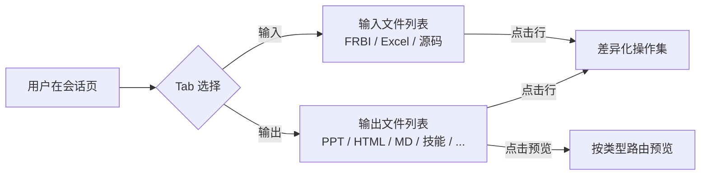
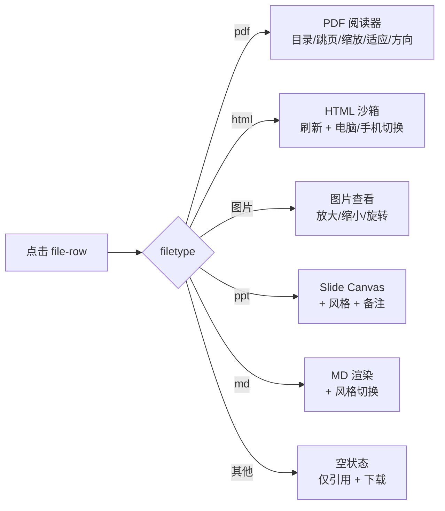
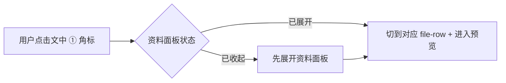
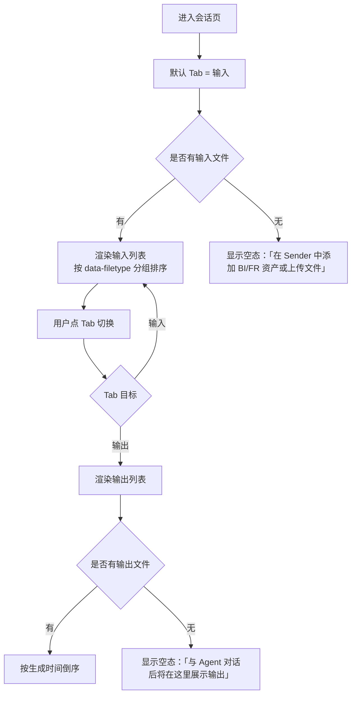
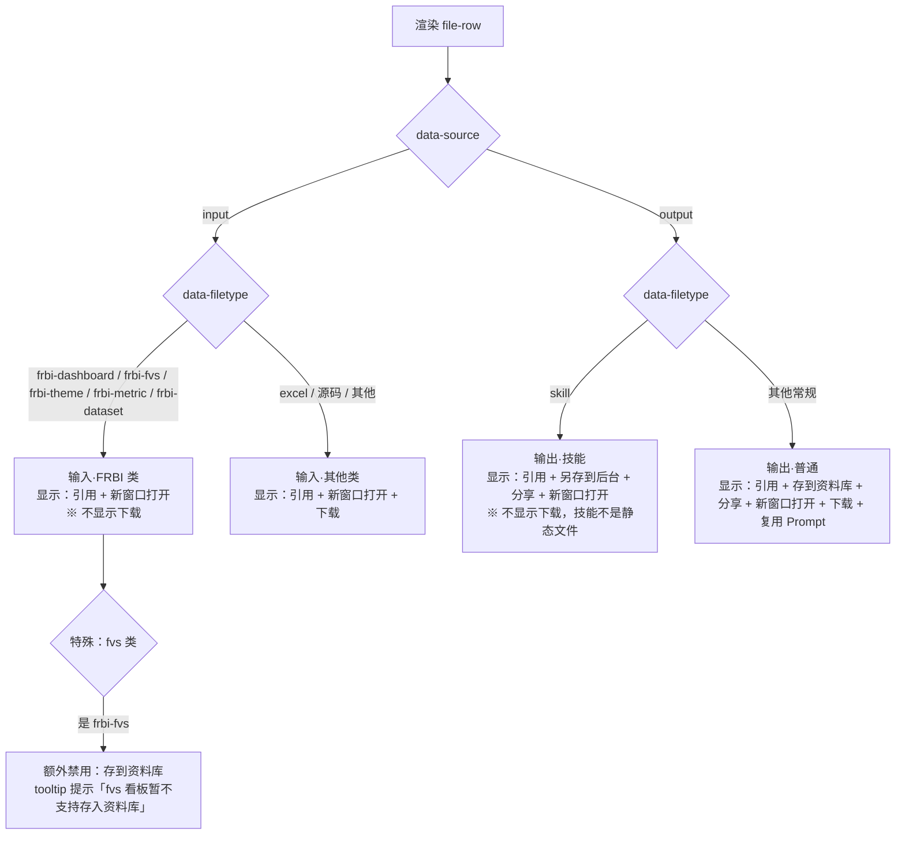
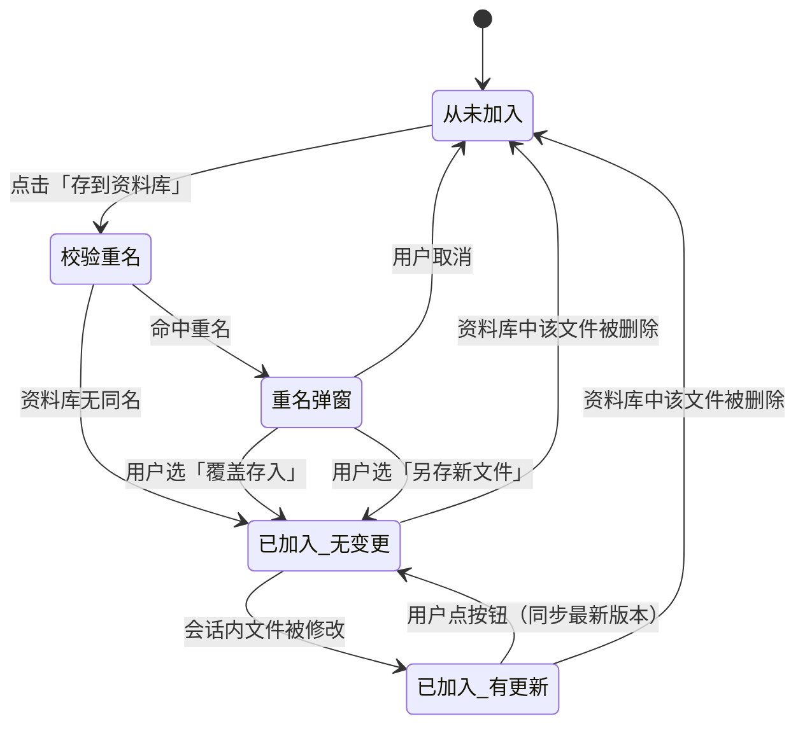
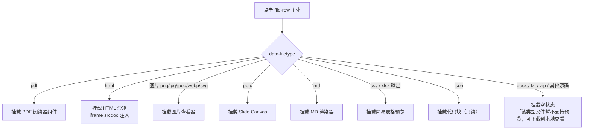
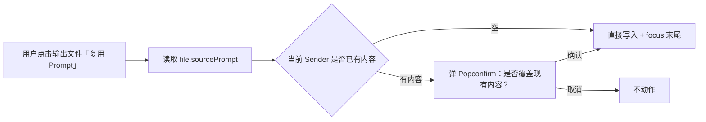

# 会话文件区交互逻辑（基于 Figma 设计稿对齐）

> **原型文件**：index.html（右侧 `.conv-files` 区，[L304-L414](./index.html#L304-L414)）
> **设计目标**：把会话文件区从"统一文件列表 + 单一操作集"重构为"按来源分流 + 按类型差异化"的形态，对齐 Figma 设计稿《会话文件（视觉🔴P1）》（node-id `13365-55286`）
> **设计稿参考**：另对照《对话&资料库（视觉🔴P1）》（node-id `13364-42728`）中"会话文件 ↔ 资料库" 5 状态机逻辑

---

## 零、评审摘要

### 会话文件区 — Tabs 重命名 + 操作集分流

**本次变更**
- Tabs 从 `资料 | 产出` → **`输入 | 输出`**（按文件来源严格分类，非按"已读/未读"或"上传/产出"模糊分类）
- 操作集按 **来源 × 类型** 矩阵差异化（不再统一显示"添加到对话/下载/删除"）
- 输出文件新增 `存到资料库`、`分享`、`新窗口打开` 三个动作
- 输入文件（FRBI 类）**禁用下载**；fvs 看板**禁用"存到资料库"**
- 技能类输出动作改名为 **`另存到后台`**（不同于普通文件的"存到资料库"）

**关键流程**

---

### 会话文件区 — 预览能力按类型分流

**本次变更**
- `.files-preview` 从"只支持 PPT 缩略图"扩展为**按文件类型路由的预览容器**
- 新增 5 种预览模式：PDF 阅读器 / HTML 沙箱 / 图片查看 / MD 渲染 / 空状态
- PPT 预览补 `风格切换` 和 `演示者备注` 开关
- 暂不支持预览的类型（docx、txt、其他源码）显示**空状态**，仅保留引用/下载

**关键流程**

---

### 会话文件区 — 输出文件回填 Prompt

**本次变更**
- 每条输出文件新增 `复用 Prompt` 动作：点击后把"生成它的提示词"回填到当前会话 Sender
- Sender 进入"已填充"状态，光标聚焦到末尾，便于用户改 prompt 再发起一次

**关键流程**

---

### 消息区 — CitationMark 引用角标

**本次变更**
- Agent 回复的 `result-slot` 段落中，凡引用了具体文件/数据的位置插入**可点击角标**（编号 ①②③...）
- 点击角标 → 自动展开/切换右侧资料面板到对应文件预览

**关键流程**

---

## 一、设计背景

### 现状问题

1. **资料/产出分类含糊**：当前原型 [index.html:307-308](./index.html#L307-L308) 用 `资料 | 产出`，跟设计稿《会话文件》明确定义的"输入/输出"语义不一致。"资料"既可指用户上传的输入，也可指 Agent 产出的中间产物。
2. **操作集一刀切**：所有 `file-row` 都显示"添加到对话 + 下载 + 删除"。设计稿明确：
   - 输入·FRBI（仪表板/fvs/标准分析主题/模型指标集/数据集）：不允许下载，因为是平台资源
   - 输入·其他：允许下载
   - 输出·普通：核心操作是 `存到资料库`（沉淀价值），下载、分享、新窗口打开是辅助
   - 输出·技能：用 `另存到后台`（语义上技能要进入运行时，不是静态文件归档）
3. **预览能力薄弱**：只有 PPT 缩略图。设计稿对每种类型都做了预览定义（PDF 阅读器、HTML 沙箱、图片旋转、MD 渲染），原型完全没体现。
4. **缺失「存到资料库」状态机入口**：设计稿《对话&资料库》定义了 5 状态机（从未加入 / 已加入无变更 / 已加入有更新 / 重名冲突 / 资料库删除后回退），这套状态机的**触发按钮**就在会话文件区的输出文件上，原型缺位。
5. **缺失引用追溯**：Agent 回复中的数据没有可点击的角标定位到具体文件，用户无法验证数据来源。
6. **缺失 Prompt 回填**：输出文件无法回填它的生成 prompt，用户改 prompt 再生成只能重新输入。

### 改造目标

把会话文件区改造成 **"按来源严格分类 + 按类型差异化操作/预览 + 与状态机贯通"** 的形态，匹配设计稿。

---

## 二、完整操作流程

### 2.1 Tab 切换与列表呈现

### 2.2 file-row 操作集决策

### 2.3 「存到资料库」状态机（与《对话&资料库》对齐）

按钮文案与外观随状态变化：

| 状态 | 按钮文案 | 按钮状态 | 额外标记 |
|---|---|---|---|
| 从未加入 | `存到资料库` | 可点 | — |
| 已加入·无变更 | `已存入资料库` | 禁用 | — |
| 已加入·有更新 | `存到资料库` | 可点 | **右上角小红点** |
| 资料库已删 | `存到资料库` | 可点 | — |

### 2.4 预览路由

### 2.5 复用 Prompt 流程

### 2.6 CitationMark 跳转

---

## 三、完整交互细节说明

### 3.1 Tabs 与计数

| 用户操作 | 系统反馈 |
|---|---|
| 进入会话页 | Tab 默认选中 `输入`；`输入`/`输出` 角标显示当前 Tab 的文件数 |
| 点击 `输入` Tab | 切到输入列表；URL hash 不变（保持原型行为） |
| 点击 `输出` Tab | 切到输出列表 |
| 剧本播放中输出新文件 | `输出` Tab 上数字徽标 +1，**伴随 800ms 高亮闪动**提示新增 |

### 3.2 输入文件操作

| 用户操作 | 系统反馈 |
|---|---|
| 在 FRBI 文件行 hover | 显示动作：`引用` `↗ 新窗口打开`，不显示下载 |
| 点击 `引用` | 该文件以 pill 形式插入到 Sender 上方 `sender-added-row` |
| 点击 `↗ 新窗口打开` | 新 tab 打开对应 BI/FR 资源（mock 弹 toast `已在新窗口打开` 即可） |
| 在其他类输入文件行 hover | 显示：`引用` `↗ 新窗口打开` `⇩ 下载` |
| 在任意输入文件行右键 / 长按 | 不显示删除（输入文件归属 Sender 上下文，**不在文件区删除**，需回 Sender 移除） |

### 3.3 输出文件操作（普通）

| 用户操作 | 系统反馈 |
|---|---|
| 在普通输出文件行 hover | 显示动作集：`引用` `存到资料库` `分享` `↗ 新窗口打开` `⇩ 下载` `↺ 复用 Prompt` |
| 点击 `引用` | 同输入文件，pill 形式插入 Sender |
| 点击 `存到资料库` ·状态=从未加入 | 调用校验重名 → 命中则弹 Popconfirm；未命中直接置为 `已加入·无变更` 并 toast `已存入资料库` |
| 点击 `存到资料库` ·状态=已加入·无变更 | 按钮禁用，无反馈 |
| 点击 `存到资料库` ·状态=已加入·有更新 | 同步最新版本，toast `已更新到资料库`，红点消失 |
| 重名 Popconfirm 弹出 | 文案：`「资料库」中已有同名文件，请确认存入方式`，按钮 `另存新文件` / `覆盖存入` / `取消` |
| Popconfirm 选 `另存新文件` | 文件名加后缀 `（2）` 存入，状态 → `已加入·无变更` |
| Popconfirm 选 `覆盖存入` | 资料库对应文件被替换，本文件状态 → `已加入·无变更` |
| 点击 `分享` | 弹出分享气泡：复制链接 + 选择成员（mock 即可） |
| 点击 `↗ 新窗口打开` | 新 tab 全屏预览 |
| 点击 `⇩ 下载` | 浏览器原生下载（mock 弹 toast） |
| 点击 `↺ 复用 Prompt` | 读取 `file.sourcePrompt` 注入 Sender 文本框 |
| 复用 Prompt 时 Sender 非空 | 弹 Popconfirm：`Sender 已有内容，是否覆盖？` |

### 3.4 输出文件操作（技能类）

| 用户操作 | 系统反馈 |
|---|---|
| 在技能文件行 hover | 显示动作：`引用` `另存到后台` `分享` `↗ 新窗口打开` |
| 点击 `另存到后台` | toast `已添加到后台技能库`；该按钮变更为 `已添加` 禁用态 |
| 技能不显示 `下载` | 技能是运行时对象，无静态产物 |

### 3.5 输出文件操作（fvs 看板特例）

| 用户操作 | 系统反馈 |
|---|---|
| 在 fvs 文件行 hover | 显示：`引用` `↗ 新窗口打开` `⇩ 下载`；`存到资料库` **显示但禁用** |
| hover `存到资料库`（禁用态） | tooltip：`fvs 看板暂不支持存入资料库` |

### 3.6 预览模式：PDF

| 用户操作 | 系统反馈 |
|---|---|
| 点击 PDF 文件主体 | 预览区切到 PDF 阅读器；toolbar：`目录` `跳页` `缩放(- 100% +)` `适应宽度/高度` `旋转方向` |
| 点击 `目录` | 左侧抽出大纲面板 |
| 输入页码回车 | 跳到对应页 |
| 调整缩放 | canvas 重渲染 |
| 切换方向 | 整页旋转 90° |

### 3.7 预览模式：HTML

| 用户操作 | 系统反馈 |
|---|---|
| 点击 HTML 文件主体 | 用 `<iframe srcdoc>` 沙箱渲染，**不展示源码** |
| 顶部按钮 `刷新` | iframe 重载 |
| 顶部切换 `电脑 / 手机` | iframe 容器宽度切到 360px / 100% |

### 3.8 预览模式：图片

| 用户操作 | 系统反馈 |
|---|---|
| 点击图片文件主体 | 居中显示，bottom toolbar：`放大` `缩小` `旋转左 90°` `旋转右 90°` |
| 双击图片 | 在 100% / 适应窗口 之间切换 |
| 鼠标滚轮 | 缩放（按 1.1 倍率） |

### 3.9 预览模式：PPT

| 用户操作 | 系统反馈 |
|---|---|
| 点击 PPT 文件主体 | 左侧 slide-list 缩略图，右侧 slide-canvas 主图（保留现状） |
| 切换 `风格` | 应用预设主题色（mock 几个即可：默认 / 商务深色 / 简约浅色） |
| 点击底部 `演示者备注` | 在主图下方展开备注编辑区，可输入文本（mock 不真存） |

### 3.10 预览模式：MD

| 用户操作 | 系统反馈 |
|---|---|
| 点击 MD 文件主体 | 渲染为 HTML（**不展示源码**） |
| 切换 `风格` | 切换排版主题（mock：默认 / 简洁 / GitHub 风） |
| **不提供** 编辑入口 | 设计稿明确：md 不支持编辑 |

### 3.11 预览模式：空状态（docx/txt/zip 等）

| 用户操作 | 系统反馈 |
|---|---|
| 点击 docx/txt/zip/其他源码文件主体 | 预览区显示插画 + 文案 `该类型文件暂不支持预览，可下载到本地查看` |
| 空状态页保留 `引用` `下载` 两个动作 | 按钮放在插画下方居中 |

### 3.12 CitationMark 引用角标

| 用户操作 | 系统反馈 |
|---|---|
| Agent 回复段落中显示 `① ② ③ ...` 上标 | 紧贴文本，hover 显示对应文件名 tooltip |
| 点击角标 | 若资料面板已收起 → 展开；切到对应 file-row → 高亮 800ms → 进入预览 |
| 角标多个对应同一文件 | 显示编号合并：`① / ②` 都指向同一文件时仍分开显示，便于追溯不同段落 |

---

## 四、方案差异对比

**本次只有一个方案**（按设计稿对齐），无 A/B 方案。

> 顶部"方案切换栏"保留现有的 A 三方案（Sender） + B 四方案（对话）切换器，本次改动不涉及 Sender 和对话流，不与切换栏交互。

---

## 五、待讨论问题

- [ ] **fvs 看板的"引用"语义**：如果引用到对话后 Agent 想读其数据，Agent 是直接读 fvs 配置还是读底层数据集？设计稿未明确。
- [ ] **"复用 Prompt"是否需要保留原 prompt 关联的资产**：用户复用 prompt 时，原 Sender 上的 BI/FR 资产 pill 是否一起回填？建议**不一起**，用户重新选，但需评审确认。
- [ ] **CitationMark 在流式输出时的时机**：是边打字边出现，还是输出完成后一次性插入？建议输出完成后插入，避免抖动。
- [ ] **状态机第 5 状态（资料库已删 → 回退）触发时机**：用户在资料库删除时，会话页此时如果不在前台，是否需要实时推送 / 何时检测？mock 阶段可用"切回 Tab 时重新校验"代替。
- [ ] **技能"另存到后台"后能否撤销**：原型阶段先不做，按钮变 `已添加` 即可；正式版需补撤销路径。
- [ ] **空状态插画素材**：原型先用简单 SVG 占位，正式版需视觉同学补图。

---

## 六、实施分批

| 批次 | 范围 | 预估 | 落点 |
|---|---|---|---|
| **C1（P0 必改）** | Tabs 改名 + `file-row` 增 `data-source`/`data-filetype` + 操作集按矩阵渲染 + 输出新增「存到资料库/分享/新窗口打开/复用 Prompt」按钮（仅 UI，逻辑 mock） | ~30 min | [index.html:304-414](./index.html#L304-L414) + [script.js](./script.js) |
| **C2（P1 状态机）** | 「存到资料库」5 状态机 + 重名 Popconfirm + 红点更新提示 + 复用 Prompt 真实回填 | ~45 min | [script.js](./script.js) + [style.css](./style.css) |
| **C3（P1 预览）** | 6 种预览路由（PDF/HTML/图片/PPT 补、MD/空态） + PPT 补风格+备注 | ~1.5h | [index.html](./index.html) + [script.js](./script.js) + [style.css](./style.css) |
| **C4（P2 引用）** | CitationMark 角标 + 跳转预览联动 | ~30 min | [index.html:226-258](./index.html#L226-L258) + [script.js](./script.js) |
| **C5（P2 分享）** | 简易分享气泡（复制链接 + 选成员） | ~20 min | 新增 modal 模块 |

> 建议每批落地后**同步更新本文档**对应章节，并在 `index.html` 顶部"交互说明"开关下追加新的 `change-marker`（编号沿用现有 17 之后递增）。
