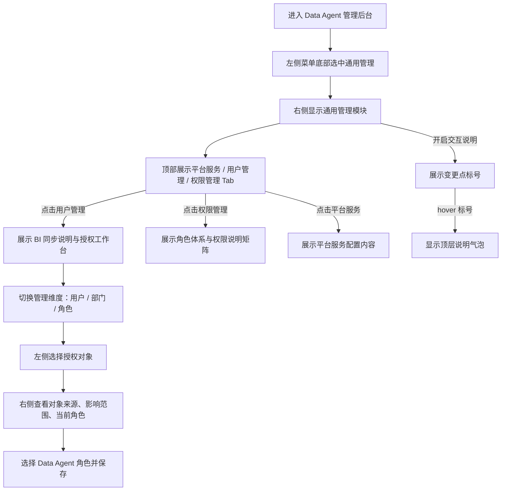

# 通用管理 · 权限管理 Tab 交互逻辑

> **原型文件**：`prototype.html`  
> **设计目标**：基于产品文档，补齐通用管理中的 `用户管理` 与 `权限管理` 页签，用于表达 BI 同步角色分配与权限说明矩阵

---

## 零、评审摘要

### 通用管理 — 用户管理 / 权限管理

**当前设计**
- 页面框架复刻项目后台：左侧管理菜单、右侧模块容器、模块标题栏、Tab 页签
- 左侧 `通用管理` 入口位于所有管理菜单项的最下方
- `通用管理` 内保留 `平台服务` 页签，并新增 / 展示 `用户管理`、`权限管理` 页签
- `用户管理` 承接 BI 同步用户、部门、角色，并以”对象选择 + 角色分配”工作台完成 Data Agent 角色分配；同时提供 **IM 用户映射** 子视图
- `权限管理` 承接角色体系、权限类型与具体权限边界说明
- 开启右上角 `交互说明` 后，页面变更点以浮动标号展示；hover 标号时，说明气泡以页面顶层浮层展示，不受容器裁切

**关键流程**

---

## 一、设计背景

用户管理与权限管理都属于后台通用管理下的配置能力。根据产品文档，用户管理页签负责承接 BI 同步的用户、部门、角色，并允许管理员按“用户 / 部门 / 角色”三种维度为对象分配 Data Agent 平台角色；权限管理页签用于说明三类用户的权限范围与边界。

---

## 二、完整操作流程

---

## 三、完整交互细节说明

### 3.1 后台页面框架

| 用户操作 | 系统反馈 |
|----------|----------|
| 进入后台 | 左侧显示管理菜单，`通用管理` 位于菜单底部，右侧显示模块容器 |
| 查看通用管理 | 模块标题栏显示 `通用管理` |
| 查看模块内容 | 标题栏下方显示 Tab 页签区域 |

### 3.2 交互说明标注

| 用户操作 | 系统反馈 |
|----------|----------|
| 点击右上角 `交互说明` | 页面上出现浮动数字标号，标记当前原型的交互变更点 |
| hover 标号 `1` | 展示左侧 `通用管理` 入口位置调整说明 |
| hover 标号 `2` | 展示 `用户管理` 承接 BI 同步与角色分配的说明 |
| hover 标号 `3` | 展示 `权限管理` 承接角色体系与权限说明矩阵的说明，且说明气泡以页面顶层浮层显示 |
| hover 标号 `4` | 展示用户管理改为“双栏授权工作台”的说明 |
| 再次点击 `交互说明` | 所有标号和说明气泡隐藏 |

### 3.3 用户管理 / 权限管理 Tab

| 用户操作 | 系统反馈 |
|----------|----------|
| 点击 `用户管理` | `用户管理` 页签高亮，内容区展示 BI 同步说明与授权工作台 |
| 切换 `按用户 / 按部门 / 按角色` | 左侧对象列表切换为对应维度，便于从不同管理视角做授权 |
| 选择左侧对象 | 右侧展示当前对象来源、影响范围、成员数和当前 Data Agent 角色 |
| 点击右侧角色卡片 | 为当前对象切换 Data Agent 平台角色，并即时刷新影响说明 |
| 点击 `保存角色分配` | 提交当前对象的角色调整 |
| 点击 `权限管理` | `权限管理` 页签高亮，内容区展示角色体系与权限说明矩阵 |
| 查看权限矩阵 | 按超级管理员、Agent 查看用户、Agent 开发用户说明使用权限、管理权限、发布权限、页面管理权限、分级授权 |
| 点击 `平台服务` | `平台服务` 页签高亮，内容区切回服务器配置示意 |

### 3.4 IM 用户映射

**入口**：用户管理 → 工具栏第四个 scope tab「IM 用户映射」

#### 空状态（初始未配置）

| 用户操作 | 系统反馈 |
|----------|----------|
| 点击 `IM 用户映射` | 工具栏搜索框和视角提示隐藏；内容区切换为 IM 映射视图，默认展示「飞书」平台 |
| 查看空状态视图 | 展示飞书品牌色图标、「暂无映射」状态标签、标题「飞书用户映射尚未配置」、功能说明文案、三条帮助提示、「+ 添加映射」主按钮 |
| 切换至「钉钉」Tab | 图标、颜色、文案同步切换为钉钉；空状态布局相同 |
| 切换至「企业微信」Tab | 图标、颜色、文案同步切换为企业微信 |

**设计意图**：初始零状态下，通过品牌色图标 + 「暂无映射」标签 + 功能描述 + 帮助提示，让用户在看到空状态的第一眼就理解：这里用来配置什么、当前没有任何数据、可以做什么。

#### 添加映射

| 用户操作 | 系统反馈 |
|----------|----------|
| 点击「+ 添加映射」 | 弹出模态框，标题根据当前平台变化（如「添加飞书用户映射」），下拉已过滤掉已配置过映射的 BI 用户 |
| 选择 BI 用户 | 更新待提交的用户 ID |
| 输入 IM 账号 | 更新待提交的账号文本 |
| 未填写账号直接点「确认添加」 | 账号输入框变红，显示错误文案「请输入账号」，不关闭弹窗 |
| 填写完毕点「确认添加」 | 关闭弹窗，视图切换为映射列表；新增条目显示「刚刚」时间戳 |
| 点击蒙层或「取消」 | 关闭弹窗，不提交数据 |

**过滤逻辑**：同一平台下，已添加映射的 BI 用户不再出现在下拉选项中，避免重复映射。

#### 有映射后的列表视图

| 用户操作 | 系统反馈 |
|----------|----------|
| 查看列表视图 | 顶部显示「已添加 N 条映射关系」和「+ 添加映射」按钮；下方为表格（BI 用户 / IM 账号 / 添加时间 / 操作列） |
| 再次点击「+ 添加映射」 | 弹出添加弹窗，已映射用户从下拉中排除 |
| 点击某行「删除」 | 立即从列表中移除该条映射；若删除后该平台映射数为 0，切回空状态视图 |
| 切换到其他平台 Tab | 显示该平台自己的状态（独立数据，互不影响） |

---

## 四、待讨论问题

- [ ] 用户管理与权限管理是否都应保留在 `通用管理` 下？
- [ ] BI 同步对象是否支持在 Data Agent 侧新增本地对象，还是仅允许映射已有用户 / 部门 / 角色？
- [ ] 权限矩阵最终是否需要支持更细粒度到页面按钮级别的权限说明？
- [ ] IM 用户映射是否需要支持批量导入（CSV）？
- [ ] 是否需要在映射列表中展示映射状态（如账号是否有效）？
