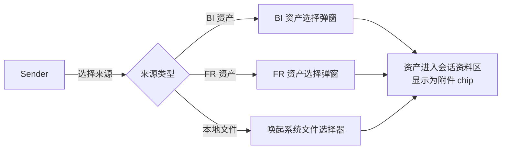
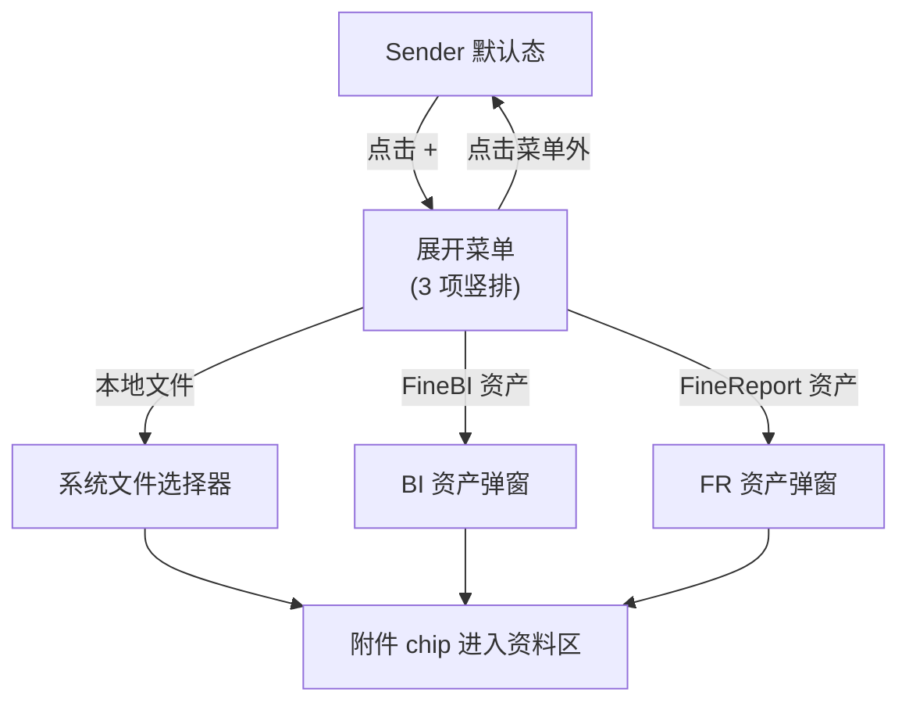
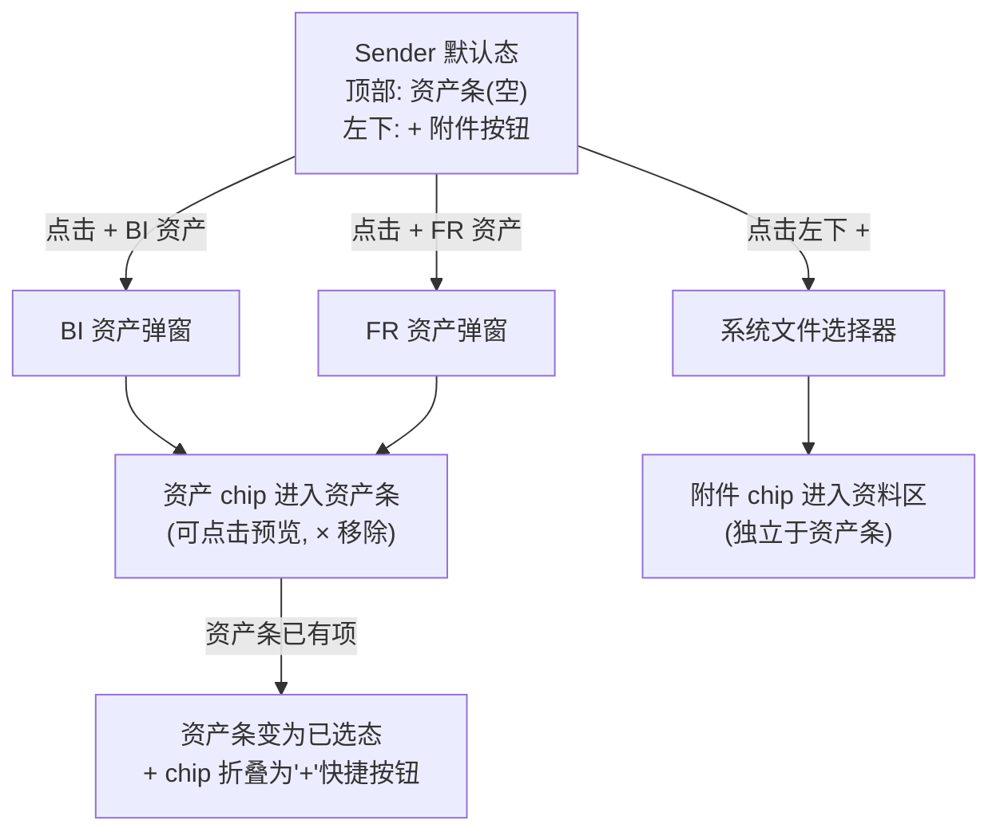
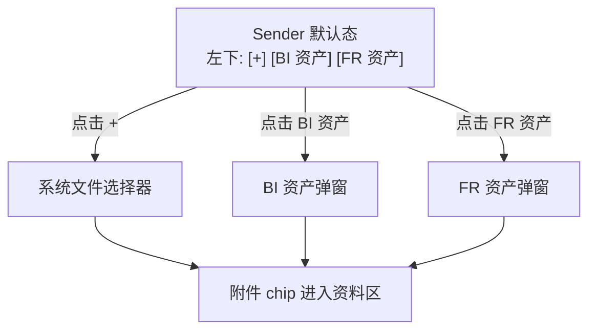
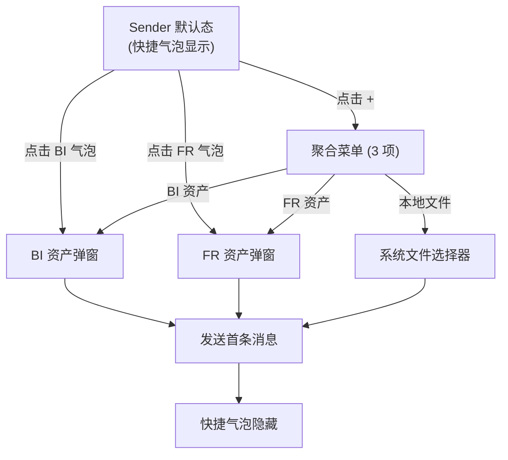

# Sender 数据来源入口 交互逻辑

> **原型文件**：prototype.html
> **设计目标**：在 Dora 通用智能体的对话首页 sender 中，验证 4 种「本地文件 / FineBI 资产 / FineReport 资产」入口的暴露方式，平衡 BI/FR 高频操作的"暴露度"与界面"优雅度"。

---

## 零、评审摘要

### Dora 通用智能体首页 — Sender 区

**本次变更**
- Sender 新增 3 种来源接入入口：本地文件、FineBI 资产、FineReport 资产
- 提供 4 个方案对比，差异集中在「BI / FR 入口」的暴露层级和位置
- BI / FR 选择弹窗复用同一套结构（左侧目录树 + 右侧预览），仅入口形式不同

**关键流程**

---

## 一、设计背景

- 当前 sender 仅支持本地文件上传，BI / FR 资产只能通过 `@` 提及，发现性差。
- PM 反馈：BI / FR 资产是分析的主角，使用频次远高于本地文件，但 3 个入口在 sender 平铺会让一个本应"简洁干净"的首页输入框变得冗余。
- 需要在「高频操作可达」和「界面克制」之间找到平衡。
- 本设计点只验证**入口形式**，不验证弹窗内的资产选择细节（弹窗结构基线见 add-data-catalog 原型）。

---

## 二、完整操作流程

### 方案 A — 聚合「+」菜单（基线）

`+` 按钮在 sender 左下，点击后弹出竖排菜单：本地文件 / FineBI 资产 / FineReport 资产。三者平级。

### 方案 B — 资产条 + 附件「+」（推荐）

输入框**内部顶部**新增一行"会话资料条"。空态时显示两枚 ghost chip：`+ BI 资产` `+ FR 资产`。本地文件继续走输入框左下的「+」附件按钮。

### 方案 C — 主按钮 + 次按钮平铺

`+` 按钮（承载本地文件）与 `BI 资产` `FR 资产` 两枚 ghost 文字按钮并排显示在 sender 左下。3 个控件同时可见，但视觉层级用样式区分：`+` 是图标按钮，BI/FR 是带图标的浅色 ghost 按钮。

### 方案 D — 欢迎语下方快捷气泡

输入框上方、推荐 prompt 卡片**下方**追加一行"快速接入资产：📊 BI · 📈 FR"，作为新会话的引导。`+` 聚合菜单保持不变（含 3 项）。开始对话后这一行自动隐藏。

---

## 三、完整交互细节说明

### 3.1 通用 — Sender 默认态

| 用户操作 | 系统反馈 |
|----------|----------|
| 进入"新聊天"页面 | 渲染 Dora 欢迎语、4 条推荐 prompt、空态 sender |
| 输入文本 | 输入区高度自适应；发送按钮由 disabled 变为可点击 |
| 添加资产/附件成功 | 资料 chip 出现在对应位置；sender 整体上推 |
| 移除资产/附件 (`×`) | chip 立即消失；高度回收 |

### 3.2 方案 A — 聚合「+」菜单

| 用户操作 | 系统反馈 |
|----------|----------|
| 点击左下 `+` 按钮 | 在按钮上方弹出 198px 宽竖排菜单，显示 3 项 |
| 鼠标悬停菜单项 | 项底色变为浅蓝 (`--brand-1`) |
| 点击「本地文件」 | 关闭菜单 → 触发原生 file picker |
| 点击「FineBI 资产」 | 关闭菜单 → 打开 BI 资产弹窗 |
| 点击「FineReport 资产」 | 关闭菜单 → 打开 FR 资产弹窗 |
| 点击菜单外 / Esc | 关闭菜单，无副作用 |

### 3.3 方案 B — 资产条 + 附件「+」

| 用户操作 | 系统反馈 |
|----------|----------|
| 默认空态 | 输入框顶部显示一行：`+ BI 资产` `+ FR 资产` 两枚虚线 ghost chip |
| 点击 `+ BI 资产` chip | 打开 BI 弹窗 |
| 点击 `+ FR 资产` chip | 打开 FR 弹窗 |
| 弹窗确认后 | 资产 chip（实色，带图标 + 名称 + ×）替换/追加到资产条 |
| 资产条已有项时 | "未添加的 + chip"折叠为一枚紧凑的 `+` 图标按钮，hover 可再次展开 BI / FR 选项 |
| 点击资产 chip 主体 | 在浮层中预览资产元信息（不在本原型实现） |
| 点击 chip `×` | 立即移除该资产，资料条若全空恢复成虚线 chip 引导态 |
| 点击左下 `+` 附件按钮 | 触发系统文件选择器；上传完成后文件 chip 显示在**资料条下方**的附件区 |

### 3.4 方案 C — 主按钮 + 次按钮平铺

| 用户操作 | 系统反馈 |
|----------|----------|
| 默认态 | 左下显示 `[+]` 图标按钮、`📊 BI 资产` ghost 按钮、`📈 FR 资产` ghost 按钮，用 4px 间距分隔 |
| 点击 `+` | 触发系统文件选择器（本方案中 `+` 只承载本地文件） |
| 点击 `BI 资产` | 打开 BI 弹窗 |
| 点击 `FR 资产` | 打开 FR 弹窗 |
| 任一资产/附件添加后 | chip 显示在 sender 顶部资料区，3 个按钮位置不变 |
| ghost 按钮 hover | 浅蓝底色提示可点击 |

### 3.5 方案 D — 欢迎语下方快捷气泡

| 用户操作 | 系统反馈 |
|----------|----------|
| 进入新会话 | 推荐 prompt 卡片下方插入分隔条 + 一行 `💡 快速接入资产：[📊 BI 资产] [📈 FR 资产]` |
| 点击 `BI 资产` 气泡 | 打开 BI 弹窗（与 `+` 菜单的 BI 项等价） |
| 点击 `FR 资产` 气泡 | 打开 FR 弹窗 |
| 添加资产后 | 资产 chip 进入 sender 顶部资料区；快捷气泡仍保留 |
| 发送首条消息（或切换到已有会话） | 推荐 prompt 与快捷气泡整体隐藏，sender 上移至底部固定 |
| 点击 `+` | 聚合菜单同方案 A（含 3 项），保证用户在气泡隐藏后仍有入口 |

### 3.6 资产选择弹窗（通用占位）

本原型不重做弹窗细节，仅用一张静态贴图示意。弹窗结构（左侧目录树 + 右侧预览/明细 + 底部"已选 X 个 / 取消 / 确定"）与图 1 中现有 FineBI / FineReport 弹窗一致。点击"取消" / 关闭 / 点击遮罩外不保存；点击"确定"将所选资产作为 chip 注入 sender 资料区。

---

## 四、方案差异对比

| 维度 | A 聚合菜单 | B 资产条 + 附件 + | C 主次平铺 | D 快捷气泡 |
|------|-----------|------------------|------------|------------|
| BI/FR 暴露度 | ★（藏一层） | ★★★（直接可见） | ★★★（直接可见） | ★★★（直接可见，但仅新会话） |
| Sender 视觉密度 | 最低 | 中（多一行资产条） | 中（3 个按钮平铺） | 低（气泡在 sender 外） |
| 本地文件位置 | 与 BI/FR 同级 | 左下 `+` 按钮 | 左下 `+` 按钮 | 与 BI/FR 同级 |
| 职责分离 | 三者同级，无主次 | 强（结构化资产 vs 临时附件） | 弱（视觉区分） | 弱（仅引导态分离） |
| 已添加资产展示 | 进入资料区 | **就地**进入资产条 | 进入资料区 | 进入资料区 |
| 引导对话后保持度 | 完整保留 | 完整保留 | 完整保留 | **气泡消失**，需走 `+` |
| 实现复杂度 | 低 | 中（需双层资料区） | 低 | 中（需会话状态判定） |
| 适用判断 | 三类来源都低频 | 推荐：BI/FR 是分析主角，本地文件是辅助 | BI/FR 极高频但用户希望"按钮可见即可" | 期望保留极简 sender、靠引导教育用户 |

---

## 五、待讨论问题

- [ ] 资产条（方案 B）是否需要支持拖拽排序？
- [ ] 方案 D 快捷气泡在用户**显式关闭**后是否要在下次新会话再次展示？
- [ ] FineBI / FineReport 弹窗能否进一步收敛为同一个弹窗 + 顶部 tab？
- [ ] 已添加资产的 chip 是否支持「替换」操作（点击后重新打开弹窗，预选当前资产）？
