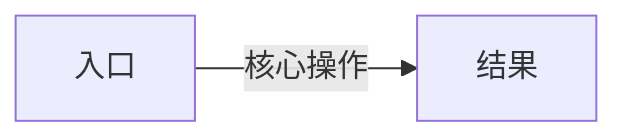
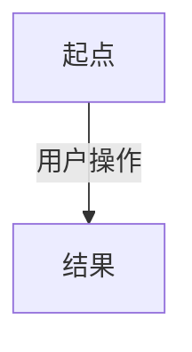

# {功能名称} 交互逻辑

> **原型文件**：prototype.html  
> **设计目标**：一句话说明这个原型要验证什么

---

## 零、评审摘要

> 供评审使用——每个变更页面一节，只含本次改了什么 + 核心流程。细节见下方。

### {变更页面 A — 页面名称}

**本次变更**
- 变更点 1
- 变更点 2

**关键流程**

### {变更页面 B — 页面名称}

**本次变更**
- 变更点 1

**关键流程**

---

## 一、设计背景

<!-- 现有交互的问题是什么，为什么要改 -->

---

## 二、完整操作流程

<!-- 每个功能区域一张流程图，包含所有分支和异常路径 -->

---

## 三、完整交互细节说明

<!-- 按功能区域分节，每节一张操作→反馈表 -->

### 3.1 {功能区域名称}

| 用户操作 | 系统反馈 |
|----------|----------|
| ...      | ...      |

---

## 四、方案差异对比（多方案时填写）

| 维度 | 方案 A | 方案 B |
|------|--------|--------|
| ...  | ...    | ...    |

---

## 五、待讨论问题

- [ ] 问题描述

---

<!--
多方案写法备注：
- 零、评审摘要：每个方案在对应页面节下注明差异
- 二、完整操作流程：按「### 方案 A — {名称}」「### 方案 B — {名称}」分节
- 三、完整交互细节说明：同上按方案分节
- 四、方案差异对比：统一汇总

不应出现在本文档中的内容（放到视觉稿）：
颜色值、像素尺寸、字体字号、阴影圆角、动效曲线时长（除非是关键交互时机）
-->
